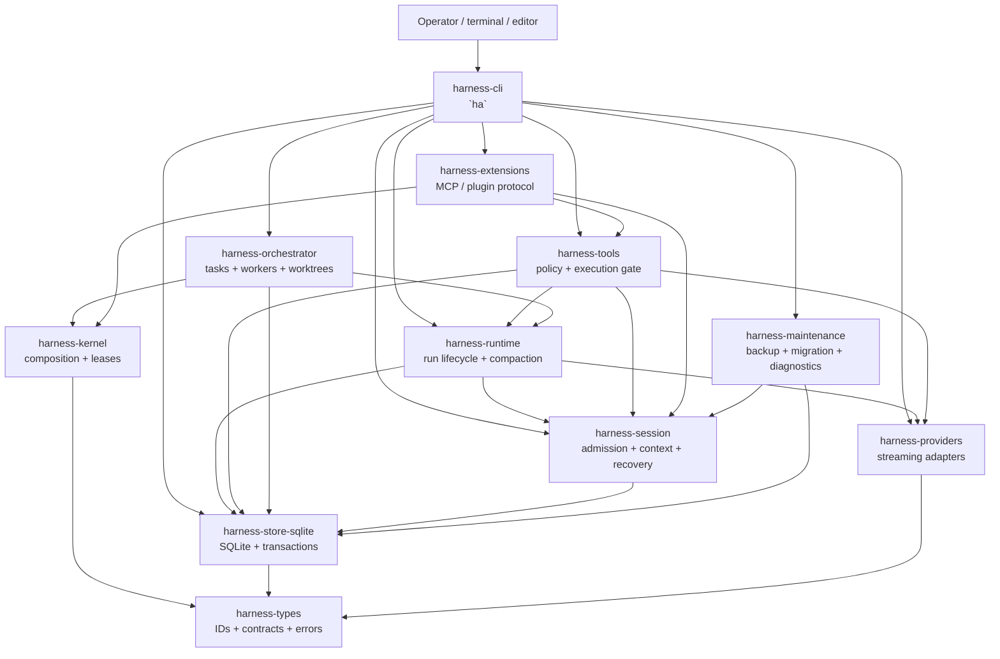

# Harness architecture overview

English | [Tiếng Việt](ARCHITECTURE_OVERVIEW.vi.md)

**Status:** current source-tree guide, 7 October 2026 (`ha` 0.2.3). This document explains the boundaries that are present in the Rust workspace. It is an overview of boundaries, invariants and data flow, not a changelog; when it and the source disagree, the source and its executable tests win.

## 1. Purpose and scope

Harness Agents is a local coding-agent host. The `ha` binary owns the user-facing composition: it opens an interactive terminal app, runs headless prompts, serves RPC and ACP clients, runs background agents, and provides maintenance commands. The application is deliberately split so that a provider, a tool, a storage implementation, or an extension protocol cannot silently become the authority for another domain.

This overview covers:

- the Rust crates that are currently in the workspace;
- the durable request, execution, recovery, delegation, extension, background-agent, and maintenance paths;
- the authority and security boundaries between those crates;
- what the architecture does **not** claim to provide.

It does not replace the detailed contracts in [the operator guide](OPERATOR_GUIDE.en.md), [the plugin architecture](PLUGIN_ARCHITECTURE.en.md), [the terminal interface notes](TUI.md), or the decision records [ADR-N01](adr/ADR-N01-DOMAIN-IDENTITY-STATE.en.md), [ADR-N02](adr/ADR-N02-STORE-OWNERSHIP-DURABILITY.en.md), [ADR-N03](adr/ADR-N03-EXECUTION-BINDING.en.md) and [ADR-N04](adr/ADR-N04-PROVIDER-PROTOCOL.en.md).

## 2. Design in one sentence

**The CLI composes application services; services admit typed, durable commands; SQLite is the durable authority; providers propose model output; policy-gated tools create execution evidence; and recovery rebuilds work from committed records rather than from model narration.**

The important consequence is that a model response is never itself proof that a side effect happened. A request must cross the relevant durable and policy boundaries before it can change the workspace or the data directory.

## 3. Runtime shape



The graph is a responsibility map of the main dependency edges (every crate also depends on `harness-types`), not a promise that every call is synchronous. Tokio services and streams are used where the implementation needs them; the durable boundary remains explicit.

## 4. Crate map

The workspace has eleven crates.

| Crate | Owns | Does not own |
|---|---|---|
| `harness-types` | Shared IDs, error codes, event/receipt contracts, the store port, scope and workspace types, schemas and serialization conventions | Business orchestration, provider calls, SQL mutation policy |
| `harness-kernel` | In-process plugin graph validation, service requirements, scoped registration, service leases and ordered shutdown | Native-code sandboxing, user input admission, provider state |
| `harness-store-sqlite` | SQLite opening rules and the single-writer lock/fence, migrations, transactions, durable records (runs, steps, budgets, questions, tool intents/approvals, delegation, tombstones), backend leases, the rebuildable journal index and notes, artifacts | Model context policy, terminal rendering, arbitrary tool execution |
| `harness-session` | Atomic input admission, instruction ledger, projections, snapshots, deterministic recovery views, and the context builder (typed context blocks with channels) | Model classification, process execution, UI state |
| `harness-providers` | Provider request/response types, the mock provider, OpenAI Chat, OpenAI Responses (API and the ChatGPT Codex backend) and Anthropic Messages adapters, SSE decoding, thinking levels, rate-limit parsing, prompt-cache request fields | Session mutation, tool approval, workspace writes |
| `harness-runtime` | Run state machine, budgets, frozen requests, provider attempts, human input, goal evaluation, compaction, fork/rollback/resume of a conversation, the run inbox, session-file import/export | Direct terminal UI, arbitrary filesystem/process effects |
| `harness-tools` | Coding-tool descriptors, canonicalization, path policy and approval modes, durable intents/receipts, filesystem/Git/process adapters, the bounded model-tool-model turn driver, hooks, the destructive-git guard, and strict-execution capability probes | Model selection, terminal widgets, cross-session extraction |
| `harness-orchestrator` | Delegation contracts and grants, the durable task DAG, bounded worker scheduling, host-owned isolated worktrees, revision-bound integration | Provider protocol details, tool policy implementation, raw SQL authority |
| `harness-extensions` | Extension handshake and trust, capability negotiation, the NDJSON stdio transport, external tool/provider bridges, the MCP client (stdio and Streamable HTTP), the tool catalogue, versioned skill composition | Trust by name alone, host policy bypass, direct database ownership |
| `harness-maintenance` | Backup/restore verification, compatibility checks, migration copies, retention pins/tombstones, garbage collection and support bundles | Normal turn execution or interactive presentation |
| `harness-cli` | `ha` command parsing; the interactive controller, the TUI and line renderers; the background worker and its client; RPC and ACP modes; headless `exec`; configuration, credentials and the model catalog; the project-level harness features in section 8; the package manager; the Python REPL host; fixtures and acceptance binaries | Domain rules that belong in the libraries above |

### 4.1 Dependency direction

The intended dependency direction is inward toward stable contracts. These are the workspace-internal edges declared in the crate manifests:

```text
harness-types                       (depends on no sibling)
  ├── harness-kernel
  ├── harness-providers
  └── harness-store-sqlite
        └── harness-session
              └── harness-runtime   (also providers)
                    ├── harness-tools          (also providers, session, store)
                    └── harness-orchestrator   (also kernel)
harness-extensions  -> kernel, providers, session, tools
harness-maintenance -> session, store
harness-cli         -> every crate above
```

Higher-level crates depend on more than one sibling because they compose a use case. That is different from giving them ownership of the sibling's records. A domain record has one authoritative writer; adding a facade or a crate must not create a second database authority.

## 5. The main request path

### 5.1 Startup

1. `harness-cli` parses the command and resolves configuration. Launch resolution reads the caller directory, project identity, Git root, user paths and non-secret configuration; it opens no store, resolves no model and makes no network call.
2. The host opens the selected SQLite data directory and obtains the single-writer ownership/fencing boundary.
3. The CLI creates the application services it needs: session, runtime, tools, orchestrator, extensions and maintenance.
4. The kernel validates required service contracts before work is admitted. A missing required provider or incompatible generation is a composition error, not a degraded successful run.
5. The interactive UI, a headless command, or an RPC/ACP server starts the selected run mode.

An unconfigured provider fails before any state is left behind; a production launch never falls back to a fixture provider.

### 5.2 User turn and provider attempt

```text
raw input
  -> SessionService::admit_input
  -> durable instruction / event / sequence ACK
  -> context build and mandatory-context admission
  -> frozen request + budget reservation
  -> provider stream
  -> persisted provider attempt and run state
  -> proposed answer or proposed tool action
```

The session service stores raw admitted input before model classification. The runtime then builds a bounded context and freezes the request given to the provider. Providers receive a request snapshot, not mutable session state. A provider failure cannot be rewritten into a successful side effect.

The run state machine accepts validated commands (`start`, `pause`, `resume`, `complete`, `fail`, `cancel`, `dispose`); callers do not write arbitrary next states. Context overflow triggers compaction in the runtime (also available on demand as `/compact`); a conversation can be forked, rolled back, resumed or replayed offline from committed records.

A user message normally drives more than one provider attempt. `harness-tools` owns a bounded model-tool-model loop (the turn driver): it admits one input per user message through the runtime, executes requested tools through the gate in 5.3, and sends their results back for a bounded number of continuation steps.

### 5.3 Coding-tool action

```text
model / CLI proposal
  -> parse and canonicalize
  -> workspace and capability checks
  -> policy decision (and pre-tool hooks)
  -> final-action approval (when required)
  -> durable intent
  -> process/filesystem/Git execution
  -> immutable receipt + bounded output/artifact references
  -> session projection and user-facing view
```

All coding-tool actions pass through the same `harness-tools` boundary. The core tools are file read/list/search/glob, `edit_file`, `write_file`, `apply_patch`, `run_process`, `run_shell`, `read_process_output`, Git status/diff/log, history search/read, and `task_update`. Tools that come from elsewhere reach the same gate as an external-tool action: extension and MCP tools, `web_search`/`web_fetch` (loopback, private and link-local targets refused; `HA_WEB=off` removes them), the Python `ipython` tool (approved like `run_shell`), and the `delegate` tool of section 7.

The presentation returned to the model or UI may be truncated or otherwise shaped, but it is not the authoritative execution record. The receipt records what the host knows about the admitted action, its outcome, output references and relevant hashes. Approval modes are `ask`, `auto-edit` and `full-auto`; all of them keep path validation, deny rules, workspace revalidation and receipts. A hook can block a call or ask the user, but an `allow` from a hook cannot skip an approval, and a `pre_tool_use` hook that fails blocks the call.

The process boundary exposes an explicit host-environment contract and allowlist. On Windows a job object contains the process tree; the strict execution module (`ha sandbox`) measures what the host can actually enforce and exports evidence, and a strict request is either served by a backend that proved the capability or refused. A transport, worktree or process wrapper must not be described as a complete sandbox unless the capability matrix proves that claim.

### 5.4 Recovery

Recovery uses a snapshot plus the committed journal tail:

```text
SQLite snapshot + committed events
  -> deterministic projection
  -> RecoveryView
  -> pending execution / interruption diagnostics
  -> resume, inspect or refuse safely
```

The recovery path is intentionally usable without a model extractor. It distinguishes a protocol repair from an unknown external side-effect outcome. An uncertain command is not silently replayed merely because the previous model turn ended unexpectedly. Background agents have their own recovery layer on top of this (section 6).

## 6. Process model: foreground, worker, RPC/ACP

An interactive session runs in a background worker, one per project store, and the terminal attaches to it ([operator guide 12.7](OPERATOR_GUIDE.en.md#127-background-agents)). Closing the terminal detaches; the agent keeps its running turn, goal, children and schedules, and `ha attach`, `ha agents`, `ha send`, `ha stop` and `ha shutdown` manage agents. `HA_DAEMON=off` (or `"daemon": false` in settings) runs the session in the terminal instead.

- **One worker per project, one store writer.** The agents of a project share the worker and its single store lease, so they never fight over the writer lock. The worker writes a descriptor (port, token, process) beside a lock file; clients connect over a loopback socket with a token, speaking one JSON object per line. Several terminals may attach to one agent.
- **The same controller everywhere.** Each agent is the interactive app's own controller on a worker thread; a terminal only sends keys and draws what comes back. Headless `ha exec` also runs its turn through the worker unless the daemon is off or unreachable.
- **Supervision and recovery.** `ha worker` runs under a per-project supervisor that restarts a dead worker after 250 ms, 1 s and 5 s. The worker keeps a journal of its agents; agents a dead worker or a reboot left in a journal are brought back by the next `ha agents`/`ha list`. A delegated child that was running when its worker went away comes back as failed. An agent with no terminal, no work and no schedule is evicted after `idleEvictionMinutes` (90 by default).
- **Foreground paths.** Maintenance commands and `ha sandbox` do not use the worker. `--mode rpc` speaks JSON lines on stdin/stdout and `--mode acp` speaks line-delimited JSON-RPC 2.0 for editors; they serve a session in their own process, so the daemon-only RPC commands (cron, heartbeats, agent messaging) answer that they require daemon mode.

The product is still single-host: one writable host owns a data directory at a time. The worker is a per-user, per-project process set, not a network service.

## 7. Delegation and extensions

### Delegation

`harness-orchestrator` treats a delegated worker as a durable task, not as a prompt fragment. The host materializes role, scope, depth, worker-count and model-request limits before dispatch (defaults: depth 2, 3 workers, 8 queued, 24 model requests per worker). Results and parent delivery are persisted so a worker can finish while the parent is paused or can be inspected after a crash. A role preset (`coordinator`, `explorer`, `coder`, `reviewer`, `verifier`) is only a preset; it grants no authority by itself. A coder works in a host-owned isolated worktree on its own branch; worktrees isolate concurrent edits and are not a security boundary.

In an interactive session the model delegates with the `delegate` tool. Children belong to the session, not to the turn that started it: spawning returns at admission, the parent is notified when a child settles, a message to a finished child wakes it for a follow-up turn, and a spawn ledger brings a conversation's children back after `/resume` or a worker restart. The scheduler and workspace planner are separate from the coding-tool gate: a child may propose an edit, but the host still applies the same tool policy, approval and receipt rules.

### Extensions and MCP

`harness-extensions` supports local extension processes (off unless `HA_EXTENSIONS=on`, started only after the executable digest matches the manifest and the trust grant) and an MCP client built on the `rmcp` SDK. The handshake negotiates protocol versions and capabilities, validates schemas and bounds frames, calls, discovery pages, tasks and cancellation grace periods. MCP over stdio and over Streamable HTTP is supported; HTTP requires TLS (cleartext only on loopback) and reads bearer credentials from the environment or from an OAuth login (`ha mcp login`, PKCE with a loopback callback; tokens are stored in `auth.json` bound to the server). `/plugins` and `/mcp` offer a service catalog (built-ins, the user's `mcp-services.json`, a daily-refreshed public catalog). Discovery is not permission: an MCP or extension tool call is dispatched through the same `harness-tools` policy, approval and receipt path. Skills are composed as bounded, version-pinned contributions; a skill name does not bypass host policy.

Stdio or a child process is a transport boundary, not proof that hostile native code is isolated, and native same-process plugins are trusted code.

## 8. Harness features built into `ha`

These live in `harness-cli` as application-layer features over the services above. None of them adds a durable authority; they use project files, the data directory and the existing gates.

- **Prompt caching.** The system prompt is a cache-stable prefix: it changes only with the tool set, and everything that changes between turns (date, Git branch, changed-file count, turn limits) is sent as turn input after it. Providers add their own fields: Anthropic gets ephemeral `cache_control` breakpoints on the system prompt, the last tool and the last two user messages; OpenAI Chat (only against `api.openai.com`) and the Responses API get a `prompt_cache_key` derived from the session id (at most 64 characters). `HA_CACHE_RETENTION=long` asks for a longer retention. Cache read/write tokens are priced apart, and the status line shows the session's cache share.
- **Verification, not self-report.** `[verify]` checks in the project config are run by the harness (when the model calls `goal_complete`, when a feature asks to become passing, as gates of `/autonomous`, and on `/verify`); a failure goes back to the agent with its output and a fix hint. After the checks pass, an independent verifier child (fresh context, read-only tools) judges a goal before it completes. The feature list `.harness/features.json` records each feature's state and evidence; the model can add, start or block a feature but only a passing run of the harness's own commands moves it to `passing`.
- **Session lifecycle.** The first prompt of a session carries a brief the harness gathers (recent commits, uncommitted changes, the handoff in `.harness/progress.md`). `/handoff` has the agent write that file and `/handoff --reset` starts a fresh conversation from it. `/doctor` and `ha doctor` score a repository on instructions, tools, environment, state and feedback with structural checks only.
- **Learned state.** `/refine` has a model propose edits to memories, prompt notes, skills and subagent specs, and the host validates and applies them (host-side, no keyword classifier); it can also propose checks, which join `[[verify.checks]]` only after the user accepts them (`/checks accept`). Learned skills are plain `SKILL.md` folders in a global or a trusted-project layer, written only by one promotion function, with a ledger, use counting and archiving.
- **Goals, schedules and autonomy.** Persistent goals (only `goal_complete` finishes one), `/autonomous` continuation within budgets and shell-command gates, steering and follow-up queues, heartbeats and schedules kept under the data directory. Schedules and heartbeats run while a worker keeps the agent alive.
- **Conversation tree.** Turns form branches; `/tree` navigates them with optional branch summaries, and `/fork` starts a new conversation before one of the user's messages and `/clone` starts one with the whole history.
- **Python REPL.** The `ipython` tool is a persistent Python kernel (vendored `rlm` runtime under `crates/harness-cli/python`) offered only when Python 3.11+ is found; `HA_REPL=off` removes it. Its host requests are answered by the controller, and orphan kernels from a crashed `ha` are reaped through a journal.
- **Package manager.** `ha package install | remove | update | list` manages `npm:`, git and local-directory sources; a package carries skills, prompts and themes only, and ha executes nothing in it.
- **Providers and models.** OpenAI Chat, OpenAI Responses, the ChatGPT Codex backend (browser sign-in), Anthropic Messages, plus DeepSeek, OpenCode Zen and OpenCode Go over those wire formats, and user-defined models. The model list is a snapshot in the binary, refreshed at most daily, and a refreshed catalog can only select transports the snapshot already knows, so it cannot redirect where a credential is sent. Credentials live in a separate `auth.json` written by `/login`, never in the strict configuration file.

## 9. Durable authorities and identity

| Concern | Durable authority | Key boundary |
|---|---|---|
| Shared identity and schema vocabulary | `harness-types` contracts, serialized by owning services | Stable typed IDs and versioned payloads |
| Input and instruction history | `harness-session` through `harness-store-sqlite` | Sequence checks and atomic admission |
| Run lifecycle and provider attempts | `harness-runtime` records through the store | Validated state transitions, frozen requests and budgets |
| Tool side effects | `harness-tools` receipts/intents and store artifacts | Policy + approval precede execution |
| Task delegation | `harness-orchestrator` task records and delivery contracts | Parent/child ownership, depth/worker/budget caps and settlement |
| Extension protocol | `harness-extensions` negotiated session and lease state | Version/capability/argument validation and bounded transport |
| Backups, migrations and deletion markers | `harness-maintenance` plus store metadata | Manifest hashes, compatibility refusal, retention pins/tombstones |
| Background agents | The worker's journal and descriptor files, plus the project store | One worker and one store writer per project; the journal only says which agents to bring back, the conversation stays in the store |
| Project harness state | Files in the workspace (`.harness/`) and the data directory | Written by the host or after user acceptance; never a second source of run truth |
| UI projections | `harness-cli` views over services | Presentation cannot become a second writer |

The core identity chain is project → task → session → run, with typed IDs and workspace observations attached at the boundaries that need them. A new session is not permission to duplicate a task, and a model-visible label is not an authority grant.

## 10. Configuration and UI composition

`harness-cli` has these presentation paths over the same application services:

- the interactive terminal app: a fullscreen TUI by default, an inline-viewport TUI with the terminal's own scrollback when fullscreen is off, and a plain line renderer (`--plain` or `HA_UI=plain`); the interactive app refuses to start without a terminal, and headless runs use `exec` (see [the terminal interface notes](TUI.md));
- headless `exec` (text, JSON or stream-JSON output);
- the `--mode rpc` and `--mode acp` servers.

Configuration is resolved before service construction. A controller is a pure state reducer that emits typed effects and history items; it never touches a terminal, and a terminal or a worker connection renders its effects. Every path calls application services rather than reaching into another path's internals or issuing mutation SQL directly, so every request is subject to the same admission, policy, persistence and recovery rules.

The UI may show compact, streaming or redacted views. It must not turn an unverified provider sentence into an execution receipt, and it must not hide a refusal, pending question, budget stop or recovery uncertainty.

## 11. Security and failure boundaries

The architecture makes these guarantees explicit:

- **Fail closed at admission:** missing required composition, invalid contracts, sequence conflicts, denied policy and incompatible stores stop before the dependent effect.
- **Durable before acknowledgement:** raw input and intent records are committed before the corresponding durable ACK is returned.
- **No invented evidence:** provider output and post-processing do not replace execution receipts; a goal or feature is completed by harness-run checks, not by the model's claim.
- **Bounded work:** context, output, process capture, extension frames, delegation depth/workers and provider budgets have explicit limits.
- **Single-writer storage:** file locking plus database fencing prevent two writable hosts from treating the same data directory as theirs.
- **Credentials stay out of the model path:** secrets are redacted before export and support bundles, and a worker's connection token is readable only by its owner and never printed.
- **Inspectable degradation:** recovery diagnostics, release matrices and support bundles identify what was not verified instead of reporting a false clean state.

These are not claims that the model is correct, that a disk cannot fail, or that a native in-process plugin is hostile-code safe. Backups, retention and operator inspection remain part of continuity.

## 12. Current support and known limits

The repository documents Windows 10/11 x64 as the supported platform. Linux is visible in CI but remains unverified/pending support; macOS is not tested. The release is a local binary built by `scripts/New-HaRelease.ps1`, not a published hosted service.

Current limits to preserve in code and docs:

- a background agent lives in its project's worker process: a supervised worker is restarted and its agents come back from the journal, but after a reboot (or if the supervisor is gone) agents return only when `ha agents`/`ha list` runs, and a child that was mid-run comes back as failed;
- one writable host per data directory;
- no OS-level sandbox: containment is a process tree, not confinement, unless `ha sandbox` measures otherwise;
- no guarantee of perfect model reasoning or unlimited context retention;
- no signed or published release artifact unless the release evidence explicitly says otherwise;
- provider authentication and paid remote API behavior are not proven by offline/unit gates;
- `ha maintenance release-matrix` still lists `remote_mcp_endpoints` and `background_daemon` as unsupported and a Web UI as out of scope; the code now supports Streamable HTTP MCP and background workers, so that command's capability list lags this document and should be reconciled.

## 13. Verification map

For implementation changes, use the repository's normal checks and the owning crate's tests:

```powershell
cargo fmt --all -- --check
cargo clippy --workspace --all-targets --locked -- -D warnings
cargo test --workspace --all-targets --locked
pwsh -NoProfile -File scripts/Verify-Docs.ps1
```

Tests marked `#[ignore]` (the pseudo-terminal acceptance cases) are skipped by `cargo test`; run them with `scripts/Invoke-HaPtyAcceptance.ps1`. Use the current Git revision and test output; do not treat an old plan as a fresh release claim.

## 14. Related documents

- [Operator guide](OPERATOR_GUIDE.en.md)
- [Plugin architecture](PLUGIN_ARCHITECTURE.en.md)
- [Terminal interface](TUI.md)
- [Build and release](BUILD_AND_RELEASE.md)
- Decision records: [ADR-N01 domain identity and state](adr/ADR-N01-DOMAIN-IDENTITY-STATE.en.md), [ADR-N02 store ownership and durability](adr/ADR-N02-STORE-OWNERSHIP-DURABILITY.en.md), [ADR-N03 execution binding](adr/ADR-N03-EXECUTION-BINDING.en.md), [ADR-N04 provider protocol](adr/ADR-N04-PROVIDER-PROTOCOL.en.md)
