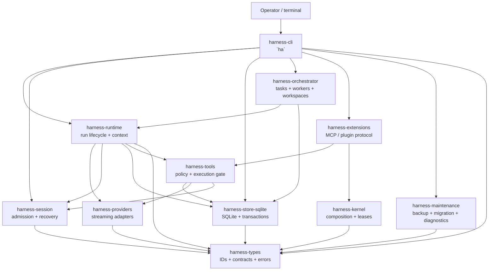

# Harness architecture overview

English | [Tiếng Việt](ARCHITECTURE_OVERVIEW.vi.md)

**Status:** current source-tree guide, 29 September 2026. This document explains the boundaries that are present in the Rust workspace. It is not a promise that every item in the older phase plans is still a live capability; when a plan and the source disagree, the source and its executable tests win.

## 1. Purpose and scope

Harness Agents is a local coding-agent host. The `ha` binary owns the user-facing composition: it opens an interactive terminal app, runs headless prompts, and provides maintenance commands. The application is deliberately split so that a provider, a tool, a storage implementation, or an extension protocol cannot silently become the authority for another domain.

This overview covers:

- the Rust crates that are currently in the workspace;
- the durable request, execution, recovery, delegation, extension, and maintenance paths;
- the authority and security boundaries between those crates;
- what the architecture does **not** claim to provide.

It does not replace the detailed contracts in [the architecture review](ARCHITECTURE_REVIEW.en.md), [the operator guide](OPERATOR_GUIDE.en.md), or the phase runbooks under [`docs/implementation/`](implementation/README.en.md).

## 2. Design in one sentence

**The CLI composes application services; services admit typed, durable commands; SQLite is the durable authority; providers propose model output; policy-gated tools create execution evidence; and recovery rebuilds work from committed records rather than from model narration.**

The important consequence is that a model response is never itself proof that a side effect happened. A request must cross the relevant durable and policy boundaries before it can change the workspace or the data directory.

## 3. Runtime shape



The graph is a responsibility map, not a promise that every call is synchronous. Tokio services and streams are used where the implementation needs them; the durable boundary remains explicit.

## 4. Crate map

| Crate | Owns | Does not own |
|---|---|---|
| `harness-types` | Shared IDs, error codes, event/receipt contracts, scope and workspace types, schemas and serialization conventions | Business orchestration, provider calls, SQL mutation policy |
| `harness-kernel` | In-process plugin composition, service requirements, scoped registration, leases and ordered shutdown | Native-code sandboxing, user input admission, provider state |
| `harness-store-sqlite` | SQLite connection/opening rules, migrations, transactions, durable records, queues, artifacts and query access | Model context policy, terminal rendering, arbitrary tool execution |
| `harness-session` | Atomic input admission, instruction ledger, projections, snapshots and deterministic recovery views | Model classification, process execution, UI state |
| `harness-providers` | Provider request/response types, mock provider, streaming adapters and provider-specific response handling | Session mutation, tool approval, workspace writes |
| `harness-runtime` | Run state machine, budgets, context admission, frozen requests, provider attempts, human input and goals | Direct terminal UI, arbitrary filesystem/process effects |
| `harness-tools` | Coding-tool descriptors, canonicalization, policy decisions, approvals, durable intents/receipts, filesystem/Git/process adapters and strict capability probes | Model selection, terminal widgets, cross-session extraction |
| `harness-orchestrator` | Delegated task contracts, DAG scheduling, worker ownership, budgets, handoffs and isolated workspace planning | Provider protocol details, tool policy implementation, raw SQL authority |
| `harness-extensions` | Extension handshake, capability negotiation, MCP discovery/calls/tasks, skill composition, transport and extension leases | Trust by name alone, host policy bypass, direct database ownership |
| `harness-maintenance` | Backup/restore verification, compatibility checks, migration copies, retention/tombstones and support diagnostics | Normal turn execution or interactive presentation |
| `harness-cli` | `ha` command parsing, interactive TUI/line UI, CLI composition, loopback web adapter and acceptance fixtures | Domain rules that belong in the libraries above |

### 4.1 Dependency direction

The intended dependency direction is inward toward stable contracts:

```text
harness-types
  ├── harness-kernel
  ├── harness-store-sqlite
  │     └── harness-session
  ├── harness-providers
  ├── harness-runtime
  ├── harness-tools
  ├── harness-orchestrator
  ├── harness-extensions
  └── harness-maintenance
                              └── harness-cli composes the services
```

Some higher-level crates depend on more than one sibling because they compose a use case. That is different from giving them ownership of the sibling's records. A domain record has one authoritative writer; adding a facade or a crate must not create a second database authority.

## 5. The main request path

### 5.1 Startup

1. `harness-cli` parses the command and resolves configuration.
2. The host opens the selected SQLite data directory and obtains the single-writer ownership/fencing boundary.
3. The CLI creates the application services it needs: session, runtime, tools, orchestrator, extensions and maintenance.
4. The kernel validates required service contracts before work is admitted. A missing required provider or incompatible generation is a composition error, not a degraded successful run.
5. The interactive UI or headless command starts the selected run mode.

The product is single-host. An interactive session runs in a background worker, one per project, that the terminal attaches to (prime-agent's daemon, [OPERATOR_GUIDE 12.7](OPERATOR_GUIDE.en.md#127-background-agents)): closing the terminal leaves the session working, and the worker holds the project's store for all of its agents. Headless runs and maintenance stay in the foreground, and one writable host owns a data directory at a time.

### 5.2 User turn and provider attempt

```text
raw input
  -> SessionService::admit_input
  -> durable instruction / event / sequence ACK
  -> context build and mandatory-context admission
  -> frozen request + budget reservation
  -> provider stream
  -> persisted provider attempt and run state
  -> proposed answer or proposed tool action
```

The session service stores raw admitted input before model classification. The runtime then builds a bounded context and freezes the request given to the provider. Providers receive a request snapshot, not mutable session state. A provider failure cannot be rewritten into a successful side effect.

The run state machine accepts validated commands such as `start`, `pause`, `resume`, `complete`, `fail`, `cancel` and `dispose`; callers do not write arbitrary next states.

### 5.3 Coding-tool action

```text
model / CLI proposal
  -> parse and canonicalize
  -> workspace and capability checks
  -> policy decision
  -> final-action approval (when required)
  -> durable intent
  -> process/filesystem/Git execution
  -> immutable receipt + bounded output/artifact references
  -> session projection and user-facing view
```

All coding-tool actions pass through the same `harness-tools` boundary. The presentation returned to the model or UI may be truncated or otherwise shaped, but it is not the authoritative execution record. The receipt records what the host knows about the admitted action, its outcome, output references and relevant hashes.

The process boundary exposes an explicit host-environment contract and allowlist. The strict execution module measures capabilities and exports evidence; a transport, worktree or process wrapper must not be described as a complete sandbox unless the capability matrix proves that claim.

### 5.4 Recovery

Recovery uses a snapshot plus the committed journal tail:

```text
SQLite snapshot + committed events
  -> deterministic projection
  -> RecoveryView
  -> pending execution / interruption diagnostics
  -> resume, inspect or refuse safely
```

The recovery path is intentionally usable without a model extractor. It distinguishes a protocol repair from an unknown external side-effect outcome. An uncertain command is not silently replayed merely because the previous model turn ended unexpectedly.

## 6. Durable authorities and identity

| Concern | Durable authority | Key boundary |
|---|---|---|
| Shared identity and schema vocabulary | `harness-types` contracts, serialized by owning services | Stable typed IDs and versioned payloads |
| Input and instruction history | `harness-session` through `harness-store-sqlite` | Sequence checks and atomic admission |
| Run lifecycle and provider attempts | `harness-runtime` records through the store | Validated state transitions, frozen requests and budgets |
| Tool side effects | `harness-tools` receipts/intents and store artifacts | Policy + approval precede execution |
| Task delegation | `harness-orchestrator` task records and delivery contracts | Parent/child ownership, depth/worker/budget caps and settlement |
| Extension protocol | `harness-extensions` negotiated session and lease state | Version/capability/argument validation and bounded transport |
| Backups, migrations and deletion markers | `harness-maintenance` plus store metadata | Manifest hashes, compatibility refusal, retention pins/tombstones |
| UI and web projections | `harness-cli` views over services | Presentation cannot become a second writer |

The core identity chain is project → task → session → run, with typed IDs and workspace observations attached at the boundaries that need them. A new session is not permission to duplicate a task, and a model-visible label is not an authority grant.

## 7. Delegation and extensions

### Delegation

`harness-orchestrator` treats a delegated worker as a durable task, not as a prompt fragment. The host materializes role, scope, depth, worker-count and model-request limits before dispatch. Results and parent delivery are persisted so a worker can finish while the parent is paused or can be inspected after a crash. A role preset such as `coder` or `reviewer` is only a preset; it grants no authority by itself.

The scheduler and workspace planner are separate from the coding-tool gate. A worker may propose an edit, but the host still applies the same tool policy, approval and receipt rules.

### Extensions and MCP

`harness-extensions` supports local extension processes and MCP-style tool/resource/task protocols. The handshake negotiates protocol versions and capabilities, validates schemas and bounds frames, calls, discovery pages, tasks and cancellation grace periods. Skills are composed as bounded, version-pinned contributions; a skill name does not bypass host policy.

The current design supports loopback/local integration. Remote MCP support and OS sandbox claims remain separate release-matrix decisions. Stdio or a child process is a transport boundary, not proof that hostile native code is isolated.

## 8. Configuration and UI composition

`harness-cli` has two presentation paths over the same application services:

- interactive terminal chat/TUI or line mode;
- headless `exec`/run flows for scripts and automation.

Configuration is resolved before service construction. Each presentation path calls application services rather than reaching into another path's internals or issuing mutation SQL directly, so every request is subject to the same admission, policy, persistence and recovery rules.

The UI may show compact, streaming or redacted views. It must not turn an unverified provider sentence into an execution receipt, and it must not hide a refusal, pending question, budget stop or recovery uncertainty.

## 9. Security and failure boundaries

The architecture makes these guarantees explicit:

- **Fail closed at admission:** missing required composition, invalid contracts, sequence conflicts, denied policy and incompatible stores stop before the dependent effect.
- **Durable before acknowledgement:** raw input and intent records are committed before the corresponding durable ACK is returned.
- **No invented evidence:** provider output and post-processing do not replace execution receipts.
- **Bounded work:** context, output, process capture, extension frames, delegation depth/workers and provider budgets have explicit limits.
- **Single-writer storage:** file locking plus database fencing prevent two writable hosts from treating the same data directory as theirs.
- **Inspectable degradation:** recovery diagnostics, release matrices and support bundles identify what was not verified instead of reporting a false clean state.

These are not claims that the model is correct, that a disk cannot fail, or that a native in-process plugin is hostile-code safe. Native same-process plugins are trusted code. Backups, retention and operator inspection remain part of continuity.

## 10. Current support and known limits

The repository documents Windows 10/11 x64 as the supported platform. Linux is visible in CI but remains unverified/pending support; macOS is not tested. The release is a local foreground binary, not a published hosted service.

Current limits to preserve in code and docs:

- a background agent lives as long as its worker process: a worker that dies or a reboot ends its agents, and nothing restarts them (the conversation stays in the store);
- one writable host per data directory;
- no guarantee of perfect model reasoning or unlimited context retention;
- no claim that transport isolation is an OS sandbox;
- no signed or published release artifact unless the release evidence explicitly says otherwise;
- provider authentication and paid remote API behavior are not proven by offline/unit gates.

## 11. Verification map

For implementation changes, use the repository's normal checks and the owning crate's tests:

```powershell
cargo fmt --all -- --check
cargo clippy --workspace --all-targets --locked -- -D warnings
cargo test --workspace --all-targets --locked
pwsh -NoProfile -File scripts/Verify-Docs.ps1
```

Historical phase notes were removed from this documentation set. Use the current Git revision and test output; do not treat an old plan as a fresh release claim.

## 12. Related documents

- [Architecture review](ARCHITECTURE_REVIEW.en.md)
- [Operator guide](OPERATOR_GUIDE.en.md)
- [Plugin architecture](PLUGIN_ARCHITECTURE.en.md)
- [Implementation handbook](implementation/README.en.md)
- [Build and release](BUILD_AND_RELEASE.md)
