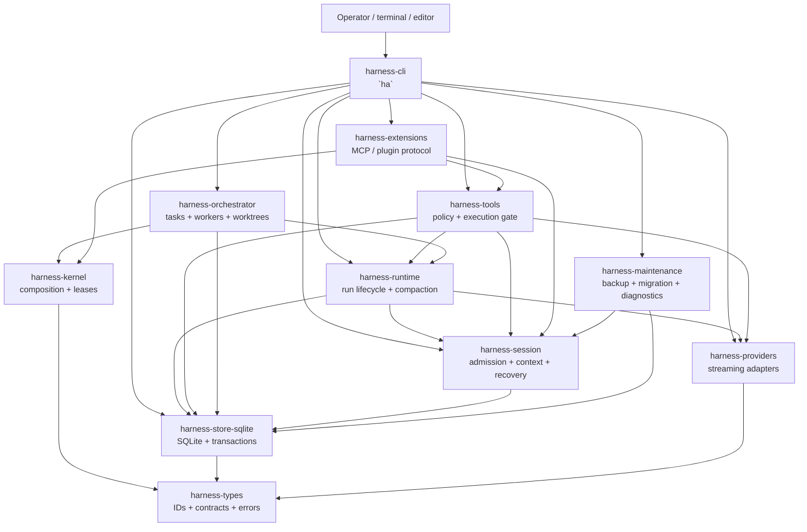

# Tổng quan kiến trúc Harness

[English](ARCHITECTURE_OVERVIEW.en.md) | Tiếng Việt

**Trạng thái:** tài liệu hướng dẫn theo source tree hiện tại, ngày 07/10/2026 (`ha` 0.2.3). Tài liệu này giải thích các ranh giới đang có trong workspace Rust. Đây là tổng quan về ranh giới, bất biến và luồng dữ liệu, không phải changelog; khi tài liệu và source khác nhau, source cùng các executable tests là nguồn đúng.

## 1. Mục đích và phạm vi

Harness Agents là host coding-agent chạy cục bộ. Binary `ha` sở hữu phần composition hướng người dùng: mở ứng dụng terminal tương tác, chạy prompt headless, phục vụ client RPC và ACP, chạy agent nền và cung cấp các lệnh maintenance. Ứng dụng được tách thành các crate để provider, tool, storage implementation hoặc extension protocol không thể âm thầm trở thành authority của domain khác.

Tổng quan này bao quát:

- các crate Rust hiện có trong workspace;
- luồng durable request, execution, recovery, delegation, extension, agent nền và maintenance;
- ranh giới authority và bảo mật giữa các crate;
- những điều kiến trúc **không** tuyên bố cung cấp.

Tài liệu không thay thế các contract chi tiết trong [operator guide](OPERATOR_GUIDE.vi.md), [plugin architecture](PLUGIN_ARCHITECTURE.vi.md), [ghi chú giao diện terminal](TUI.md), hay các decision record [ADR-N01](adr/ADR-N01-DOMAIN-IDENTITY-STATE.vi.md), [ADR-N02](adr/ADR-N02-STORE-OWNERSHIP-DURABILITY.vi.md), [ADR-N03](adr/ADR-N03-EXECUTION-BINDING.vi.md) và [ADR-N04](adr/ADR-N04-PROVIDER-PROTOCOL.vi.md).

## 2. Kiến trúc trong một câu

**CLI compose application services; services nhận các command có kiểu và bền vững; SQLite là authority durable; provider đề xuất output của model; tool qua policy gate tạo execution evidence; recovery dựng lại công việc từ records đã commit thay vì từ model narration.**

Hệ quả quan trọng: câu trả lời của model không tự nó là bằng chứng side effect đã xảy ra. Request phải đi qua các ranh giới durable và policy liên quan trước khi được thay đổi workspace hoặc data directory.

## 3. Hình dạng runtime



Đồ thị là bản đồ trách nhiệm của các cạnh dependency chính (mọi crate đều còn phụ thuộc `harness-types`), không phải cam kết mọi lời gọi đều synchronous. Nơi cần thiết implementation dùng Tokio và stream; ranh giới durable vẫn được nêu rõ.

## 4. Bản đồ crate

Workspace có mười một crate.

| Crate | Sở hữu | Không sở hữu |
|---|---|---|
| `harness-types` | ID dùng chung, error code, event/receipt contracts, store port, scope và workspace types, schema và quy ước serialization | Business orchestration, provider calls, policy mutation SQL |
| `harness-kernel` | Validate plugin graph trong process, service requirements, scoped registration, service lease và shutdown theo thứ tự | Sandbox native code, input admission, provider state |
| `harness-store-sqlite` | Quy tắc mở SQLite và single-writer lock/fence, migrations, transactions, durable records (run, step, budget, question, tool intent/approval, delegation, tombstone), backend leases, journal index rebuild được và notes, artifacts | Model context policy, terminal rendering, tool/process tùy ý |
| `harness-session` | Atomic input admission, instruction ledger, projections, snapshots, recovery views xác định được và context builder (context block có kiểu, có channel) | Model classification, process execution, UI state |
| `harness-providers` | Provider request/response types, mock provider, adapter OpenAI Chat, OpenAI Responses (API và backend ChatGPT Codex) và Anthropic Messages, giải mã SSE, thinking level, parse rate-limit, trường prompt-cache trong request | Session mutation, tool approval, ghi workspace |
| `harness-runtime` | Run state machine, budgets, frozen requests, provider attempts, human input, đánh giá goal, compaction, fork/rollback/resume hội thoại, run inbox, import/export session file | Terminal UI trực tiếp, filesystem/process effects tùy ý |
| `harness-tools` | Coding-tool descriptors, canonicalization, path policy và approval mode, durable intents/receipts, adapter filesystem/Git/process, turn driver model-tool-model có giới hạn, hooks, destructive-git guard và strict-execution capability probes | Model selection, terminal widgets, cross-session extraction |
| `harness-orchestrator` | Delegation contracts và grants, durable task DAG, worker scheduling có giới hạn, worktree cô lập do host sở hữu, integration gắn với revision | Chi tiết provider protocol, triển khai tool policy, raw SQL authority |
| `harness-extensions` | Extension handshake và trust, capability negotiation, transport NDJSON stdio, bridge tool/provider ngoài, MCP client (stdio và Streamable HTTP), tool catalogue, skill composition có version | Trust chỉ dựa trên tên, bypass host policy, database ownership trực tiếp |
| `harness-maintenance` | Backup/restore verification, compatibility checks, migration copies, retention pins/tombstones, garbage collection và support bundle | Turn execution thông thường hoặc presentation tương tác |
| `harness-cli` | Parse command `ha`; interactive controller, renderer TUI và line; worker nền cùng client; chế độ RPC và ACP; `exec` headless; configuration, credentials và model catalog; các tính năng harness cấp project ở mục 8; package manager; host của Python REPL; fixtures và acceptance binaries | Domain rules thuộc các library ở trên |

### 4.1 Hướng dependency

Hướng dependency chủ đạo đi vào các contract ổn định. Đây là các cạnh nội bộ workspace khai báo trong manifest của crate:

```text
harness-types                       (không phụ thuộc sibling nào)
  ├── harness-kernel
  ├── harness-providers
  └── harness-store-sqlite
        └── harness-session
              └── harness-runtime   (thêm providers)
                    ├── harness-tools          (thêm providers, session, store)
                    └── harness-orchestrator   (thêm kernel)
harness-extensions  -> kernel, providers, session, tools
harness-maintenance -> session, store
harness-cli         -> mọi crate ở trên
```

Các crate tầng trên phụ thuộc nhiều sibling để compose một use case. Điều đó không trao quyền sở hữu records của sibling cho chúng. Mỗi domain record có một authoritative writer; thêm facade hoặc crate không được tạo database authority thứ hai.

## 5. Luồng request chính

### 5.1 Khởi động

1. `harness-cli` parse command và resolve configuration. Bước resolve launch đọc thư mục gọi, project identity, Git root, user paths và cấu hình không bí mật; nó không mở store, không resolve model và không gọi mạng.
2. Host mở data directory SQLite đã chọn và nhận ranh giới single-writer ownership/fencing.
3. CLI tạo các application service cần dùng: session, runtime, tools, orchestrator, extensions và maintenance.
4. Kernel validate required service contracts trước khi nhận việc. Provider bắt buộc bị thiếu hoặc generation không tương thích là composition error, không phải một run thành công ở chế độ degraded.
5. UI tương tác, command headless hoặc server RPC/ACP khởi động mode được chọn.

Provider chưa cấu hình sẽ lỗi trước khi để lại bất kỳ state nào; launch production không bao giờ lùi về fixture provider.

### 5.2 User turn và provider attempt

```text
raw input
  -> SessionService::admit_input
  -> durable instruction / event / sequence ACK
  -> context build và mandatory-context admission
  -> frozen request + budget reservation
  -> provider stream
  -> persisted provider attempt và run state
  -> answer hoặc tool action được đề xuất
```

Session service lưu raw input đã được admit trước khi model classification. Runtime sau đó dựng context có giới hạn và freeze request gửi provider. Provider nhận request snapshot, không nhận mutable session state. Provider failure không thể bị viết lại thành side effect thành công.

Run state machine nhận các command đã validate (`start`, `pause`, `resume`, `complete`, `fail`, `cancel`, `dispose`); caller không được ghi next state tùy ý. Context overflow kích hoạt compaction trong runtime (cũng gọi được theo yêu cầu bằng `/compact`); hội thoại có thể fork, rollback, resume hoặc replay offline từ các record đã commit.

Một tin nhắn của người dùng thường kéo theo nhiều provider attempt. `harness-tools` sở hữu vòng model-tool-model có giới hạn (turn driver): mỗi tin nhắn được admit một lần qua runtime, tool được thực thi qua gate ở 5.3 và kết quả được gửi lại model trong số bước tiếp tục có giới hạn.

### 5.3 Coding-tool action

```text
model / CLI proposal
  -> parse và canonicalize
  -> workspace và capability checks
  -> policy decision (và pre-tool hooks)
  -> final-action approval (khi cần)
  -> durable intent
  -> process/filesystem/Git execution
  -> immutable receipt + bounded output/artifact references
  -> session projection và user-facing view
```

Mọi coding-tool action đi qua cùng một ranh giới `harness-tools`. Tool lõi gồm đọc/liệt kê/tìm/glob file, `edit_file`, `write_file`, `apply_patch`, `run_process`, `run_shell`, `read_process_output`, Git status/diff/log, history search/read và `task_update`. Tool đến từ nơi khác vào cùng gate dưới dạng external-tool action: tool của extension và MCP, `web_search`/`web_fetch` (từ chối đích loopback, private và link-local; `HA_WEB=off` gỡ chúng), tool Python `ipython` (duyệt như `run_shell`) và tool `delegate` ở mục 7.

Presentation trả về model hoặc UI có thể bị truncate hoặc định hình lại, nhưng không phải execution record có authority. Receipt ghi action đã admit, outcome, output references và các hash liên quan trong phạm vi host biết được. Approval mode gồm `ask`, `auto-edit` và `full-auto`; mọi mode đều giữ path validation, deny rules, workspace revalidation và receipt. Hook có thể chặn một call hoặc hỏi người dùng, nhưng `allow` từ hook không bỏ qua được approval, và hook `pre_tool_use` bị lỗi thì chặn call.

Process boundary công bố rõ host-environment contract và allowlist. Trên Windows, job object chứa process tree; module strict execution (`ha sandbox`) đo host thực sự enforce được gì và export evidence, và một strict request hoặc được backend đã chứng minh capability phục vụ, hoặc bị từ chối. Không được gọi transport, worktree hay process wrapper là sandbox đầy đủ nếu capability matrix chưa chứng minh điều đó.

### 5.4 Recovery

Recovery dùng snapshot cộng với journal tail đã commit:

```text
SQLite snapshot + committed events
  -> deterministic projection
  -> RecoveryView
  -> pending execution / interruption diagnostics
  -> resume, inspect hoặc refuse an toàn
```

Recovery cố ý hoạt động được mà không cần model extractor. Nó phân biệt protocol repair với external side-effect outcome chưa biết. Command không chắc đã chạy không bị tự động replay chỉ vì model turn trước kết thúc bất thường. Agent nền có thêm một lớp recovery riêng phía trên (mục 6).

## 6. Mô hình tiến trình: foreground, worker, RPC/ACP

Phiên tương tác chạy trong một worker nền, mỗi project store một worker, và terminal gắn vào nó ([operator guide 12.7](OPERATOR_GUIDE.vi.md#127-agent-chạy-nền)). Đóng terminal là detach; agent giữ turn đang chạy, goal, child và schedule, còn `ha attach`, `ha agents`, `ha send`, `ha stop` và `ha shutdown` quản lý agent. `HA_DAEMON=off` (hoặc `"daemon": false` trong settings) chạy phiên ngay trong terminal.

- **Một worker mỗi project, một store writer.** Các agent của một project dùng chung worker và store lease duy nhất của nó, nên không tranh writer lock. Worker ghi descriptor (port, token, process) cạnh một lock file; client kết nối qua socket loopback bằng token, mỗi dòng là một JSON object. Nhiều terminal có thể attach vào một agent.
- **Cùng một controller ở mọi nơi.** Mỗi agent là controller của ứng dụng tương tác chạy trên một thread của worker; terminal chỉ gửi phím và vẽ lại những gì nhận về. `ha exec` headless cũng chạy turn qua worker, trừ khi daemon tắt hoặc không liên lạc được.
- **Giám sát và recovery.** `ha worker` chạy dưới supervisor của từng project, khởi động lại worker chết sau 250 ms, 1 s và 5 s. Worker giữ journal các agent của nó; agent mà worker chết hay máy khởi động lại để lại trong journal được đưa trở lại ở lần `ha agents`/`ha list` kế tiếp. Child được giao đang chạy lúc worker biến mất sẽ quay lại với trạng thái failed. Agent không có terminal, không có việc và không có schedule bị loại sau `idleEvictionMinutes` (mặc định 90).
- **Đường foreground.** Lệnh maintenance và `ha sandbox` không dùng worker. `--mode rpc` nói JSON lines trên stdin/stdout, `--mode acp` nói JSON-RPC 2.0 theo dòng cho editor; chúng phục vụ phiên trong process riêng, nên các lệnh RPC chỉ có ở daemon (cron, heartbeat, agent messaging) trả lời rằng cần daemon mode.

Sản phẩm vẫn là single-host: mỗi thời điểm chỉ một writable host sở hữu data directory. Worker là tập tiến trình theo từng người dùng và từng project, không phải network service.

## 7. Delegation và extensions

### Delegation

`harness-orchestrator` coi worker được giao là một durable task, không phải một mảnh prompt. Host materialize role, scope, depth, worker-count và model-request limits trước khi dispatch (mặc định: depth 2, 3 worker, 8 hàng đợi, 24 model request mỗi worker). Result và parent delivery được lưu để worker có thể hoàn tất khi parent đang pause hoặc được inspect sau crash. Role preset (`coordinator`, `explorer`, `coder`, `reviewer`, `verifier`) chỉ là preset; tự tên role không cấp authority. Coder làm việc trong worktree cô lập do host sở hữu, trên branch riêng; worktree cô lập các edit đồng thời và không phải ranh giới bảo mật.

Trong phiên tương tác, model giao việc bằng tool `delegate`. Child thuộc về phiên chứ không thuộc turn đã khởi tạo nó: spawn trả về ngay khi được admit, parent được báo khi child kết thúc, nhắn cho child đã xong sẽ đánh thức nó cho một turn tiếp theo, và spawn ledger đưa các child của hội thoại trở lại sau `/resume` hoặc khi worker khởi động lại. Scheduler và workspace planner tách khỏi coding-tool gate: child có thể đề xuất edit, nhưng host vẫn áp dụng cùng tool policy, approval và receipt rules.

### Extensions và MCP

`harness-extensions` hỗ trợ local extension process (tắt trừ khi `HA_EXTENSIONS=on`, chỉ khởi chạy khi digest của executable khớp manifest và trust grant) và MCP client xây trên SDK `rmcp`. Handshake negotiate protocol versions và capabilities, validate schema và giới hạn frame, call, discovery page, task cùng cancellation grace period. MCP qua stdio và qua Streamable HTTP đều được hỗ trợ; HTTP yêu cầu TLS (cleartext chỉ trên loopback) và lấy bearer credential từ môi trường hoặc từ đăng nhập OAuth (`ha mcp login`, PKCE với callback loopback; token lưu trong `auth.json`, gắn với server). `/plugins` và `/mcp` cung cấp service catalog (built-in, `mcp-services.json` của người dùng, catalog công khai làm mới hằng ngày). Discovery không phải permission: một call tới tool MCP hay extension đi qua cùng đường policy, approval và receipt của `harness-tools`. Skill được compose như đóng góp có giới hạn và pin version; tên skill không bypass host policy.

Stdio hay child process là transport boundary, không phải bằng chứng native code độc hại đã được cô lập, và native same-process plugin là trusted code.

## 8. Các tính năng harness tích hợp trong `ha`

Các tính năng này nằm trong `harness-cli` như tính năng tầng ứng dụng trên các service ở trên. Không cái nào thêm durable authority; chúng dùng file của project, data directory và các gate có sẵn.

- **Prompt caching.** System prompt là prefix ổn định cho cache: nó chỉ đổi theo tập tool, còn mọi thứ đổi giữa các turn (ngày, Git branch, số file thay đổi, giới hạn turn) được gửi như input của turn, sau prefix. Mỗi provider thêm trường riêng: Anthropic nhận breakpoint `cache_control` ephemeral trên system prompt, tool cuối và hai user message cuối; OpenAI Chat (chỉ với `api.openai.com`) và Responses API nhận `prompt_cache_key` lấy từ session id (tối đa 64 ký tự). `HA_CACHE_RETENTION=long` yêu cầu giữ cache lâu hơn. Token đọc/ghi cache được tính giá riêng, và status line hiển thị tỷ lệ cache của phiên.
- **Verification thay vì tự báo cáo.** Các check `[verify]` trong config project do harness tự chạy (khi model gọi `goal_complete`, khi một feature xin chuyển sang passing, làm gate của `/autonomous`, và khi `/verify`); check lỗi được gửi lại cho agent cùng output và gợi ý sửa. Sau khi các check qua, một verifier độc lập (child với context mới, tool chỉ đọc) đánh giá goal trước khi nó hoàn tất. Feature list `.harness/features.json` ghi state và evidence của từng feature; model có thể thêm, bắt đầu hoặc block feature nhưng chỉ một lần chạy pass các command do harness thực thi mới chuyển nó sang `passing`.
- **Session lifecycle.** Prompt đầu tiên của phiên mang một brief do harness tự thu thập (commit gần nhất, thay đổi chưa commit, handoff trong `.harness/progress.md`). `/handoff` bảo agent ghi file đó và `/handoff --reset` mở hội thoại mới bắt đầu từ nó. `/doctor` và `ha doctor` chấm điểm repository theo instructions, tools, environment, state và feedback, chỉ bằng check cấu trúc.
- **Learned state.** `/refine` để model đề xuất sửa memory, prompt note, skill và subagent spec, còn host validate và áp dụng (phía host, không có keyword classifier); nó cũng có thể đề xuất check, chỉ gia nhập `[[verify.checks]]` sau khi người dùng chấp nhận (`/checks accept`). Learned skill là thư mục `SKILL.md` thường ở tầng global hoặc tầng project đã trust, chỉ do một hàm promotion ghi, kèm ledger, đếm lượt dùng và archive.
- **Goal, schedule và autonomy.** Goal bền vững (chỉ `goal_complete` mới kết thúc), `/autonomous` tiếp tục trong giới hạn budget và gate là shell command, hàng đợi steering và follow-up, heartbeat và schedule lưu dưới data directory. Schedule và heartbeat chạy khi có worker giữ agent sống.
- **Cây hội thoại.** Các turn tạo thành nhánh; `/tree` điều hướng chúng kèm tóm tắt nhánh tùy chọn, `/fork` bắt đầu hội thoại mới trước một tin nhắn của người dùng và `/clone` bắt đầu hội thoại mới với toàn bộ lịch sử.
- **Python REPL.** Tool `ipython` là kernel Python bền vững (runtime `rlm` vendored trong `crates/harness-cli/python`), chỉ được cung cấp khi tìm thấy Python 3.11+; `HA_REPL=off` gỡ nó. Host request của kernel do controller trả lời, và kernel mồ côi do `ha` crash để lại được dọn qua journal.
- **Package manager.** `ha package install | remove | update | list` quản lý nguồn `npm:`, git và thư mục local; package chỉ mang skill, prompt và theme, và ha không thực thi gì trong đó.
- **Provider và model.** OpenAI Chat, OpenAI Responses, backend ChatGPT Codex (đăng nhập qua trình duyệt), Anthropic Messages, cộng DeepSeek, OpenCode Zen và OpenCode Go trên các wire format đó, và model do người dùng định nghĩa. Danh sách model là snapshot trong binary, làm mới tối đa mỗi ngày, và catalog đã làm mới chỉ chọn được transport mà snapshot đã biết, nên không thể chuyển hướng nơi credential được gửi đi. Credential nằm trong `auth.json` riêng do `/login` ghi, không bao giờ nằm trong file cấu hình strict.

## 9. Durable authority và identity

| Mối quan tâm | Durable authority | Ranh giới chính |
|---|---|---|
| Identity và schema vocabulary dùng chung | `harness-types` contracts, được serialize bởi service sở hữu | Typed ID ổn định và payload có version |
| Input và instruction history | `harness-session` thông qua `harness-store-sqlite` | Sequence check và atomic admission |
| Run lifecycle và provider attempts | Records của `harness-runtime` qua store | State transition đã validate, frozen request và budget |
| Tool side effects | Intents/receipts của `harness-tools` và store artifacts | Policy + approval trước execution |
| Task delegation | Task records và delivery contracts của `harness-orchestrator` | Parent/child ownership, depth/worker/budget caps và settlement |
| Extension protocol | Negotiated session và lease state của `harness-extensions` | Version/capability/argument validation và transport bounded |
| Backup, migration và deletion markers | `harness-maintenance` cộng metadata của store | Manifest hashes, compatibility refusal, retention pins/tombstones |
| Agent nền | Journal và descriptor file của worker, cộng store của project | Một worker và một store writer mỗi project; journal chỉ nói agent nào cần đưa trở lại, hội thoại vẫn nằm trong store |
| State harness của project | File trong workspace (`.harness/`) và data directory | Do host ghi hoặc sau khi người dùng chấp nhận; không bao giờ là nguồn sự thật thứ hai của run |
| UI projections | `harness-cli` views trên services | Presentation không thành writer thứ hai |

Chuỗi identity lõi là project → task → session → run, với typed IDs và workspace observations gắn ở boundary cần chúng. Session mới không phải quyền duplicate task, và label hiển thị cho model không phải authority grant.

## 10. Composition của configuration và UI

`harness-cli` có các presentation path sau trên cùng application services:

- ứng dụng terminal tương tác: TUI fullscreen theo mặc định, TUI inline-viewport dùng scrollback của chính terminal khi tắt fullscreen, và renderer dòng thuần (`--plain` hoặc `HA_UI=plain`); ứng dụng tương tác từ chối khởi động khi không có terminal, còn chạy headless dùng `exec` (xem [ghi chú giao diện terminal](TUI.md));
- `exec` headless (output text, JSON hoặc stream-JSON);
- các server `--mode rpc` và `--mode acp`.

Configuration được resolve trước khi tạo service. Controller là state reducer thuần, phát ra effect và history item có kiểu; nó không chạm terminal, còn terminal hay kết nối worker render các effect đó. Mỗi path đều gọi application services thay vì đi vào internals của path khác hoặc mutation SQL trực tiếp, nên mọi request chịu cùng admission, policy, persistence và recovery rules.

UI có thể hiển thị view compact, streaming hoặc redacted. UI không được biến câu provider chưa verify thành execution receipt, cũng không được che refusal, câu hỏi đang chờ trả lời, budget stop hoặc recovery uncertainty.

## 11. Ranh giới bảo mật và lỗi

Kiến trúc làm rõ các bảo đảm sau:

- **Fail closed tại admission:** composition bắt buộc bị thiếu, contract sai, sequence conflict, policy deny và store không tương thích đều dừng trước dependent effect.
- **Durable trước acknowledgement:** raw input và intent record được commit trước khi ACK durable tương ứng trả về.
- **Không tự bịa evidence:** provider output và post-processing không thay thế execution receipt; goal hay feature được hoàn tất bằng check do harness chạy, không phải bằng lời của model.
- **Công việc có giới hạn:** context, output, process capture, extension frame, delegation depth/workers và provider budget đều có limit rõ.
- **Storage single-writer:** file locking cộng database fencing ngăn hai host ghi cùng data directory như thể cả hai đều sở hữu nó.
- **Credential ở ngoài đường model:** secret được redact trước khi export và trong support bundle, và token kết nối của worker chỉ chủ sở hữu đọc được và không bao giờ được in ra.
- **Degradation inspect được:** recovery diagnostics, release matrices và support bundles chỉ rõ phần chưa verify thay vì báo trạng thái sạch giả.

Đây không phải tuyên bố model luôn đúng, disk không thể hỏng, hay native in-process plugin an toàn trước code độc hại. Backup, retention và operator inspection vẫn là một phần của continuity.

## 12. Hỗ trợ hiện tại và giới hạn đã biết

Repository ghi Windows 10/11 x64 là platform được hỗ trợ. Linux xuất hiện trong CI nhưng vẫn unverified/pending support; macOS chưa được test. Release là binary local do `scripts/New-HaRelease.ps1` build, không phải hosted service đã public.

Các giới hạn phải được giữ nhất quán trong code và docs:

- agent chạy nền sống trong worker của project nó: worker được giám sát sẽ được khởi động lại và agent quay về từ journal, nhưng sau khi máy khởi động lại (hoặc khi supervisor không còn) agent chỉ quay lại khi chạy `ha agents`/`ha list`, và child đang chạy dở quay lại với trạng thái failed;
- một writable host cho mỗi data directory;
- không có OS-level sandbox: containment là process tree, không phải confinement, trừ khi `ha sandbox` đo được điều ngược lại;
- không bảo đảm model reasoning hoàn hảo hoặc giữ context không giới hạn;
- không có signed/published release artifact nếu evidence release chưa nói rõ điều đó;
- provider authentication và hành vi gọi remote API trả phí không được chứng minh bằng offline/unit gates;
- `ha maintenance release-matrix` vẫn liệt kê `remote_mcp_endpoints` và `background_daemon` là unsupported và Web UI là out of scope; code nay đã hỗ trợ MCP Streamable HTTP và worker nền, nên danh sách capability của lệnh đó đang lệch so với tài liệu này và cần được đối chiếu lại.

## 13. Bản đồ kiểm chứng

Khi sửa implementation, dùng các kiểm tra thông thường của repository cùng tests của crate sở hữu:

```powershell
cargo fmt --all -- --check
cargo clippy --workspace --all-targets --locked -- -D warnings
cargo test --workspace --all-targets --locked
pwsh -NoProfile -File scripts/Verify-Docs.ps1
```

Các test đánh dấu `#[ignore]` (ca acceptance dùng pseudo-terminal) bị `cargo test` bỏ qua; chạy chúng bằng `scripts/Invoke-HaPtyAcceptance.ps1`. Dùng Git revision và test output hiện tại; không coi plan cũ là release claim mới.

## 14. Tài liệu liên quan

- [Operator guide](OPERATOR_GUIDE.vi.md)
- [Plugin architecture](PLUGIN_ARCHITECTURE.vi.md)
- [Giao diện terminal](TUI.md)
- [Build and release](BUILD_AND_RELEASE.md)
- Decision record: [ADR-N01 domain identity và state](adr/ADR-N01-DOMAIN-IDENTITY-STATE.vi.md), [ADR-N02 store ownership và durability](adr/ADR-N02-STORE-OWNERSHIP-DURABILITY.vi.md), [ADR-N03 execution binding](adr/ADR-N03-EXECUTION-BINDING.vi.md), [ADR-N04 provider protocol](adr/ADR-N04-PROVIDER-PROTOCOL.vi.md)
