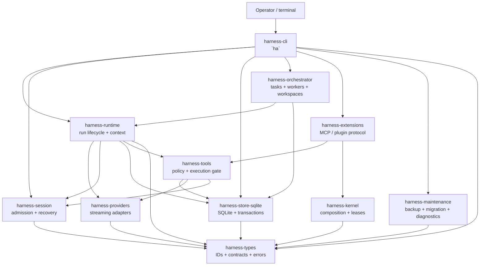

# Tổng quan kiến trúc Harness

[English](ARCHITECTURE_OVERVIEW.en.md) | Tiếng Việt

**Trạng thái:** tài liệu hướng dẫn theo source tree hiện tại, ngày 29/09/2026. Tài liệu này giải thích các ranh giới đang có trong workspace Rust. Nó không hứa rằng mọi mục trong phase plan cũ vẫn là capability đang hoạt động; khi plan và source khác nhau, source cùng các executable tests là nguồn đúng.

## 1. Mục đích và phạm vi

Harness Agents là host coding-agent chạy cục bộ. Binary `ha` sở hữu phần composition hướng người dùng: mở ứng dụng terminal tương tác, chạy prompt headless, cung cấp web surface trên loopback và các lệnh maintenance. Ứng dụng được tách thành các crate để provider, tool, storage implementation hoặc extension protocol không thể âm thầm trở thành authority của domain khác.

Tổng quan này bao quát:

- các crate Rust hiện có trong workspace;
- luồng durable request, execution, recovery, delegation, extension và maintenance;
- ranh giới authority và bảo mật giữa các crate;
- những điều kiến trúc **không** tuyên bố cung cấp.

Tài liệu không thay thế các contract chi tiết trong [architecture review](ARCHITECTURE_REVIEW.vi.md), [operator guide](OPERATOR_GUIDE.vi.md), hay các phase runbook trong [`docs/implementation/`](implementation/README.vi.md).

## 2. Kiến trúc trong một câu

**CLI compose application services; services nhận các command có kiểu và bền vững; SQLite là authority durable; provider đề xuất output của model; tool qua policy gate tạo execution evidence; recovery dựng lại công việc từ records đã commit thay vì từ model narration.**

Hệ quả quan trọng: câu trả lời của model không tự nó là bằng chứng side effect đã xảy ra. Request phải đi qua các ranh giới durable và policy liên quan trước khi được thay đổi workspace hoặc data directory.

## 3. Hình dạng runtime



Đồ thị là bản đồ trách nhiệm, không phải cam kết mọi lời gọi đều synchronous. Nơi cần thiết implementation dùng Tokio và stream; ranh giới durable vẫn được nêu rõ.

## 4. Bản đồ crate

| Crate | Sở hữu | Không sở hữu |
|---|---|---|
| `harness-types` | ID dùng chung, error code, event/receipt contracts, scope và workspace types, schema và quy ước serialization | Business orchestration, provider calls, policy mutation SQL |
| `harness-kernel` | Plugin composition trong process, service requirements, scoped registration, leases và shutdown theo thứ tự | Sandbox native code, input admission, provider state |
| `harness-store-sqlite` | Quy tắc mở/kết nối SQLite, migrations, transactions, durable records, queues, artifacts và query access | Model context policy, terminal rendering, tool/process tùy ý |
| `harness-session` | Atomic input admission, instruction ledger, projections, snapshots và recovery views xác định được | Model classification, process execution, UI state |
| `harness-providers` | Provider request/response types, mock provider, streaming adapters và xử lý response theo provider | Session mutation, tool approval, ghi workspace |
| `harness-runtime` | Run state machine, budgets, context admission, frozen requests, provider attempts, human input và goals | Terminal UI trực tiếp, filesystem/process effects tùy ý |
| `harness-tools` | Coding-tool descriptors, canonicalization, policy decisions, approvals, durable intents/receipts, filesystem/Git/process adapters và strict capability probes | Model selection, terminal widgets, cross-session extraction |
| `harness-orchestrator` | Delegated task contracts, DAG scheduling, worker ownership, budgets, handoffs và isolated workspace planning | Provider protocol, tool policy, raw SQL authority |
| `harness-extensions` | Extension handshake, capability negotiation, MCP discovery/call/task, skill composition, transport và extension leases | Trust chỉ dựa trên tên, bypass host policy, database ownership trực tiếp |
| `harness-maintenance` | Backup/restore verification, compatibility checks, migration copies, retention/tombstones và support diagnostics | Turn execution thông thường hoặc presentation tương tác |
| `harness-cli` | Parse command `ha`, interactive TUI/line UI, CLI composition, loopback web adapter và acceptance fixtures | Domain rules thuộc các library ở trên |

### 4.1 Hướng dependency

Hướng dependency chủ đạo đi vào các contract ổn định:

```text
harness-types
  ├── harness-kernel
  ├── harness-store-sqlite
  │     └── harness-session
  ├── harness-providers
  ├── harness-runtime
  ├── harness-tools
  ├── harness-orchestrator
  ├── harness-extensions
  └── harness-maintenance
                              └── harness-cli compose các service
```

Một số crate tầng trên phụ thuộc nhiều sibling để compose một use case. Điều đó không trao quyền sở hữu records của sibling cho chúng. Mỗi domain record có một authoritative writer; thêm facade hoặc crate không được tạo database authority thứ hai.

## 5. Luồng request chính

### 5.1 Khởi động

1. `harness-cli` parse command và resolve configuration.
2. Host mở data directory SQLite đã chọn và nhận ranh giới single-writer ownership/fencing.
3. CLI tạo các application service cần dùng: session, runtime, tools, orchestrator, extensions và maintenance.
4. Kernel validate required service contracts trước khi nhận việc. Provider bắt buộc bị thiếu hoặc generation không tương thích là composition error, không phải một run thành công ở chế độ degraded.
5. UI tương tác hoặc command headless khởi động mode được chọn.

Sản phẩm chạy trên một host. Phiên tương tác chạy trong một worker nền, mỗi project một worker, và terminal gắn vào nó (daemon của prime-agent, [OPERATOR_GUIDE 12.7](OPERATOR_GUIDE.vi.md#127-agent-chạy-nền)): đóng terminal thì phiên vẫn làm việc, và worker giữ store của project cho mọi agent của nó. Chạy headless và bảo trì vẫn foreground, và mỗi thời điểm chỉ một writable host sở hữu data directory.

### 5.2 User turn và provider attempt

```text
raw input
  -> SessionService::admit_input
  -> durable instruction / event / sequence ACK
  -> context build và mandatory-context admission
  -> frozen request + budget reservation
  -> provider stream
  -> persisted provider attempt và run state
  -> answer hoặc tool action được đề xuất
```

Session service lưu raw input đã được admit trước khi model classification. Runtime sau đó dựng context có giới hạn và freeze request gửi provider. Provider nhận request snapshot, không nhận mutable session state. Provider failure không thể bị viết lại thành side effect thành công.

Run state machine nhận các command đã validate như `start`, `pause`, `resume`, `complete`, `fail`, `cancel` và `dispose`; caller không được ghi next state tùy ý.

### 5.3 Coding-tool action

```text
model / CLI proposal
  -> parse và canonicalize
  -> workspace và capability checks
  -> policy decision
  -> final-action approval (khi cần)
  -> durable intent
  -> process/filesystem/Git execution
  -> immutable receipt + bounded output/artifact references
  -> session projection và user-facing view
```

Mọi coding-tool action đi qua cùng một ranh giới `harness-tools`. Presentation trả về model hoặc UI có thể bị truncate hoặc định hình lại, nhưng không phải execution record có authority. Receipt ghi action đã admit, outcome, output references và các hash liên quan trong phạm vi host biết được.

Process boundary công bố rõ host-environment contract và allowlist. Module strict execution đo capability và export evidence; không được gọi transport, worktree hay process wrapper là sandbox đầy đủ nếu capability matrix chưa chứng minh điều đó.

### 5.4 Recovery

Recovery dùng snapshot cộng với journal tail đã commit:

```text
SQLite snapshot + committed events
  -> deterministic projection
  -> RecoveryView
  -> pending execution / interruption diagnostics
  -> resume, inspect hoặc refuse an toàn
```

Recovery cố ý hoạt động được mà không cần model extractor. Nó phân biệt protocol repair với external side-effect outcome chưa biết. Command không chắc đã chạy không bị tự động replay chỉ vì model turn trước kết thúc bất thường.

## 6. Durable authority và identity

| Mối quan tâm | Durable authority | Ranh giới chính |
|---|---|---|
| Identity và schema vocabulary dùng chung | `harness-types` contracts, được serialize bởi service sở hữu | Typed ID ổn định và payload có version |
| Input và instruction history | `harness-session` thông qua `harness-store-sqlite` | Sequence check và atomic admission |
| Run lifecycle và provider attempts | Records của `harness-runtime` qua store | State transition đã validate, frozen request và budget |
| Tool side effects | Intents/receipts của `harness-tools` và store artifacts | Policy + approval trước execution |
| Task delegation | Task records và delivery contracts của `harness-orchestrator` | Parent/child ownership, depth/worker/budget caps và settlement |
| Extension protocol | Negotiated session và lease state của `harness-extensions` | Version/capability/argument validation và transport bounded |
| Backup, migration và deletion markers | `harness-maintenance` cộng metadata của store | Manifest hashes, compatibility refusal, retention pins/tombstones |
| UI và web projections | `harness-cli` views trên services | Presentation không thành writer thứ hai |

Chuỗi identity lõi là project → task → session → run, với typed IDs và workspace observations gắn ở boundary cần chúng. Session mới không phải quyền duplicate task, và label hiển thị cho model không phải authority grant.

## 7. Delegation và extensions

### Delegation

`harness-orchestrator` coi worker được giao là một durable task, không phải một mảnh prompt. Host materialize role, scope, depth, worker-count và model-request limits trước khi dispatch. Result và parent delivery được lưu để worker có thể hoàn tất khi parent đang pause hoặc được inspect sau crash. Role preset như `coder` hay `reviewer` chỉ là preset; tự tên role không cấp authority.

Scheduler và workspace planner tách khỏi coding-tool gate. Worker có thể đề xuất edit, nhưng host vẫn áp dụng cùng tool policy, approval và receipt rules.

### Extensions và MCP

`harness-extensions` hỗ trợ local extension process và protocol dạng MCP cho tool/resource/task. Handshake negotiate protocol versions và capabilities, validate schema và giới hạn frame, call, discovery page, task cùng cancellation grace period. Skill được compose như đóng góp có giới hạn và pin version; tên skill không bypass host policy.

Thiết kế hiện hỗ trợ tích hợp loopback/local. Remote MCP và tuyên bố OS sandbox là các quyết định riêng trong release matrix. Stdio hay child process là transport boundary, không phải bằng chứng native code độc hại đã được cô lập.

## 8. Composition của configuration, UI và web

`harness-cli` có ba presentation path trên cùng application services:

- interactive terminal chat/TUI hoặc line mode;
- headless `exec`/run cho script và automation;
- authenticated loopback `web` surface.

Configuration được resolve trước khi tạo service. Web adapter phải gọi application services thay vì đi vào CLI internals hoặc mutation SQL trực tiếp. Nhờ vậy request từ terminal và request web tương lai chịu cùng admission, policy, persistence và recovery rules.

UI có thể hiển thị view compact, streaming hoặc redacted. UI không được biến câu provider chưa verify thành execution receipt, cũng không được che refusal, câu hỏi đang chờ trả lời, budget stop hoặc recovery uncertainty.

## 9. Ranh giới bảo mật và lỗi

Kiến trúc làm rõ các bảo đảm sau:

- **Fail closed tại admission:** composition bắt buộc bị thiếu, contract sai, sequence conflict, policy deny và store không tương thích đều dừng trước dependent effect.
- **Durable trước acknowledgement:** raw input và intent record được commit trước khi ACK durable tương ứng trả về.
- **Không tự bịa evidence:** provider output và post-processing không thay thế execution receipt.
- **Công việc có giới hạn:** context, output, process capture, extension frame, delegation depth/workers và provider budget đều có limit rõ.
- **Storage single-writer:** file locking cộng database fencing ngăn hai host ghi cùng data directory như thể cả hai đều sở hữu nó.
- **Degradation inspect được:** recovery diagnostics, release matrices và support bundles chỉ rõ phần chưa verify thay vì báo trạng thái sạch giả.

Đây không phải tuyên bố model luôn đúng, disk không thể hỏng, hay native in-process plugin an toàn trước code độc hại. Native same-process plugin là trusted code. Backup, retention và operator inspection vẫn là một phần của continuity.

## 10. Hỗ trợ hiện tại và giới hạn đã biết

Repository ghi Windows 10/11 x64 là platform được hỗ trợ. Linux xuất hiện trong CI nhưng vẫn unverified/pending support; macOS chưa được test. Release là binary local foreground, không phải hosted service đã public.

Các giới hạn phải được giữ nhất quán trong code và docs:

- agent chạy nền sống cùng tiến trình worker của nó: worker chết hay máy khởi động lại thì agent kết thúc, và không gì khởi động lại chúng (hội thoại vẫn nằm trong store);
- một writable host cho mỗi data directory;
- không bảo đảm model reasoning hoàn hảo hoặc giữ context không giới hạn;
- không tuyên bố transport isolation là OS sandbox;
- không có signed/published release artifact nếu evidence release chưa nói rõ điều đó;
- provider authentication và hành vi gọi remote API trả phí không được chứng minh bằng offline/unit gates.

## 11. Bản đồ kiểm chứng

Khi sửa implementation, dùng các kiểm tra thông thường của repository cùng tests của crate sở hữu:

```powershell
cargo fmt --all -- --check
cargo clippy --workspace --all-targets --locked -- -D warnings
cargo test --workspace --all-targets --locked
pwsh -NoProfile -File scripts/Verify-Docs.ps1
```

Các phase note lịch sử đã được gỡ khỏi bộ tài liệu này. Dùng Git revision và test output hiện tại; không coi plan cũ là release claim mới.

## 12. Tài liệu liên quan

- [Architecture review](ARCHITECTURE_REVIEW.vi.md)
- [Operator guide](OPERATOR_GUIDE.vi.md)
- [Plugin architecture](PLUGIN_ARCHITECTURE.vi.md)
- [Implementation handbook](implementation/README.vi.md)
- [Build and release](BUILD_AND_RELEASE.md)
