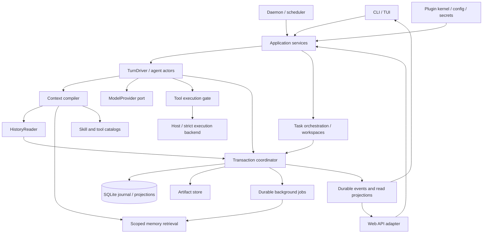

# Harness Agents — Kế hoạch sản phẩm và kiến trúc tổng thể mới

**Revision 1 — 15/09/2026 — Planning, chưa triển khai.**

[English overview](HARNESS_MASTER_PLAN.en.md) · [Nghiên cứu DeerFlow và nguồn tham chiếu](research/DEERFLOW_RESEARCH_2026-09-15.md) · [Roadmap và backlog thực hiện](HARNESS_ROADMAP.vi.md)

## 1. Định hướng và những quyết định chính

Xây **coding-agent harness cá nhân bằng Rust**, sử dụng qua CLI trước, có thể tiếp tục công việc qua nhiều phiên, giao việc cho agent con, và mở rộng thành Web/daemon khi cần. Đây là bản thiết kế mới theo mục tiêu sản phẩm; **không lấy code cũ hay phase cũ làm ràng buộc, không phải danh sách vá implementation hiện tại**.

DeerFlow cung cấp nhiều cơ chế đáng học: một runtime dùng chung cho các giao diện; context/skills nạp có chọn lọc; source history sau compaction; task delegation; sandbox lifecycle; run events; tác vụ dài và lịch chạy. Ta chọn các cơ chế này, thiết kế lại bằng Rust và thu hẹp phạm vi phù hợp sản phẩm cá nhân. [Nguồn D01–D18](research/DEERFLOW_RESEARCH_2026-09-15.md).

Các quyết định mặc định:

| Chủ đề | Quyết định |
|---|---|
| Người dùng và nền tảng | Một người dùng; Windows chính, Linux là nền tảng kiểm chứng thứ hai |
| Sản phẩm đầu tiên | CLI làm trọn coding task, stream tiến độ, diff/checks, approval, pause/resume |
| Runtime | Rust + Tokio, một writable host trên mỗi data directory; modular monolith |
| Dữ liệu | SQLite local + artifact files; journal và domain state giao dịch, không dùng chat summary làm database |
| Khả năng tiếp tục | WorkingState có cấu trúc + checkpoint + journal tail + truy lại nguồn |
| Model | API provider qua adapter; DeepSeek đầu tiên, mock để kiểm thử; cấu hình được model theo vai trò |
| Mở rộng | Built-in traits trước; trusted local skills và MCP client; process plugin có protocol version sau |
| Nhiều agent | Cùng runtime, context riêng; editing worktree riêng; host kiểm chứng kết quả trước tích hợp |
| Bảo vệ thực thi | Host mode cho repo tin cậy; strict backend riêng có capability/kiểm chứng, không gọi policy là sandbox |
| Giao diện sau | Web gọi cùng application service; daemon/scheduler không tạo agent engine riêng |
| Cách phát triển | Lát cắt end-to-end, contracts nhỏ, acceptance và bằng chứng theo revision; không dựng framework tổng quát trước use case |

Các phương án cụ thể trong bản này là đề xuất thiết kế. Chọn tên crate không có nghĩa crate đã tồn tại. Các lệnh `ha` bên dưới là **giao diện mục tiêu**, không phải hướng dẫn dùng binary hiện hành.

## 2. Mục tiêu, phạm vi và định nghĩa thành công

Sản phẩm phải giúp người dùng giao một việc như “sửa parser và chứng minh tests pass”, quan sát tiến độ, can thiệp khi cần, đóng/mở lại và tiếp tục đúng việc mà không kể lại lịch sử. Agent phải biết khác nhau giữa đã thử, đã thực hiện, đã kiểm chứng và đã hoàn thành yêu cầu.

| Nhóm | Bản CLI đầu tiên | v1 hoàn chỉnh | Sau v1 / điều kiện |
|---|---|---|---|
| Coding loop, model streaming, tools | Bắt buộc | Hoàn thiện compatibility | Thêm adapter theo nhu cầu thực tế |
| Task plan, correction, checkpoints, resume | Bắt buộc | Giữ qua delegation và extensions | Remote handoff sau |
| History search/read và artifacts | Bắt buộc | Retention/export/backup có kiểm chứng | Object storage khi cần remote |
| Budget, cancel, approval, diagnostics | Bắt buộc | Toàn bộ child/background usage | Fleet-wide budget nếu multi-host |
| Local instructions và skills | Metadata + activation | Version/provenance và kiểm soát tool | Marketplace/evolution có review sau |
| MCP | Chưa bắt buộc cho lát cắt đầu | Client tools/resources, bounded discovery | Remote auth và Tasks extension theo compatibility |
| Memory tái sử dụng | Có thể tắt hoàn toàn | Scoped memory, FTS, durable extraction | Vector/hybrid nếu số liệu recall cần |
| Đa agent | Chưa bắt buộc | Coordinator + bounded workers, DAG/worktrees | Remote workers sau |
| Web | Chưa cần | Không bắt buộc để release CLI | Event replay, diff/artifact/approval UI |
| Daemon và lịch chạy | Chưa cần | Chưa hứa chạy sau CLI exit | Durable schedules, timezone/misfire, notifications |
| Strict isolation | Thiết kế capability từ đầu | Tùy profile phát hành | Bắt buộc trước tác vụ untrusted hoặc dịch vụ public |
| Web research / code graph / LSP | Ports và nguồn trích dẫn | MCP/integration tùy chọn | Không tự xây mọi crawler/indexer |
| IM channels, SSO, SaaS, multimedia | Ngoài phạm vi | Ngoài phạm vi | Chỉ đưa vào khi yêu cầu sản phẩm thay đổi |

Thành công không phải “model đã trả lời”. Một task hoàn tất khi deliverables/criteria đạt hoặc người dùng chấp nhận, có evidence ở đúng workspace/revision và không còn side effect chưa rõ. Các tiêu chí không thể kiểm tra tự động được đánh dấu cần đánh giá, không tự coi đạt.

## 3. Các hành trình người dùng cần hỗ trợ

1. **Làm một coding task:** chọn project/model, nhập mục tiêu, agent đọc code → đề xuất bước làm → sửa → chạy checks → sửa tiếp nếu fail → trả diff, evidence và việc chưa xong.
2. **Tiếp tục sau gián đoạn:** mở task theo ID, xem recap ngắn từ state đã lưu, xác minh repo thay đổi, reconcile invocation chưa rõ, tiếp tục từ ranh giới an toàn.
3. **Đổi yêu cầu giữa chừng:** input mới được ACK sau commit; cập nhật instruction/plan ở step boundary; thao tác đang chạy có thể bị hủy nếu phạm vi/quyền đã bị thu hồi. Không coi correction là task mới trừ khi người dùng yêu cầu.
4. **Hỏi và duyệt:** clarification có question ID; approval trình action/diff/quyền cụ thể. Trả lời một câu hỏi không đồng nghĩa cho phép command, và thời gian chờ không đồng nghĩa đồng ý.
5. **Giao việc nhiều agent:** xem ai làm gì, file ownership, ngân sách và dependencies; nhận kết quả theo evidence; tích hợp ở workspace riêng rồi kiểm tra revision cuối.
6. **Đọc lại nguồn và trí nhớ:** tìm một quyết định/log cũ bằng source ID; xem memory nào đang dùng, vì sao được chọn, sửa/invalidate; xóa memory không giả vờ xóa mọi bản audit/backup.
7. **Làm lâu hoặc theo lịch:** ở bản daemon, tách task đang chạy, job bên ngoài và schedule; có resume/cancel/dedupe/notification. Không yêu cầu model polling liên tục để chờ một job.

CLI đầu tiên không cần TUI phức tạp. Cần output người đọc được và `--json` ổn định, có exit codes rõ, tương tác được khi có terminal và hành vi non-interactive xác định.

## 4. Mô hình miền và định danh

| Đối tượng | Ý nghĩa và ranh giới |
|---|---|
| Principal | Identity do host xác định; local user, agent actor hoặc trusted service; không nhận nguyên actor ID từ model |
| Project | Identity dự án ổn định, không chỉ tên folder; có registrations khi move/reassociate |
| Workspace | Một checkout/worktree với root, base revision, observed fingerprint và ownership |
| Task | Mục tiêu nghiệp vụ dài hạn, criteria, plan/DAG, state; có thể qua nhiều sessions/runs |
| Session | Chuỗi tương tác và lineage; không tự quyết định task hoàn thành |
| Run | Một lần thực thi được host nhận, có owner/generation, budget, cancel và terminal outcome |
| Turn / Step / Attempt | Turn bắt đầu từ input; step gồm request model và tool batch liên quan; attempt là retry của một request |
| Invocation | Một lần gọi tool có stable ID, normalized action, approval binding, intent và receipt |
| HumanInputRequest | Question hoặc approval request có ID, state, expiry và response correlation |
| WorkingState | Projection mục tiêu, decisions, plan, changes/checks, pending calls/children, blockers và next actions |
| Checkpoint / ContextPacket | Checkpoint là mốc phục hồi; packet là input model đã đóng băng cùng source manifest |
| SourceRef / Artifact | Nguồn journal/file/URL có digest/revision; artifact là bytes có scope và retention |
| MemoryAsset / Version | Tri thức dùng lại có scope, provenance, source dependency, status và version |
| Skill / Plugin / Profile | Skill là hướng dẫn/tài nguyên; plugin là implementation capability; profile là preset composition và quyền yêu cầu |
| BackgroundJob / ExternalTask | Durable extraction/local job hoặc remote task handle; không lẫn với worker agent |
| Schedule / Occurrence / Delivery | Lịch; một lần đến hạn; kết quả/notification được giao với dedupe và receipt |

Mọi cross-component message có schema version, stable ID, correlation/causation IDs và source authority. UUID hoặc ID format khác phải được chốt một lần; timestamp phục vụ quan sát, không thay thứ tự commit/idempotency.

State machines độc lập:

```text
Task: proposed -> ready -> active -> blocked/paused -> completed/canceled
Run: queued -> running -> waiting_input/waiting_approval/waiting_children
            -> finalizing -> completed/failed/canceled/interrupted
Tool: proposed -> authorized -> intent_committed -> executing
              -> succeeded/failed/canceled/outcome_unknown
Acceptance: pending -> satisfied/unsatisfied/unverified
```

`stop_reason` tách khỏi run status: final_answer, token_limit, step_limit, loop_detected, deadline, waiting_external, provider_error, empty_response, policy_denied, outcome_unknown. Một run completed vì kết thúc trả lời vẫn có thể mang acceptance unverified; không tự đóng Task.

## 5. Kiến trúc tổng thể và chiều dependencies



Đề xuất logical modules; có thể gộp crate ở giai đoạn đầu nếu không mất boundary:

| Module | Sở hữu | Không được sở hữu |
|---|---|---|
| `harness-contracts` | IDs, messages/events, schemas, error vocabulary | SQL, network, policy business |
| `harness-core` | Task/run state, invariants, decision/acceptance logic | UI hay concrete DB/provider |
| `harness-store` | SQLite transactions/migrations, queues, projections, artifact metadata | Tự suy verdict từ chat |
| `harness-runtime` | Actors, TurnDriver, retries, budgets, cancellation, provider/tool ports | HTTP/UI framework |
| `harness-context` | Packet compile, history, compaction, contributor admission | Ghi memory/policy ngoài transaction owner |
| `harness-providers` | Adapter/model capability registry, wire protocol/stream normalization | Quyền chạy tool |
| `harness-tools` | Tool descriptors, validators, policy gates, results/receipts | Input trực tiếp không qua host |
| `harness-execution` | Process/filesystem/Git adapters, sandbox lifecycle | Task acceptance từ exit code đơn lẻ |
| `harness-memory` | Assets/retrieval/extraction/provenance/invalidation | Điều phối task qua semantic search |
| `harness-orchestrator` | DAG, agent scheduling, worktrees, integration | Agent engine khác với runtime |
| `harness-extensions` | Kernel lifecycle, skills, MCP, process protocol | Tắt durability hoặc final policy gates |
| `harness-app` | Composition root và application commands/queries | Implementation riêng cho mỗi giao diện |
| `harness-cli`, `harness-api`, `harness-daemon` | Presentation/transport/process lifecycle | SQL mutation hoặc business loop tự viết lại |

Core dùng ports, implementations được inject tại composition root. Dependency tests cấm core/runtime import CLI/API. Không tạo vòng runtime ↔ tools; interface thuộc tầng thấp hơn. Không dùng Rust dynamic-library ABI làm plugin protocol v1. DeerFlow cũng tách harness/app/extension API; đây là pattern nên học. [D01, D19](research/DEERFLOW_RESEARCH_2026-09-15.md).

## 6. Journal, transactions và phục hồi

**Nguồn chuẩn:** một coordinator sở hữu domain writes vào SQLite. Journal và projections bắt buộc cập nhật chung transaction. FTS/vector indexes là projections rebuild được. JSONL dùng export/debug, không là transaction authority thứ hai.

| Ranh giới | Những gì phải commit cùng nhau | Sau commit |
|---|---|---|
| Input admission | Input dedupe + event + instruction/WorkingState change | ACK cho client |
| Run claim | Ownership generation + run transition + command claim | Bắt đầu execution |
| Tool admission | Consume grant + invocation intent + event | Tạo side effect |
| Tool settlement | Receipt + artifact refs + changes/checks projection + event | Model được nhận kết quả |
| Child completion | Child outcome + evidence refs + parent inbox/outbox item | Notification đánh thức parent |
| Memory settlement | Candidate/version mutation + source dispositions + job/cursor state | Retrieval có thể nhìn thấy |
| Terminal outcome | Run outcome/acceptance + delivery record/outbox | UI nhận terminal state |

Journal envelope có `(session_id, seq)` duy nhất, event ID và event schema version. Append kiểm tra expected sequence và owner generation. Một process lock cho data directory kết hợp fencing; writer cũ không được finalizing sau khi mất quyền sở hữu. Không tuyên bố external side effects “exactly once”: host chỉ chống trùng admission/settlement; side effect không xác định phải reconcile.

SQLite local dùng WAL với sync policy cho ACK bền vững, foreign keys, busy timeout, migrations versioned, đọc có timeout. Không đặt WAL database trên network filesystem. [SQLite WAL](https://sqlite.org/wal.html).

Artifact: ghi staging → flush → publish content-addressed bytes → commit reference. GC dựa reachability và grace period; pinned checkpoint/active tasks bảo vệ artifacts liên quan. Nếu crash giữa publish và transaction thì file orphan có thể dọn; không commit reference trước khi publish thành công.

Resume: acquire ownership → đọc snapshot có hash/schema hợp lệ → fold journal tail → reconcile pending calls/jobs/children → đối chiếu workspace → cập nhật stale evidence → dựng context → chạy tiếp. Snapshot lỗi có thể fallback snapshot trước và replay; unknown critical event chặn execution nhưng vẫn cho inspect/export phần an toàn.

Replay, resume, fork khác nhau: replay chỉ đọc; resume tạo execution tiếp; fork tạo lineage/capability mới. Fork không copy one-shot approvals. Rollback hội thoại/checkpoint **không hoàn tác** file edits, Git operations hay tác vụ bên ngoài; undo phải là action riêng có before/after hash và policy.

## 7. Vòng agent, planning và mục tiêu dài hạn

### 7.1. Một turn hoàn chỉnh

1. Nhận/commit input và xác định task/session; từ chối input trùng đã ACK.
2. Claim run; resolve trusted configuration, permissions, model/profile/budget.
3. Compile context từ state/nguồn/skills/memory hợp lệ, validate pairing, budget toàn request rồi freeze.
4. Stream model response; ghi attempt started và outcome; tool chỉ được thực thi sau arguments đầy đủ và validation.
5. Với tool batch: phân loại read/mutate/conflict; mặc định mutate theo thứ tự, chỉ chạy song song các calls chứng minh độc lập.
6. Pipeline tool kiểm tra policy/approval/final guard → intent → executor → durable receipt; giữ exact tool-call correlation.
7. Cập nhật WorkingState từ evidence, nhận steering/correction ở boundary; tiếp tục model với tool results.
8. Khi model trả final: kiểm tra stop reason, deliverables và criteria; persist terminal outcome. Nếu mục tiêu còn dang dở và policy cho tiếp thì tiếp tục có giới hạn, không tự đánh dấu done.

Planning cần thích ứng: task nhỏ có thể làm trực tiếp; task nhiều bước tạo plan items có dependency/criteria. `plan-only`/read-only mode có capability thật, không chỉ prompt. Plan thay đổi phải có reason và supersedes refs; checklist do model tick không chứng minh command đã chạy.

### 7.2. Goal continuation

Goal có objective, criteria, progress signature, continuation count, no-progress count, budget và blocker. Sau run, evaluator đề xuất `satisfied/needs_work/needs_input/external_wait`; typed criteria và evidence checker quyết định phần kiểm chứng được. Chỉ auto-continue khi có next action hợp lệ, quyền còn hiệu lực, không phải external wait và budget còn đủ.

Không cho goal tự tăng ngân sách hoặc đổi criteria cho dễ đạt. Giới hạn tổng continuations/no-progress; hết giới hạn thì checkpoint + báo blocker. Evaluator failure hoặc câu “đã xong” không tạo satisfied. Goal loop phải sử dụng cùng run accounting/inbox; không giấu công việc ngoài audit. [D15](research/DEERFLOW_RESEARCH_2026-09-15.md).

### 7.3. Steering, cancel và retry

Question/approval có ID, state, expiry; answer được dedupe và scope. Hủy truyền xuống cả chờ permit, provider, tools, child processes và descendants; chờ cleanup với deadline, giữ trạng thái chưa rõ nếu chưa xác nhận được. Ctrl-C lần đầu graceful cancel/checkpoint; forced exit phải được thiết kế/test riêng. [Tokio shutdown](https://tokio.rs/tokio/topics/shutdown).

Retry có taxonomy: transport/429/5xx được bounded backoff/jitter và Retry-After phù hợp; auth/schema/invalid arguments không retry mù. Chỉ retry provider attempt trước side effect hoặc tiếp từ committed receipt. Remote job submit timeout không tự submit lại nếu chưa xác định được handle/outcome.

## 8. Provider, model routing, ngân sách và chống lặp

ModelProvider nhận messages typed và tool schemas; trả incremental events với backpressure: text/tool delta, usage, terminal/error. Assembler xử lý nhiều tool indexes, ID/name ở chunk đầu, UTF-8 split, mixed content/tool, finish reason, usage-only frames, output-length/safety termination và EOF. Không gọi tool từ partial JSON.

Model registry có provider/model ID, endpoint, protocol revision, context window, max output, tools/vision/structured-output/reasoning capabilities, usage semantics và pricing metadata nếu có. Unknown khác unsupported. Parameter không hỗ trợ phải báo/cấu hình mapping rõ. Không giả định mọi endpoint OpenAI-compatible giống nhau.

Routing v1 theo profile cố định: main/coder/reviewer/summarizer/extractor; không làm learned router. Fallback chỉ đến model được người dùng cấu hình và ghi lại model thật; không âm thầm đổi provider có chi phí/quyền gửi dữ liệu khác. Freeze request trước dispatch, credentials được resolve ngoài record.

| Loại giới hạn | Cách thực thi |
|---|---|
| Context window | Toàn serialized request + tools + framing + output reserve + margin |
| Token/cost của task/run | Durable ledger, dự toán/reservation trước call, settle actual sau; unknown usage hiển thị rõ |
| Steps/tool calls/retries | Host hard caps; model không tự đổi |
| Wall-clock/deadline | Kiểm tra trước dispatch và khi chờ IO; ghi stop reason |
| Concurrency/queue | Separate permits cho model/process/agent/extraction; queue bounded + timeout |
| Child budgets | Parent reserve trước dispatch; cùng tổng budget dù parent/child compact/restart |

Tiền tệ/pricing revision không trộn thành tổng sai; missing price ghi cost unavailable. Count cả retry, summary, evaluator và extraction. LLM usage không bảo đảm hard monetary cap tuyệt đối; model output cap và reservations là giới hạn trước dispatch, actual bill có thể cập nhật trễ.

Loop detector kết hợp repeated tool+argument signature, frequency window, errors lặp và evidence progress. Cảnh báo rồi hard stop; không cấm polling hợp lệ được scheduler/job service thực hiện. State theo logical run/task continuation; thay session không phải cách reset hết accounting. [D05, D06](research/DEERFLOW_RESEARCH_2026-09-15.md).

## 9. Context engineering và source history

Context compiler là **đường duy nhất** tạo input model; contributors chỉ trả proposed blocks. Sau freeze, middleware/plugin không được chèn text mới mà manifest không ghi.

| Kênh | Authority / cách giữ |
|---|---|
| Host policy | Framework-owned; không chứa summary/model text |
| User instructions/decisions | Có source refs, effective/superseded state; giữ corrections hiện hành |
| Project instructions | Chỉ bản đã chấp nhận theo trust policy; repo text không nâng quyền host |
| WorkingState | Objective/criteria, plan, changes/checks, pending calls/children, blockers |
| Active skills | Metadata + pin digest/version; reload content đúng version khi cần |
| Summary và task notes | Dữ liệu có provenance; notes là `model_report`, không là execution fact |
| History source | Excerpts/records có stable source IDs, scope, digest, pagination |
| Reusable memory | Chỉ asset/version còn quyền và validity; optional budget |
| Recent conversation/tool pairs | Protocol-valid tail, không cắt assistant call khỏi result |

Packet manifest ghi source watermark, contributor/render versions, model/tool/skill/config digests, memory versions, token estimate và omitted reasons. Static policy prefix nên ổn định để có cơ hội cache; không dựa vào cache để giữ instruction đúng.

Compaction chỉ ở safe boundary: đọc source watermark → dựng candidate → validate mandatory channels/pairing/budget → CAS đúng watermark → publish checkpoint. Concurrent correction làm candidate stale phải rebase hoặc fail rõ. Window của run model và summarizer được tính độc lập; summary model window lớn không được khiến run model overflow. [D02, D03](research/DEERFLOW_RESEARCH_2026-09-15.md).

Khi summarizer fail/empty, dựng packet tối thiểu từ WorkingState + decisions + refs và tail. Nếu mandatory state vẫn không vừa thì pause với `mandatory_context_overflow`, không lén bỏ constraints. Source gốc giữ theo retention.

`history_search` trả source IDs + bounded excerpts; `history_read` đọc record phân trang; hỗ trợ task/session lineage. Dùng FTS/BM25 baseline, kiểm tra tiếng Việt có/không dấu và code identifiers; không bắt embeddings cho resume. Index rebuild không tạo source authority mới. Trả rõ `available/partially_expired/unavailable/scope_denied`.

Task notes là scratchpad nhỏ, expected version + sources; sửa/xóa có event. Source tồn tại không chứng minh note diễn giải đúng. Fork chỉ chia sẻ nguồn theo lineage/grants; không mở toàn bộ session khác. Đừng copy archive database riêng của DeerFlow nếu journal đã lưu dữ liệu cần thiết. [D04](research/DEERFLOW_RESEARCH_2026-09-15.md).

## 10. Tools, artifacts và execution backend

Toolset coding cốt lõi: file read/list/search, patch, structured process, Git status/diff/log, task update, history read/search và artifact read/search. Memory, delegation, web fetch/search và MCP được thêm khi milestone tương ứng đã có. Không cần hàng trăm tools ở prompt đầu.

Pipeline cố định: schema validate → resolve principal/scope → normalize action → policy → approval nếu action chưa được cấp → revalidate workspace/policy → intent commit → execute → normalize immutable receipt → project model/UI view. Plugin presentation không thể biến test fail thành pass.

Approval record bind invocation/task/session/principal/action hash/workspace/policy/tool revision/expiry; consume cùng intent transaction. Quyền user đã cấp có phạm vi có thể dùng lại theo policy rõ; không hỏi lại mọi read hoặc mỗi bước vô hại. One-shot grant không dùng cho proposal khác dù command giống nhau.

File patch kiểm tra before hash, binary/encoding/CRLF, symlink/junction, Windows case/path equivalence, races và locked files. Edit scope phải được kiểm tra lại gần thời điểm write. Run process nhận executable/argv/cwd/env có cấu trúc; script shell là request khác được lưu nguyên nghĩa. Process-tree termination, stdout/stderr draining và output quota phải được test trên cả Windows/Linux. Job Objects giúp quản lý nhóm process, không tự bảo đảm filesystem/network confinement. [Microsoft](https://learn.microsoft.com/en-us/windows/win32/procthread/job-objects).

Artifact spool nhận stdout/stderr incremental, content hash, captured/truncated metadata và quota từng call/tổng workspace. Model nhận synopsis có status, exit code, file ref và cách đọc tail/range. Khi spool lỗi/disk full phải giữ failure/unknown đúng nghĩa; không đưa link tới bytes chưa lưu. Search/read/export artifacts áp cùng scopes; raw path không được bypass policy.

ExecutionBackend contract: acquire(workspace, policy) → handle/capabilities; execute/read/write; cancel/drain; release. Tách WorkspaceManager khỏi backend. Host backend phục vụ repo tin cậy; strict backend có filesystem mounts, egress/env/resource controls và lifecycle cleanup được chứng minh. Khi user yêu cầu strict mà backend không đáp ứng, reject profile đó.

Input uploads/files được stage, validate size/type/path, hash, atomic publish và register source; converters chạy như tools có quota. Nội dung file/HTML/PDF là data không phải instructions. Generated HTML preview ở Web phải sandbox/CSP; artifact file không được execute chỉ vì được mở xem. [D10, D17](research/DEERFLOW_RESEARCH_2026-09-15.md).

## 11. Skills, plugins, MCP và tích hợp nghiên cứu

### 11.1. Ba loại mở rộng riêng biệt

- **Skill:** hướng dẫn + resources/scripts, metadata identity/version/digest/provenance và requested tools/secrets. Discovery không có nghĩa activation; activation không cấp quyền thực thi.
- **Built-in plugin:** Rust service implementation có descriptor/dependencies/scope/lifecycle; compiled vào binary.
- **External plugin/MCP server:** process hoặc remote capability, có protocol/schema/trust/cancellation riêng. Không coi MCP server là Rust plugin tương thích tự động.

Kernel chỉ cần dependency DAG, required/optional services, scoped registration tokens, health, startup rollback, shutdown reverse order và config explain. Không cho extension thay transaction authority, tắt policy cuối hay inject sau freeze. Export API nhỏ, versioned; thêm capability khi đã có consumer cần. [D07, D08, D19](research/DEERFLOW_RESEARCH_2026-09-15.md).

Local skills v1 có precedence rõ user/project/profile, conflict IDs và explicit activation; catalogue metadata nhỏ, lazy content. Ghi exact version vào packet; skill đang dùng phải giữ refs qua compact. Update theo step boundary; file nguồn không còn thì báo unavailable. Scripts/secret requests không được chạy khi chỉ mở repo.

### 11.2. MCP và external tasks

Ưu tiên official Rust SDK `rmcp`; pin release và compatibility matrix tại implementation, không ghi “latest” vào dependency. Tại ngày research, spec hiện hành là `2026-07-28`; SDK công bố hỗ trợ và có legacy lifecycle riêng. Cần chọn/test protocol negotiation đúng từng version, không hardcode một handshake cho mọi server. [MCP spec](https://modelcontextprotocol.io/specification/2026-07-28), [Rust SDK](https://github.com/modelcontextprotocol/rust-sdk).

v1: local stdio tools/resources, page-bounded discovery, validate schemas/results, invoke qua tool gate, process lifecycle và minimal env. Custom process-plugin protocol là hợp đồng riêng với frame size/inflight/deadline/cancel/EOF bounds.

Mở rộng remote Streamable HTTP sau khi có endpoint trust/auth/egress policy; token gắn audience và scopes, không forward provider secrets. Prompts/resources là context có provenance. Elicitation đi vào HumanInputService. Sampling/server-initiated model calls mặc định không bật nếu chưa có policy/budget. Tools/resources/prompts và optional extensions có support matrix rõ.

Deferred tool catalog chỉ gồm entries caller được phép thấy; `tool_search` promote schema theo catalog digest và budget. Execute vẫn qua final authorization. Schema đổi hoặc server restart làm invalidation trước lần dùng tiếp.

Tasks extension: durable remote handle + server identity/protocol version + submit idempotency nếu supported, status/poll schedule/deadline, cancel semantics và terminal receipt. Worker service polling có backoff; model chờ kết quả qua inbox. Không submit lại remote mutation chỉ vì local timeout. Chỉ bật extension khi hai phía hỗ trợ. [D18](research/DEERFLOW_RESEARCH_2026-09-15.md).

### 11.3. Code intelligence và web research

V1 có text/Git search đủ dùng; thêm ports cho CodeGraph/LSP/MCP để tìm definitions/callers/references và diagnostics. Index metadata gắn commit/working-tree fingerprint; stale/missing index fallback direct source. Search result không thay source snippet/receipt.

Web search/fetch là capability tùy chọn cho docs/research: lưu URL, retrieval time, content digest và excerpt/source ref; content từ web là untrusted. Network policy xử lý redirects/private endpoints/egress tùy deployment. Cache có freshness/size limits; không cần tự xây browser/crawler engine trước coding MVP.

## 12. Memory dài hạn và tiếp tục công việc

Ba lớp có trách nhiệm khác nhau: journal ghi đã xảy ra gì; WorkingState ghi công việc đang ở đâu; memory tái sử dụng knowledge/preferences qua task. Tắt memory vẫn phải coding/resume được.

MemoryAsset gồm kind, principal/project/task/profile scope, visibility, status và current version. MemoryVersion gồm digest, source events/file hashes/commit, extraction policy/model version, validity, supersedes và dependencies. Model confidence là ranking hint, không phải permission hay proof.

Luồng: committed source → durable extraction job → proposed facts → validate provenance/scope/schema → CAS publish → invalidate derived summaries/indexes khi source đổi. Job key có source range + extractor version; claim/settle/cursor một owner transaction. Notification chỉ đánh thức; restart quét backlog. Không lấy injected memory hoặc summary từ memory làm bằng chứng độc lập mới.

Retrieval: scope/permission/status filter trước ranking; FTS baseline, top-k/token/latency caps; fact source mismatch thì stale/unknown. Query từ objective/next action/files/errors, không quét mọi memory. Inspect giải thích why-selected, source, version và validity. User có thể edit/reject/invalidate/export.

Memory modes: small confirmed profile bootstrap; on-demand search/read; optional query-aware retrieval. Background extraction có budget/priority thấp hơn foreground. Project instructions có authority riêng; memory không được lén override latest user correction.

Không dùng memory search làm message bus hoặc task completion store. Vector/hybrid/RRF chỉ thêm sau benchmark FTS, có embedding version/dimension/reindex và deletion propagation. DeerFlow có backend-neutral interface nhưng queue implementation được đọc không thay durable job contract của kế hoạch này. [D11](research/DEERFLOW_RESEARCH_2026-09-15.md).

## 13. Điều phối nhiều agent và tích hợp code

Agent roles là presets của cùng runtime: explorer, coder, reviewer, verifier. Coordinator có thể tự làm phần nhỏ; chỉ delegate khi có subtask độc lập/đủ scope và dự toán có lợi. Mặc định một coordinator, tối đa ba workers; các cap cấu hình và đo lại, không phải lời hứa tốc độ gấp bốn.

TaskBrief: task/parent ID, objective, criteria, context/source refs, base snapshot, file ownership, granted capabilities, budget/deadline. Child context là snapshot bất biến; cập nhật sau qua inbox có sequence. Không copy parent active tool calls thành child executions hoặc copy approvals.

DAG reject cycles; dependencies failed/blocked phải propagate có lý do; queue bound/timeout; parent chờ nhả compute permit. Scheduler tách actor concurrency khỏi model/process capacity để tránh oversubscription. Child state/result/delivery bền vững và dedupe.

Editing workers dùng worktree riêng từ một base đã xác minh; host serialize shared Git metadata. V1 yêu cầu clean base hoặc snapshot riêng được tạo rõ. Dirty repo support cần giữ tracked/untracked selections, index và HEAD; chưa có proof thì từ chối tự động snapshot, không tự stash/reset. Git worktrees dùng chung metadata, không phải security boundary. [Git documentation](https://git-scm.com/docs/git-worktree).

TaskResult gồm outcome/stop reason, deliverables, diff/artifacts, receipt refs, base/result/tested revision và limitations. Host verifier kiểm tra file scope, evidence correspondence và typed acceptance; unsupported criterion là unverified. “Done” không evidence không được accepted. [D09](research/DEERFLOW_RESEARCH_2026-09-15.md).

Tích hợp theo dependency vào integration worktree; resolve conflict có record; chạy checks trên **revision tích hợp cuối**. Recheck user workspace fingerprint trước apply; nếu user đã đổi thì pause/rebase có chủ đích. Agent không tự commit/push/release nếu task chưa có authority tương ứng.

Parent crash không làm mất result đã commit; child chết giữ checkpoint/reconciliation state, không reassign task completed. Foreground host exit mặc định cancel/drain children. Chỉ daemon mode mới được tiếp tục sau client detach.

## 14. Daemon, scheduler và công việc bên ngoài

Đưa vào kiến trúc từ đầu, triển khai sau CLI ổn định. Daemon là owner của cùng application services; CLI/Web trở thành clients. Windows local IPC cần user ACL, Linux socket permissions; transport API không được giả danh actor từ payload.

Schedule: timezone IANA + type once/interval/cron + next occurrence, context mode, project/task template, model/profile, budget và overlap policy. Occurrence ID/idempotency được lưu trước launch; launch và terminal status riêng. Queue đầy không được làm mất lần đến hạn mà không có misfire policy.

Chốt explicit semantics: timezone/DST, clock changes, missed runs (`skip/latest/bounded_catch_up`), overlap (`skip/queue`, không tự chạy trùng), manual trigger không tiêu thụ future schedule, pause/delete/cancel khác nhau. Test bằng fake clock và restart ở mọi launch boundary.

Non-interactive run chỉ dùng quyền đã cấp; thiếu input/approval thì chuyển waiting/blocked và notify, không tự bấm chấp nhận. Schedule không tăng budget hoặc permissions của template. Mặc định notify khi hoàn tất/lỗi/cần user, không spam lúc không đổi. Delivery có outbox/dedupe/receipt và retry riêng. [D16](research/DEERFLOW_RESEARCH_2026-09-15.md).

IM gateway/webhooks là adapter tương lai: verify source signature/replay window, map external conversation → principal/project/task, inbound dedupe và delivery receipts. Không cần Redis/multi-worker trước khi một daemon local đúng. Multi-host về sau phải thiết kế distributed ownership, remote cancel và external side-effect fencing riêng; SQLite local không tự mở rộng thành distributed DB.

## 15. CLI, Web API và trải nghiệm kiểm tra kết quả

CLI mục tiêu: `project`, `run`, `task status/continue/pause/cancel`, `session inspect/replay/fork`, `context inspect/compact`, `history search/read`, `artifacts`, `memory`, `skills`, `mcp`, `config explain`, `doctor`, `export/backup`. Commands được bổ sung theo milestone, không scaffold menu rỗng.

CLI progress phân biệt model đang nghĩ/stream, tool đang chạy, chờ permission, chờ child/external task; hiển thị spend/limits và workspace mode. Recap sau resume gồm mục tiêu, việc xong có bằng chứng, việc còn, blockers và next action. Final gồm deliverables/diff, checks đúng revision, failures/uncertainties, cách đọc artifacts.

Application API chuẩn hóa commands có client request ID và queries; event stream có sequence/cursor, schema version, correlation IDs. Begin/cancel/approve/answer dedupe; identity lấy từ transport auth. API adapter không sửa SQL trực tiếp hoặc parse CLI text.

Web tối thiểu: project/task list, conversation/plan, live tools và agent tree, diff/check receipts, artifact preview/download, approval/questions, context/memory inspection, settings/capabilities. Keyboard/accessibility và tiếng Việt cần được kiểm tra. Upload/preview không là đường chạy code.

SSE live buffer là acceleration; durable store là nguồn reload. Reconnect hỗ trợ cursor, backfill/dedupe, gap event nếu buffer đã bị trim; reload projection rồi nối tail. Out-of-order event không đảo terminal task thành running. Chat text không là protocol lifecycle. [D12, D13](research/DEERFLOW_RESEARCH_2026-09-15.md).

Web bind loopback mặc định, auth/session và origin checks cho mutations; local không mặc định an toàn khỏi website khác trên browser. Public/multi-user mode cần tenant scoping, TLS/proxy trust, auth hardening, upload limits/rate limits và strict execution profile trước khi được hỗ trợ. Không quảng cáo public deployment chỉ vì bật listen `0.0.0.0`. [D20](research/DEERFLOW_RESEARCH_2026-09-15.md).

## 16. Bảo mật, cấu hình và vòng đời dữ liệu

Trust hierarchy: host policy → explicit user grants → accepted project/profile config; repo/web/tool/skill/memory content không tạo authority. Effective permissions là giao của các giới hạn, không cộng quyền từ nhiều agent. Model-supplied actor/workspace/secret identifiers phải được host resolve/validate.

Credentials ở OS credential store hoặc explicit env config; secret references trong config, không giá trị trong journal/prompts. Process env bắt đầu từ allowlist cần thiết rồi inject scoped secrets được phép; chú ý credential helpers, agent sockets và file paths cũng có thể trao quyền. Redaction theo tên biến/regex chỉ là lớp hỗ trợ, không bảo đảm phát hiện mọi bí mật. [D21](research/DEERFLOW_RESEARCH_2026-09-15.md).

Config schema strict, explain nguồn/precedence, effective revision và unsupported options. Separate fields: step-reloadable (model defaults, budgets cho run mới), startup-only (store/backend/pools/transport), sensitive/trusted-only (plugin executables/secret grants). Đang chạy giữ snapshot; đổi quyền khẩn cấp phải có revocation path tới final gate/cancel, không đợi restart mới chặn action. [D14](research/DEERFLOW_RESEARCH_2026-09-15.md).

Retention policies theo loại dữ liệu: active task/checkpoint/evidence được pin; expired history/artifacts báo mất nguồn rõ; memory deletion truyền tới derived/index entries; backups có thời hạn riêng. Archive task chỉ đổi visibility, không cancel/delete dữ liệu. Delete cần policy cho children/schedules/lineage refs; không xóa ancestors mà fork/resume còn cần. DeerFlow retention document được khảo sát là **draft**, chỉ dùng như nguồn failure modes. [D22](research/DEERFLOW_RESEARCH_2026-09-15.md).

Backup phải nhất quán database + reachable artifact manifest, hash và schema version; restore vào thư mục mới, verify integrity rồi mới activate. Không copy riêng file `.db` khi WAL đang hoạt động rồi coi là backup đủ. [SQLite backup API](https://sqlite.org/backup.html).

Migration: forward schema versions, compatibility readers/upcasters, backup trước destructive conversion; interrupted migration có recovery. Không overwrite data directory cũ khi bắt đầu implementation mới. Import/export có version và phần không tương thích được báo; upgrade/rollback binary không mặc nhiên downgrade DB.

## 17. Quan sát hệ thống, kiểm thử và vận hành

Journal là audit execution; structured logs/metrics/traces hỗ trợ chẩn đoán. Correlate principal/project/task/session/run/step/attempt/invocation/artifact; không log secrets/raw content mặc định trong telemetry. Trace exporter optional/offline, failure không làm mất domain commits.

Metrics: task acceptance và false completion; resume/source recall; latency/TTFT; token/cost theo foreground/summary/extraction/children; tool/queue/deadline/cancel; artifact/DB/WAL growth; memory backlog; integration conflicts; provider error categories. `doctor` kiểm tra config/provider capability/store/migrations/runner. Support bundle có manifest/redacted diagnostics, không tự gom transcript/env đầy đủ.

Testing theo lớp: pure reducers/protocol validators; real SQLite/runner/FS integration; fault injection/crash boundaries; end-to-end coding với deterministic provider; optional bounded live smoke; portability Windows/Linux; schema compatibility và dependency-boundary tests. Acceptance phải chạy được bằng một command gate và xác nhận test discovery, không nhận zero tests là pass.

Eval suite dùng cùng task/config/budget: single-agent baseline, history/compaction on/off, memory on/off, deferred tools on/off, multi-agent on/off. Chấm deliverables/criteria/evidence, cost và thời gian tích hợp; không chỉ chấm văn phong report. Bộ tiếng Việt/code identifiers và repo thay đổi ngoài agent là bắt buộc.

Không đặt con số tiết kiệm token/tỷ lệ thành công production khi chưa có baseline. Safety/durability cases bắt buộc không có vi phạm; performance thresholds được chốt sau benchmark đầu. Test của upstream được đọc là design evidence, không có nghĩa bản Rust được kiểm chứng.

Release: pinned dependencies/toolchain trong implementation, fmt/clippy/tests, vulnerability/license/dependency review phù hợp, build Windows/Linux, checksums và provenance, changelog/migration guide, install/uninstall, sample config không secrets. Không tự update binary/plugin trong task đang chạy. Release tag/artifact publish là action riêng có authority rõ.

## 18. Những quyết định chưa cần làm lớn và rủi ro thiết kế

| Rủi ro / lựa chọn | Quyết định mặc định | Khi nào xét lại |
|---|---|---|
| Framework/plugin quá rộng | Chỉ ports có consumer, built-ins trước | Có extension thật cần phân phối độc lập |
| Journal/receipt tăng nhanh | Bounded artifacts, projections, retention + backup đo được | Số liệu storage vượt target |
| Summary làm mất chi tiết | Structured state + source history + fallback | Cải tiến summarizer bằng eval, không thay nguồn chuẩn |
| False completion | Run/task/acceptance tách; typed evidence | Criteria ngôn ngữ cần human review hoặc evaluator hỗ trợ |
| Nhiều agents tốn phí/xung đột | Bounded delegation, worktrees, integrated checks | Đo được gain trên task đại diện |
| Sandbox portability | Công bố support matrix; strict backend riêng | Untrusted tasks trở thành use case chính |
| Memory nhiễm/sai/stale | Source-backed proposals, CAS, invalidation | Hybrid retrieval chỉ khi baseline thiếu recall |
| Model/protocol thay đổi | Adapter conformance + pinned capability matrix | Nâng SDK/provider có tests riêng |
| Daemon/remote phức tạp | Một writable host trước | Có yêu cầu background/multi-host thật |
| Thời gian ước lượng sai | Re-estimate sau single-agent slice | Không chia ngày công theo số agent một cách máy móc |

Không có review tĩnh nào chứng minh “không còn mọi thiếu sót”. Để kiểm soát điều này, roadmap đi kèm coverage matrix: mỗi subsystem có owner, milestone, failure mode và acceptance. Các quyết định mở có default và điều kiện đổi, tránh để plan phụ thuộc câu hỏi chưa trả lời.

## 19. Quan hệ với tài liệu cũ và cách bắt đầu

Đối với **phát triển tương lai**, dùng master plan này và roadmap mới làm baseline. Các tài liệu P0–P8 và evidence cũ giữ lại như hồ sơ lịch sử; không cần sửa code cũ để phù hợp trước khi chốt thiết kế. Plan mới không tuyên bố migration đã chạy hoặc dữ liệu cũ bị bỏ.

Bước đầu là **M0: chốt contracts và acceptance nền tảng** trong roadmap. Chốt ADR về task/run/step, transaction ownership, execution authority, context provenance, plugin boundary và compatibility. Sau đó làm từng lát cắt đủ chạy/test, không triển khai toàn bộ sơ đồ trong một đợt.

Mục tiêu đầu tiên: một agent có thể sửa fixture repository, gặp test fail, tự sửa tiếp, trả evidence đúng revision, bị kill/reopen vẫn tiếp tục mà không lặp side effect. Đây là nền tảng để skills, memory, multi-agent, Web và scheduler phát triển ổn định.
