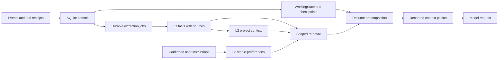

# Memory and work continuity

English | [Tiếng Việt](MEMORY_AND_CONTINUITY.vi.md)

Revision 2 — September 10, 2026. Proposed design for a personal Rust coding harness. Companion to the [implementation plan](RUST_HARNESS_PLAN.en.md) and [plugin contracts](PLUGIN_ARCHITECTURE.en.md). All structures, commands, and targets below require implementation and verification. Sections 14–18 define the additional persistence and context-admission contracts from the second review.

## 1. Product requirement

The user has tried multiple harnesses and encountered the same problem: agents forget completed work after context exhaustion or reopening a session. Memory must therefore support continuing work as well as reusing knowledge across agents.

Distinguish these situations:

| Situation | Required restoration |
|---|---|
| Compaction within a session | Objective, current instructions, completed work, pending tools, decisions, and next action |
| Closing/reopening the same session | All committed state, inbox, tasks, artifacts, and child-agent state |
| A new session for an existing task | Correct task identity and checkpoint without importing unrelated work |
| Another agent takes over | Task brief, authority, input revision, existing results, and remaining work |
| Reopening after repository changes | Detect differences and mark evidence/memory for revalidation |

Acceptance standard: the user can say “continue,” and the harness reconstructs the right state from persisted data. When several tasks are plausible, the CLI provides selection instead of silently guessing.

## 2. What Tencent actually does

Research is pinned to [`906b5823b5106eed8f842b62f16d23228838149a`](https://github.com/TencentCloud/TencentDB-Agent-Memory/tree/906b5823b5106eed8f842b62f16d23228838149a). This section describes inspected source; subsequent sections propose our Rust design.

### 2.1. Separate memory granularity

Tencent distinguishes L0 conversations, L1 atomic information, L2 scenarios, and L3 long-term profiles. Assets and bindings equip each agent with relevant knowledge. [Tencent overview](https://github.com/TencentCloud/TencentDB-Agent-Memory/blob/906b5823b5106eed8f842b62f16d23228838149a/README.md).

The inspected `l0-recorder.ts` path selects user/assistant messages, filters content, and removes previously injected material to limit memory feedback loops. This capture path is therefore not equivalent to a complete journal of every tool side effect. [L0 recorder](https://github.com/TencentCloud/TencentDB-Agent-Memory/blob/906b5823b5106eed8f842b62f16d23228838149a/MemoryCore/src/core/conversation/l0-recorder.ts).

### 2.2. Distinguish the legacy pipeline from the current Gateway

The repository retains an older `MemoryPipelineManager`. Its `recoverPendingSessions()` explains that in-memory message buffers are not restored intact and schedules L2 as best-effort recovery. This describes the inspected legacy path; it does not establish data loss across the entire product. [Legacy pipeline](https://github.com/TencentCloud/TencentDB-Agent-Memory/blob/906b5823b5106eed8f842b62f16d23228838149a/MemoryCore/src/utils/pipeline-manager.ts#L1143).

The current Gateway wires together `StatefulPipelineManager`, `IStateBackend`, `TimerScanner`, and `PipelineWorker`. The manager states that message content already resides in the Store; notification primarily updates progress and schedules work. The executor calls `runL1WithStore()` and includes backlog-draining logic. [Gateway wiring](https://github.com/TencentCloud/TencentDB-Agent-Memory/blob/906b5823b5106eed8f842b62f16d23228838149a/MemoryCore/src/gateway/server.ts), [Stateful manager](https://github.com/TencentCloud/TencentDB-Agent-Memory/blob/906b5823b5106eed8f842b62f16d23228838149a/MemoryCore/src/utils/stateful-pipeline-manager.ts).

Workers implement claims, acknowledgments, retries, locks, and ownership-loss checks. Durability depends on the backend: the local implementation uses process-local maps, arrays, and timers. Having a queue alone does not establish process-crash recovery. [Worker](https://github.com/TencentCloud/TencentDB-Agent-Memory/blob/906b5823b5106eed8f842b62f16d23228838149a/MemoryCore/src/services/pipeline-worker.ts), [Local backend](https://github.com/TencentCloud/TencentDB-Agent-Memory/blob/906b5823b5106eed8f842b62f16d23228838149a/MemoryCore/src/core/state/local-backend.ts).

### 2.3. Checkpoint ownership

Tencent separates `runner_states` from `pipeline_states`: capture/extraction cursors do not share write ownership with counters and scheduling fields. Checkpoint updates also have serialization mechanisms. This directly informs concurrent progress recording in our harness. [Checkpoint](https://github.com/TencentCloud/TencentDB-Agent-Memory/blob/906b5823b5106eed8f842b62f16d23228838149a/MemoryCore/src/utils/checkpoint.ts).

### 2.4. Selective memory retrieval

The inspected proxy path combines an agent's own memory with assets bound from other agents; its helper currently limits imported agent contexts to two. The profile injector adds L3 and an L2 index, retrieving detailed content as needed. These are implementation choices, not limits that Rust must copy. [Fixed assets](https://github.com/TencentCloud/TencentDB-Agent-Memory/blob/906b5823b5106eed8f842b62f16d23228838149a/MemoryProxy/src/injection/injectors/tdai-fixed-asset.ts), [Profile injector](https://github.com/TencentCloud/TencentDB-Agent-Memory/blob/906b5823b5106eed8f842b62f16d23228838149a/MemoryProxy/src/injection/injectors/tdai-profile-memory-injector.ts).

L1 retrieval supports keywords and vectors, merging rankings using RRF. Deduplication has its own supplied isolation scope; it is not a consensus protocol between agents. [Candidate recall](https://github.com/TencentCloud/TencentDB-Agent-Memory/blob/906b5823b5106eed8f842b62f16d23228838149a/MemoryCore/src/core/tools/l1-candidate-recall.ts), [Deduplication](https://github.com/TencentCloud/TencentDB-Agent-Memory/blob/906b5823b5106eed8f842b62f16d23228838149a/MemoryCore/src/core/record/l1-dedup.ts).

Verification scope: documentation and relevant source-path inspection, without running Tencent benchmarks or crash tests. Comments describing guarantees are not treated as demonstrated runtime results.

### 2.5. Stable profile identity is not session identity

Tencent's profile code addresses L2/L3 by team-and-agent, intentionally excluding session/user dimensions when a team is present. Its direct lookup also validates returned row scope; a hashed key alone does not replace authorization. This explains cross-session profile continuity, but is not a specification for restoring a coding task. Our design keeps `agent_profile_id` stable and adds a separate project boundary. [Profile scope implementation](https://github.com/TencentCloud/TencentDB-Agent-Memory/blob/906b5823b5106eed8f842b62f16d23228838149a/MemoryCore/src/core/profile/profile-scope.ts).

The profile proxy uses a session-initialization cache, bounded L3 content and an L2 navigation index. That saves context but cannot itself establish that a running session has the latest decision. We refresh version/authorization metadata at request boundaries. [Profile injector](https://github.com/TencentCloud/TencentDB-Agent-Memory/blob/906b5823b5106eed8f842b62f16d23228838149a/MemoryProxy/src/injection/injectors/tdai-profile-memory-injector.ts).

### 2.6. Cursor and extraction-strategy details

The L1 runner reads oldest-first, limits work, extends its slice across equal-timestamp rows, and reports backlog for later processing. It also documents a remaining edge case when same-timestamp records extend beyond the fetched page, with a composite cursor proposed in source. Rust will use stable sequences, not assume timestamps are unique. This is source inspection, not a reproduced Tencent incident. [L1 runner](https://github.com/TencentCloud/TencentDB-Agent-Memory/blob/906b5823b5106eed8f842b62f16d23228838149a/MemoryCore/src/utils/pipeline-factory.ts#L506), [SQLite query](https://github.com/TencentCloud/TencentDB-Agent-Memory/blob/906b5823b5106eed8f842b62f16d23228838149a/MemoryCore/src/core/store/sqlite/memory-store.ts#L710).

Memory extraction prompts are themselves versioned settings. Tencent resolves an agent override before team and instance settings, with system fallback; composition appends strategy constraints. Our extractor records the resolved strategy version/digest in each job and validates output structurally. Prompt guards are not a substitute for host validation. [Resolver](https://github.com/TencentCloud/TencentDB-Agent-Memory/blob/906b5823b5106eed8f842b62f16d23228838149a/MemoryCore/src/core/memory-prompt/resolver.ts), [Composer](https://github.com/TencentCloud/TencentDB-Agent-Memory/blob/906b5823b5106eed8f842b62f16d23228838149a/MemoryCore/src/core/memory-prompt/composer.ts).

## 3. Applying the design in Rust: two update paths



The work-continuation path updates transactionally as execution proceeds. Knowledge extraction runs in the background. Slow embeddings, failed summaries, or memory backlogs must not prevent journal-based resume.

The harness's L0 source is a provenance-preserving projection of its session journal, avoiding a second competing source of truth. Raw API credentials are not memory data.

## 4. Required WorkingState

WorkingState is schema-defined business state, not merely prose generated at the end of a session.

```text
WorkingState
  schema_version, session_id, task_id, revision, through_event_seq
  objective_ref, acceptance_criteria_refs
  active_instruction_refs, decision_refs, superseded_decision_refs
  plan_items: id, status, owner, dependencies, evidence_refs
  workspace: project_id, worktree_id, base_commit, observed_fingerprint
  changes: path, before_hash, after_hash, tool_execution_id
  checks: command_ref, outcome, tested_revision, artifact_ref
  pending_tool_calls: execution_id, state, reconciliation_hint
  children: agent_run_id, task_id, status, result_ref
  blockers, pending_questions, next_action_proposals
```

Separate user instructions, runtime observations, and model proposals. A model may propose next actions and plan updates, but its claim that a test passed cannot become a runner receipt by itself.

Update points include incoming requests/corrections, decisions, settled tools, task transitions, child handoffs/results, pre-compaction, pause, and shutdown. Required fields contain evidence or an explicit `unknown`; never invent data to fill a checkpoint.

Example: the agent edited `parser.rs`, test A passed on revision R, and test B failed without a fix. Resume must retain failure B, identify the edited file, and continue by addressing B. Compaction must not convert “attempted” into “completed.”

## 5. Resume procedure

1. Resolve project/task/session and acquire ownership with a new generation.
2. Load the latest valid snapshot, validate schema/hash, and fold the event tail through the newest sequence.
3. Restore inbox, task DAG, decisions, WorkingState, and tool/child state.
4. Reconcile worktrees, Git revisions, and file fingerprints; mark stale evidence.
5. Reconcile uncertain executions. File patches can compare before/after hashes; arbitrary shell commands require operation-specific checks. Do not automatically repeat an unresolved execution.
6. Build a context packet from current state and permitted memory; persist exact rendered content and source references.
7. Display a recovery receipt and execute an appropriate next action when state is sufficiently clear.

A damaged snapshot can be rebuilt from the journal. Corruption inside the journal must report the precise location instead of silently skipping business-relevant events. Recovery receipts report snapshot coverage, replay coverage, and unresolved checks.

A new session continuing an existing task records the task link and source checkpoint. Model changes reuse structured state; provider-specific message blocks transfer only when supported by the destination adapter.

## 6. Compaction that preserves the task

Compute the budget before a request: context window minus output reservation, protocol overhead, and a safety margin. An initial compaction threshold can be 70–80% of available input capacity, then adjusted through measurements rather than hard-coded for one model.

Context retention order:

1. System policy, currently effective user instructions and mandatory project rules.
2. Objective, acceptance criteria, active decisions, and WorkingState.
3. Unprocessed input, required tool call/result pairs, and recent results.
4. Recent conversation directly relevant to the next action.
5. Relevant memory/project facts and documentation within the remaining budget.

Never split a tool call/result pair. Superseded summaries cannot supply current decisions. Raw history remains available while a projection selects what the model sees.

Procedure: record `compaction_started` and source sequence → generate a candidate summary → validate required fields → commit a new checkpoint with compare-and-swap → record `compaction_completed`. Do not hold a SQL transaction during a model call. If source state changed, fold the new tail or regenerate the candidate.

If summarization fails or exhausts its budget, build a deterministic fallback from WorkingState and the event tail. If mandatory data cannot fit, pause with a concrete explanation or require a larger model context; do not silently discard user requirements.

Context packets contain `checkpoint_id`, `through_seq`, memory ids/versions, rendering version, token estimate, and content hash. Replay reads recorded packets rather than retrieving current memory to rewrite the past.

## 7. Long-term memory scopes

| Scope | Example | Use |
|---|---|---|
| User | User-confirmed Rust preference and communication conventions | Relevant portions only |
| Project | Architecture, verification commands, constraints, decision records | Agents authorized for that project |
| Task | Handoffs, provisional conclusions, branch results | Assigned task participants |
| Agent profile | Skills and experience associated with a stable role | Profile bindings |
| Session | History and notes from one run | Authorized restoration and retrieval |

Separate a stable `agent_profile_id` from a per-execution `agent_run_id`. A new process must not erase memory identity. Agents belonging to one user still receive distinct scopes; account ownership does not automatically grant every worker access to every asset.

Apply actor authorization, project/task scope, bindings, asset state/version, and source validity before selecting top-k results. The host supplies identity; model arguments cannot choose it freely. Bindings determine candidate eligibility, while policy determines permission to use an asset.

Permissions cover `read`, `propose`, `publish`, `bind`, and `invalidate`. Roles and memory content cannot escalate authority. Enforce checks on search, direct reads, artifact access, and exports.

## 8. Memory data model

```text
MemoryAsset
  id, kind, owner_id, project_id, scope, visibility, status
  current_version, created_by, created_at, updated_at

MemoryVersion
  asset_id, version, content_or_artifact_ref, content_hash
  source_event_refs, source_file_hashes, source_commit
  provenance_kind, evidence_state, confidence_annotation
  valid_from, expires_at, supersedes, extractor_version

MemoryBinding
  profile_or_task_id, asset_id, injection_mode, priority

MemoryGrant
  principal_id, asset_id_or_scope, allowed_actions, revision
```

Proposed states: `candidate`, `active`, `superseded`, `invalidated`, and `archived`. Validity is a separate field (`valid`, `stale`, `unknown`), with a reason and checked revision. Model confidence is a ranking signal, not evidence or authorization.

Wiki and code facts reference source commits/file hashes. Changes mark dependent facts stale. Before a complete CodeGraph exists, use conservative file-level invalidation and check Git changes during resume.

## 9. Capture, deduplication, and concurrent writes

Commit source events and extraction jobs in one transaction. Job idempotency keys include session, event range, and extractor version. Workers claim jobs with owner/generation checks, then commit results, cursors, and job state together after confirming ownership.

Do not use timestamps as the sole progress key: use event sequences and stable source ids. Simultaneous writes from different agents must not skip each other's data. SQLite stores pending jobs; startup scans the journal against extraction cursors, including cases where notifications were lost.

Extract only from actual source material. Injected context, extractor outputs, and summaries derived from memory must not count as new independent evidence. Prevent self-reinforcing memory through provenance rather than relying only on tag stripping.

Deduplicate by scope/source first, then use keyword/vector retrieval to find similar candidates. An LLM can propose merges, but writes require expected versions. Conflicts require rebasing or reevaluation instead of last-write-wins overwrites.

Apparently conflicting facts may coexist when tied to different revisions, branches, or dates. New user decisions explicitly supersede older ones. Agreement among several agents is not independent confirmation when they share the same mistaken source.

Simple project facts may publish automatically under policy with checked observations. Long-term behavioral preferences derive from user instructions; model inferences remain candidates. All records can be inspected, corrected, or invalidated through the CLI.

## 10. Retrieval and injection

v1 uses SQLite FTS5/BM25 and metadata filters to establish a local baseline. Tencent also supports keyword recall without embeddings. [SQLite FTS5](https://sqlite.org/fts5.html), [Tencent recall](https://github.com/TencentCloud/TencentDB-Agent-Memory/blob/906b5823b5106eed8f842b62f16d23228838149a/MemoryCore/src/core/hooks/auto-recall.ts).

Bootstrap context includes a short confirmed profile, a project index, WorkingState, and relevant decisions. Detailed queries derive from the objective, next action, files/symbols, and current errors. Tests cover Vietnamese with/without diacritics and code identifiers.

When embeddings are added, both keyword and vector searches operate within authorized candidates before retrieval; RRF merges rankings. Do not directly add unnormalized BM25 and cosine scores. Index metadata records embedding model/version/dimension; changing models requires reindexing.

Each packet has item, token, and time limits. Initial experimental settings: up to eight facts plus one or two project summaries, with approximately 2,000 tokens of supplemental memory, separate from mandatory WorkingState. These are tunable proposals, not Tencent guarantees.

Retrieval failures record degradation while journal/WorkingState remain available. Unresolved authorization yields no data. Cache keys include project/task/profile, query, binding revision, ACL revision, and asset revision.

Revocation and invalidation affect the next context build, including the projection of earlier memory injections when their content must be excluded from model input. Historical usage may remain for authorized auditing under retention rules; invalidation does not mean deletion of every historical copy.

## 11. Sharing between agents

Example: an explorer discovers a constraint, a coder implements, a verifier checks, and the coordinator receives results.

- The explorer publishes a task-scoped observation with source file/hash.
- The coordinator sends a handoff containing task id, input revision, observation ids, and acceptance criteria.
- The coder receives a task snapshot and starting memory bindings; later changes enter at a logged step boundary.
- The verifier receives the diff and exact revision to check, then records runner receipts.
- The coordinator updates task state from validated results and proposes reusable lessons for project memory.

Task completion, dependencies, and handoff messages use durable task state/inboxes. Semantic search is not the authority for whether an agent completed or is still running.

Each request records the memory versions it saw. L2 aggregation uses project/profile CAS to prevent competing workers from overwriting shared context. Reusable memory may be eventually consistent; work coordination requires explicit transactional semantics.

## 12. Continuity acceptance suite

| Test | Action | Required result |
|---|---|---|
| C01 | Kill immediately after input ACK | Input appears exactly once after reopening |
| C02 | Kill after result commit, before checkpoint | Tail folding restores the result; tool is not repeated |
| C03 | Kill after side effect, before receipt | Outcome is uncertain; reconcile before continuation |
| C04 | Force five compactions within a task | Preserve objectives, corrections, decisions, failures, and pending work |
| C05 | Fail summary/embedding/extraction | Resume uses WorkingState; jobs remain retryable |
| C06 | Continue an old task in a new session | Correct checkpoint, scope, and artifacts without unrelated task data |
| C07 | Three agents publish concurrently | No lost updates; CAS conflicts handled; independent cursors |
| C08 | Agent forges actor/project arguments | Search/read/export remain within its scope |
| C09 | User replaces decision A with B | Resume/compaction uses B; A is marked superseded |
| C10 | Repository revision changes externally | Related receipts and code facts become stale |
| C11 | Stop parent as a child completes | Recover durable result without reassigning completed work |
| C12 | Crash extractor between write and ACK | No duplicate memory; consistent job/cursor state |
| C13 | Reinject memory across ten turns | One source does not become ten independent pieces of evidence |
| C14 | Offline replay | No network or tool execution; restore recorded packets |
| C15 | Two processes resume one session | One owner; stale writer cannot commit |
| C16 | More than two pages of events share a timestamp | Every sequence processed once; cursor does not skip page siblings |
| C17 | Later extraction range finishes before an earlier range | Cursor cannot advance over the gap; failed range stays visible |
| C18 | User instruction has not yet been classified into WorkingState | Original instruction remains mandatory through compaction |
| C19 | Required project rule has zero keyword relevance | Rule still appears; top-k cannot remove it |
| C20 | Revoke a memory used by a cached summary | Rebuild/exclude dependent blocks before next dispatch; audit remains access-controlled |
| C21 | Disk full during input, intent or result commit | No false ACK; no new side effect without intent; uncertain result is reconciled |
| C22 | Extractor unavailable, version changes, or invalid JSON | Durable job is retryable/blocked; no cursor advancement or policy promotion |
| C23 | Clone, move or linked worktree has a similar path/remote | Resolve explicit project identity; no unrelated task/memory merge |
| C24 | Two different sessions try to continue the same task | Task ownership prevents competing continuations |
| C25 | Child result exists but parent notification was missed | Inbox/outbox replay delivers once logically; result is not lost |
| C26 | Empty FTS results, embedding timeout, Vietnamese/code queries | Distinct empty/degraded/error status; fallback never invents remembered facts |
| C27 | Restore a backup and upgrade/downgrade schema | Consistent artifacts/cursors; unsupported writer refuses mutation |
| C28 | Explicitly forget source content and resume its old task | No re-extraction of deleted data; missing continuity evidence is disclosed |
| C29 | API key appears in a captured fixture; agent requests another scope's artifact hash | Secret fixture is excluded/redacted; hash lookup cannot bypass scope checks |
| C30 | Memory job exceeds budget; CLI exits during extraction | Foreground state is safe; job pauses durably and resumes within a new budget |

All deterministic fixtures must pass. For model behavior, compare the same tasks under three configurations: history only, history plus summaries, and the complete design, holding model/tools/budget constant. Measure post-interruption completion, repeated operations, forgotten corrections, restored-context tokens, and correct next-action selection.

Initial measurement targets: local retrieval p95 below 250 ms for 10,000 small assets, and state restoration below two seconds for 10,000 events with a snapshot, on documented test hardware. No measurements exist yet. Do not meet timing targets by weakening durable commits or dropping mandatory context.

## 13. Implementation order

1. Journal, WorkingState, durable inbox/jobs, and mock-provider resume.
2. Context builder, checkpoints, and compaction with C01–C05/C09/C14/C15.
3. Coding tools and receipts supporting observed working state.
4. L1/L2, FTS, provenance, invalidation, and extraction recovery.
5. Multi-agent bindings/handoffs and concurrency tests.
6. Embeddings, Wiki/CodeGraph, and a Tencent adapter when baseline evidence warrants them.

An external Tencent adapter calls its APIs through the memory interface before freezing model requests. Persist exact injected content and source/version metadata; when reliable server versions are unavailable, retain content hashes and retrieval timestamps. External session features do not replace internal WorkingState.

This cannot make a model's context infinite or guarantee every inference. The verifiable contract is that acknowledged work persists, continuation context is reconstructed with sources, uncertain actions are not blindly repeated, and missing evidence remains explicit.

## 14. Identity, schema and transaction boundaries

### 14.1. Stable keys and one owner of current work

`project_id` is a stored UUID associated with a verified repository registration, not a hash of cwd or remote URL. Linked worktrees share that registration; unrelated clones default to distinct projects. A move requires a recorded root reassociation after inspection. Do not merge projects simply because both have the same Git remote.

`task_id` survives session replacement; `session_id` identifies a conversation stream; `agent_profile_id` identifies a stable role, while `agent_run_id` identifies one activation. A worker receives its own subtask. Task ownership and session ownership each have a generation: two new sessions cannot independently continue the same task just because their session IDs differ.

v1 has one writable runner host per local data directory, owning one SQLite write coordinator; agents execute concurrently inside it. Read-only CLI inspection can run separately. A second writer receives `owner_busy`; mutation commands run through the active CLI host or after it exits. No undocumented background daemon or multi-process IPC is required for v1. Session/task generations still fence stale in-process work and prepare for a future service host.

### 14.2. Minimum persisted records

| Record | Required keys and fields beyond content |
|---|---|
| `session_events` | `(session_id, seq)` unique; `event_id`, type/schema, producer, actor, causation/correlation, payload ref/hash, writer generation |
| `tasks` / `task_owners` | Stable task/project IDs, current revision, state, active session/run, ownership generation |
| `instruction_ledger` | Source event/span, scope, authority, effective/superseded status, mandatory flag, source hash |
| `working_state_snapshots` | Task/session, projector version, source watermark, revision, content hash |
| `tool_executions` | Invocation and idempotency IDs, input hash, policy/approval ref, intent/result states, before/after fingerprints |
| `context_packets` | Exact rendered input, request/provider config, ordered source/version manifest, hash, redaction/rendering versions |
| `background_jobs` | Source stream/range/digest, extractor+strategy version, status, attempts, lease generation, next due time, error |
| `extraction_cursors` | `(source_stream, extractor_version, strategy_digest)` unique; contiguous processed sequence |
| `memory_dependencies` | Derived version/block → source event/file/asset version; supports invalidation propagation |
| `message_deliveries` | Sender/recipient task or run, stable message ID, durable payload, delivery/consumption state |

WorkingState is an event-derived view of task state, not an independent authority. A new session continuing the same task references the current task revision plus its source session watermarks. Cross-session transitions use host-owned task commands; one agent does not append arbitrarily to another agent's session log.

### 14.3. Commit boundaries

| Boundary | One SQLite transaction | After commit |
|---|---|---|
| Input admission | Inbox + user event + instruction-ledger entry + required task projection + source-work marker | Return input ACK; allow scheduling |
| Tool admission | Validated invocation + durable intent + approval consumption + owner/revision checks | Permit the side effect |
| Tool settlement | Actual result/artifact ref + session event + task projection + extraction work marker | Expose settled result and schedule next step |
| Child completion | Child result + subtask transition + durable parent delivery | Notify parent; notification loss is harmless |
| Extraction settlement | Version/CAS validation + assets/dependencies + contiguous cursor + job completion + next-layer work | Notify indexes/context consumers |

Publish and flush artifact bytes before committing a reference. These transactions do not include the LLM call, shell execution or remote storage writes. Exactly-once logical acceptance is implemented using stable IDs; exactly-once arbitrary external side effects is not promised.

Disk-full/I/O errors stop admission and further side effects. A result already produced but not durably recorded remains uncertain; do not report successful settlement. SQLite `FULL` does not protect against lost hardware, a broken filesystem or a drive ignoring flushes; backup and restore are separate requirements.

## 15. Extraction jobs, cursors and budgets

Use oldest-first, bounded, **non-overlapping ranges per source stream/extractor strategy**. Different streams can execute concurrently; one stream advances sequentially in v1. Each claimed batch contains immutable source IDs, order and digest. Timestamp is metadata, not the paging key.

Jobs move through `pending → leased → completed`, or `retry_wait`, `blocked`, `dead_letter`. Cancellation releases/expires a claim without declaring completion. The worker computes outside the transaction; commit checks both owner generation and expected memory versions. Expired workers cannot publish after another worker takes over.

Cursor means “all events through this sequence have a recorded extraction disposition,” not “largest sequence ever seen.” A successful empty extraction advances the range with an explicit no-facts outcome. A failed call, malformed output or missing extractor does not. Explicit skipping is audited with a reason and cannot masquerade as successful extraction. If later parallelization allows out-of-order ranges, store completed intervals and advance only the contiguous prefix.

Bound source bytes/tokens, candidate count, output size, retries, wall time and model cost. Use exponential backoff with jitter and an inspectable dead-letter queue. Dedup proposals refer only to supplied candidates; validate every referenced source/asset and reject out-of-scope merges. No tool-execution privileges are needed by a fact extractor.

An extractor/strategy upgrade starts an explicit new processing generation with a chosen replay range. It does not silently reset the old cursor or republish everything. Reprocessing supersedes or links derived versions; it cannot modify original events. L2 jobs consume versioned L1 changes, including invalidations/deletions, not only new inserts.

One foreground scheduler prioritizes user tasks over extraction. Reserve independent configurable model-call/token/cost limits for memory; background work cannot consume the entire coding budget. While the CLI is closed no extraction runs. Proposed `ha memory catch-up --budget <limit>` explicitly processes durable backlog; opening a session need not wait for it.

## 16. Complete context admission, not just search

### 16.1. Do not let an LLM decide what was safely persisted

Input ACK requires the exact admitted user text and instruction source reference to be saved even before semantic classification. A structured model proposal links to exact source spans and has an explicit coverage status. Unclassified current instructions remain in mandatory context. Supersession needs an explicit source-backed relationship; an extractor cannot silently decide an inconvenient constraint is obsolete.

This does not prove semantic understanding: a span mapping may still be wrong. Preserve the original source, display decisions/requirements for inspection, and evaluate coverage with adversarial fixtures. If all mandatory instructions cannot fit, pause rather than claim lossless compaction.

### 16.2. Mandatory rules versus optional knowledge

Pinned task requirements and applicable project rules are loaded by identity/scope and validity, **outside top-k search**. Keep the current rule text or an explicitly validated representation with original refs. A zero BM25 score must not drop “do not change the public API.” Historical explanations, completed-task lessons and noncritical facts use the optional retrieval budget.

Bootstrap chooses the correct unfinished task, loads its WorkingState and instruction ledger, then adds a bounded project/profile index. Detailed retrieval uses objective, next action, filenames/symbols and recent errors. Return `found`, `empty`, `degraded` or `error` with source IDs; the model should say evidence was not found instead of claiming no such history ever existed.

FTS queries use parameters and normalized terms rather than executing arbitrary FTS syntax from model input. Baseline normalization covers case, Unicode, Vietnamese diacritics and snake/camel identifiers; preserve original text. Test precision as well as recall. Exact identifier/file matching is a fallback before paying for embeddings.

### 16.3. Provenance and revocation travel through derived content

Each admitted block carries source set, authority class, validity, scope, version and rendering hash. Summaries and extracted facts inherit transitive dependency links; quoting a memory inside a summary does not remove its origin. Mark stale/invalidated dependencies, rebuild or exclude affected derived blocks, and refreeze context before dispatch.

On invalidation/permission changes, the request-admission gate compares revisions. A packet assembled before the change must be rebuilt before a new request starts. An already-sent provider request cannot be unsent; cancel where possible, discard unauthorized future injections, and retain an access-controlled usage audit.

L3 confirmed preferences are not automatically distilled authority from L2. Behavioral inferences remain candidates unless user confirmation or an explicit publication policy permits them. Retrieved instructions are data unless the host's instruction policy admits their trusted source; neither memory nor skills can increase tool permissions.

## 17. Retention, secrets, backup and migration

Store application data outside the target source tree by default: an OS-appropriate user data directory containing SQLite, artifacts and backup manifests. `.harness/` in a repository contains only intentionally shareable project configuration. Runtime stores, credentials and raw trajectories must not be committed to Git.

Capture modes distinguish durable session continuity from reusable knowledge extraction. Disabling extraction does not disable the journal. An explicit ephemeral mode, if later supported, must warn that restart continuity is unavailable; never call it durable mode.

Host credentials are never prompt data. Secret scanning/redaction occurs before reusable extraction, export and logs; file tools apply sensitive-path policy. Detection cannot guarantee finding every arbitrary secret, so defaults minimize capture and retention, and the user can inspect/delete content. Exact replay refers to the sanitized request actually sent, not an invented redacted reconstruction. Sensitive source payloads that must be retained need restricted storage and an explicit policy.

Keep separate actions:

- **Invalidate:** stop using a fact; retain history for authorized audit.
- **Archive:** exclude completed work from routine discovery; preserve recoverability.
- **Forget/delete:** explicit, confirmed removal of selected source/derived payloads, indexes and caches; record non-content tombstones and prevent re-extraction from retained source ranges.

Append-only history is guaranteed within the retention policy, not an excuse to ignore deletion. Deletion can reduce old-session replay/resume completeness and must report that limitation. Backup copies and already-sent provider data are separate: disclose what remains; no promise to erase external copies or recoverable disk blocks without an implemented mechanism.

Backup uses a consistent SQLite backup/snapshot mechanism, not copying only the live main database file while ignoring WAL. Include referenced artifacts and checksums in a versioned manifest; hold a backup retention pin so garbage collection cannot remove them mid-backup. Restore into a new data directory, validate schema/integrity/artifact hashes and tombstones, then explicitly activate it. Do not overwrite a running data directory.

Before schema migration, verify a recoverable backup and test the upgrade on a copy. Record store/event/projector versions separately. A binary too old for the write schema refuses writes; optional read-only diagnostics must not silently reinterpret unknown critical events. Garbage collection requires no live, snapshot or backup references and a grace period; unfinished task evidence is pinned by default.

## 18. End-to-end continuity example and release gates

Example fixture, without a real model call:

1. User requests a parser fix, tests, and no public API changes. Save all three requirements before ACK.
2. Explorer records a file-backed observation. Coordinator gives coder a scoped subtask and snapshot R0.
3. Coder edits the file to R1. Verifier records test A pass and test B fail **on R1**. No completed-task promotion occurs.
4. Force compaction, then kill the process after the receipt transaction but before the next snapshot.
5. Reopen: load snapshot + tail, recover child results and task ownership, report “R1 edited; A passed; B failed; public API constraint active.”
6. If the filesystem now matches R2 instead, retain historical R1 receipts but mark them stale for current work. Revalidate before proceeding.
7. Fix B, integrate, rerun tests on the final revision, settle the task, then asynchronously propose a reusable project lesson.

Gate P1/P2 on durable reconstruction, P3 on actual tool evidence, P4 on extraction/retrieval degradation, P5 on cross-agent ownership/delivery, and P7 on backup/migration/retention. C01–C30 and plugin K01–K14 are acceptance specifications only until executable tests and fresh results exist.
