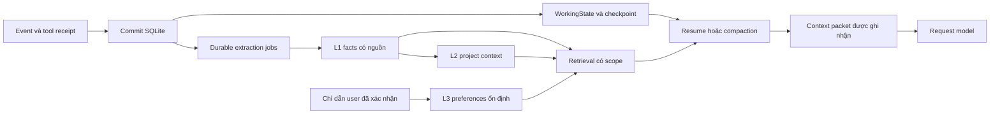

# Memory và khả năng tiếp tục công việc

[English](MEMORY_AND_CONTINUITY.en.md) | Tiếng Việt

Revision 2 — 10/09/2026. Đề xuất cho coding harness cá nhân bằng Rust. Đi cùng [kế hoạch triển khai](RUST_HARNESS_PLAN.vi.md) và [hợp đồng plugin](PLUGIN_ARCHITECTURE.vi.md). Mọi cấu trúc, lệnh và chỉ tiêu dưới đây là thiết kế cần triển khai và kiểm chứng. Các mục 14–18 bổ sung hợp đồng persistence và đưa dữ liệu vào context sau lần rà soát thứ hai.

## 1. Yêu cầu sản phẩm

Người dùng đã thử nhiều harness và gặp vấn đề: hết context hoặc mở lại session thì agent không nhớ đã làm gì. Vì vậy, memory của sản phẩm phải phục vụ khả năng làm tiếp, đồng thời hỗ trợ dùng lại kiến thức giữa nhiều agent.

Các tình huống phải phân biệt:

| Tình huống | Điều phải phục hồi |
|---|---|
| Compaction trong cùng phiên | Mục tiêu, yêu cầu hiện hành, việc đã xong, pending tools, quyết định và next action |
| Đóng/mở lại cùng session | Toàn bộ trạng thái đã commit, inbox, task, artifact, trạng thái agent con |
| Mở phiên mới cho task cũ | Định danh task và checkpoint phù hợp, không nhập nhầm công việc khác |
| Agent khác tiếp quản | Task brief, quyền, input revision, kết quả đã có và phần việc còn lại |
| Mở lại sau khi repo thay đổi | Phát hiện khác biệt, đánh dấu bằng chứng/memory cần xác minh |

Tiêu chuẩn: người dùng có thể nói "tiếp tục" và harness dựng được trạng thái đúng từ dữ liệu đã lưu. Khi có nhiều task có thể tiếp tục, CLI cần cho chọn; không đoán âm thầm.

## 2. Tencent thực sự làm gì

Khảo sát theo commit [`906b5823b5106eed8f842b62f16d23228838149a`](https://github.com/TencentCloud/TencentDB-Agent-Memory/tree/906b5823b5106eed8f842b62f16d23228838149a). Phần này mô tả source đã đọc; các phần sau là thiết kế riêng cho Rust.

### 2.1. Tách độ chi tiết của memory

Tencent có L0 hội thoại, L1 các thông tin nguyên tử, L2 bối cảnh/scenario và L3 hồ sơ lâu dài. Hệ thống dùng tài sản và binding để trang bị kiến thức phù hợp cho từng agent. [Tổng quan Tencent](https://github.com/TencentCloud/TencentDB-Agent-Memory/blob/906b5823b5106eed8f842b62f16d23228838149a/README.md).

Đường `l0-recorder.ts` được đọc chọn message user/assistant, lọc và loại nội dung đã được inject để hạn chế memory tự lặp lại. Vì vậy, đường capture này không đồng nghĩa với một journal đầy đủ của mọi tác động tool. [L0 recorder](https://github.com/TencentCloud/TencentDB-Agent-Memory/blob/906b5823b5106eed8f842b62f16d23228838149a/MemoryCore/src/core/conversation/l0-recorder.ts).

### 2.2. Phân biệt pipeline cũ và Gateway hiện tại

Repo còn có `MemoryPipelineManager` cũ. Hàm `recoverPendingSessions()` ghi rõ message buffers ở RAM không được khôi phục nguyên vẹn và kích hoạt L2 theo khả năng còn lại. Điều này chỉ mô tả đường cũ đã đọc, không đủ để kết luận toàn bộ sản phẩm mất dữ liệu. [Pipeline cũ](https://github.com/TencentCloud/TencentDB-Agent-Memory/blob/906b5823b5106eed8f842b62f16d23228838149a/MemoryCore/src/utils/pipeline-manager.ts#L1143).

Gateway hiện tại nối `StatefulPipelineManager`, `IStateBackend`, `TimerScanner` và `PipelineWorker`. Manager ghi rõ nội dung message đã nằm trong Store; bước notify chủ yếu cập nhật tiến độ và lên lịch. Executor gọi `runL1WithStore()` và có đường xử lý tiếp backlog. [Gateway wiring](https://github.com/TencentCloud/TencentDB-Agent-Memory/blob/906b5823b5106eed8f842b62f16d23228838149a/MemoryCore/src/gateway/server.ts), [Stateful manager](https://github.com/TencentCloud/TencentDB-Agent-Memory/blob/906b5823b5106eed8f842b62f16d23228838149a/MemoryCore/src/utils/stateful-pipeline-manager.ts).

Worker có claim, acknowledgment, retry, khóa và kiểm tra mất quyền sở hữu. Tuy nhiên, mức bền vững phụ thuộc backend: implementation local dùng Map/array/timer trong tiến trình; sự hiện diện của hàng đợi không tự chứng minh phục hồi qua process crash. [Worker](https://github.com/TencentCloud/TencentDB-Agent-Memory/blob/906b5823b5106eed8f842b62f16d23228838149a/MemoryCore/src/services/pipeline-worker.ts), [Local backend](https://github.com/TencentCloud/TencentDB-Agent-Memory/blob/906b5823b5106eed8f842b62f16d23228838149a/MemoryCore/src/core/state/local-backend.ts).

### 2.3. Checkpoint theo chủ sở hữu

Tencent tách `runner_states` và `pipeline_states`: cursor capture/extraction không dùng chung vùng ghi với bộ đếm và lịch chạy. Checkpoint còn có cơ chế tuần tự hóa cập nhật. Đây là bài học trực tiếp cho nhiều agent ghi tiến độ cùng lúc. [Checkpoint](https://github.com/TencentCloud/TencentDB-Agent-Memory/blob/906b5823b5106eed8f842b62f16d23228838149a/MemoryCore/src/utils/checkpoint.ts).

### 2.4. Đọc memory có chọn lọc

Đường proxy đã đọc ghép memory tự có với memory được gắn từ agent khác; helper hiện giới hạn tối đa hai agent được mượn. Profile injector đưa L3 và chỉ mục L2 vào context, còn nội dung chi tiết đọc khi cần. Đây là lựa chọn của implementation đó, không phải giới hạn phải sao chép vào Rust. [Fixed assets](https://github.com/TencentCloud/TencentDB-Agent-Memory/blob/906b5823b5106eed8f842b62f16d23228838149a/MemoryProxy/src/injection/injectors/tdai-fixed-asset.ts), [Profile injector](https://github.com/TencentCloud/TencentDB-Agent-Memory/blob/906b5823b5106eed8f842b62f16d23228838149a/MemoryProxy/src/injection/injectors/tdai-profile-memory-injector.ts).

Truy hồi L1 hỗ trợ keyword và vector, ghép thứ hạng bằng RRF. Dedup là đường riêng có phạm vi được truyền vào; không phải cơ chế đồng thuận giữa các agent. [Candidate recall](https://github.com/TencentCloud/TencentDB-Agent-Memory/blob/906b5823b5106eed8f842b62f16d23228838149a/MemoryCore/src/core/tools/l1-candidate-recall.ts), [Dedup](https://github.com/TencentCloud/TencentDB-Agent-Memory/blob/906b5823b5106eed8f842b62f16d23228838149a/MemoryCore/src/core/record/l1-dedup.ts).

Phạm vi xác minh: đọc tài liệu và các đường source liên quan, không chạy benchmark hay kiểm thử crash của Tencent. Không suy diễn các comment bảo đảm thành kết quả runtime đã được chứng minh.

### 2.5. Identity profile ổn định không phải identity session

Code profile của Tencent định địa chỉ L2/L3 theo team-and-agent, chủ động bỏ chiều session/user khi có team. Direct lookup còn kiểm tra scope của row trả về; chỉ hash key không thay authorization. Cơ chế này giải thích profile tồn tại qua phiên, nhưng không phải đặc tả phục hồi coding task. Ta giữ `agent_profile_id` ổn định và thêm ranh giới project riêng. [Implementation profile scope](https://github.com/TencentCloud/TencentDB-Agent-Memory/blob/906b5823b5106eed8f842b62f16d23228838149a/MemoryCore/src/core/profile/profile-scope.ts).

Profile proxy dùng cache lúc khởi tạo session, L3 có giới hạn và chỉ mục điều hướng L2. Cách này tiết kiệm context nhưng không tự bảo đảm phiên đang chạy có quyết định mới nhất. Ta làm mới metadata version/quyền tại request boundary. [Profile injector](https://github.com/TencentCloud/TencentDB-Agent-Memory/blob/906b5823b5106eed8f842b62f16d23228838149a/MemoryProxy/src/injection/injectors/tdai-profile-memory-injector.ts).

### 2.6. Chi tiết cursor và chiến lược trích xuất

L1 runner đọc cũ trước, giới hạn lượng việc, mở rộng lát cắt qua các row trùng timestamp và báo backlog để xử lý tiếp. Source cũng ghi trường hợp biên còn lại khi các row cùng timestamp kéo dài quá trang đã fetch, kèm đề xuất composite cursor. Rust dùng sequence ổn định, không giả định timestamp duy nhất. Đây là kết quả đọc source, không phải sự cố Tencent đã được tái hiện. [L1 runner](https://github.com/TencentCloud/TencentDB-Agent-Memory/blob/906b5823b5106eed8f842b62f16d23228838149a/MemoryCore/src/utils/pipeline-factory.ts#L506), [SQLite query](https://github.com/TencentCloud/TencentDB-Agent-Memory/blob/906b5823b5106eed8f842b62f16d23228838149a/MemoryCore/src/core/store/sqlite/memory-store.ts#L710).

Prompt trích xuất memory cũng là settings có version. Tencent ưu tiên override agent, rồi team, instance và fallback system; composer thêm ràng buộc chiến lược. Extractor của ta lưu version/digest chiến lược đã resolve trong mỗi job và validate output có cấu trúc. Prompt guard không thay kiểm tra của host. [Resolver](https://github.com/TencentCloud/TencentDB-Agent-Memory/blob/906b5823b5106eed8f842b62f16d23228838149a/MemoryCore/src/core/memory-prompt/resolver.ts), [Composer](https://github.com/TencentCloud/TencentDB-Agent-Memory/blob/906b5823b5106eed8f842b62f16d23228838149a/MemoryCore/src/core/memory-prompt/composer.ts).

## 3. Áp dụng vào Rust: hai đường cập nhật



Đường tiếp tục công việc cập nhật ngay theo transaction. Đường trích xuất tri thức chạy nền. Chậm embedding, lỗi LLM tóm tắt hoặc backlog memory không được ngăn resume từ journal.

Dữ liệu nguồn L0 của harness là projection có provenance từ session journal; không tạo một nguồn sự thật thứ hai cạnh tranh với journal. Raw API credentials không thuộc dữ liệu memory.

## 4. WorkingState bắt buộc

Đây là trạng thái nghiệp vụ có schema, không chỉ một đoạn văn do model viết cuối phiên.

```text
WorkingState
  schema_version, session_id, task_id, revision, through_event_seq
  objective_ref, acceptance_criteria_refs
  active_instruction_refs, decision_refs, superseded_decision_refs
  plan_items: id, status, owner, dependencies, evidence_refs
  workspace: project_id, worktree_id, base_commit, observed_fingerprint
  changes: path, before_hash, after_hash, tool_execution_id
  checks: command_ref, outcome, tested_revision, artifact_ref
  pending_tool_calls: execution_id, state, reconciliation_hint
  children: agent_run_id, task_id, status, result_ref
  blockers, pending_questions, next_action_proposals
```

Phân loại nguồn: người dùng đã chỉ định; runtime đã quan sát; model đang đề xuất. Model có thể đề xuất next action và cập nhật kế hoạch, nhưng không tự biến lời khẳng định "test pass" thành receipt của runner.

Các mốc cập nhật: nhận yêu cầu/correction; thay đổi quyết định; hoàn tất tool; thay đổi task; giao/nhận việc con; trước compaction; khi pause và shutdown. Các field bắt buộc phải có dữ liệu hoặc trạng thái `unknown`; không bịa để làm đầy checkpoint.

Ví dụ: agent đã sửa `parser.rs`, test A pass trên revision R, test B fail và chưa sửa. Sau resume phải giữ cả thất bại B, biết đã sửa file nào và bắt đầu từ xử lý B. Việc nén context không được biến "đã thử" thành "đã hoàn tất".

## 5. Quy trình resume

1. Xác định project/task/session; lấy quyền sở hữu session và generation mới.
2. Đọc snapshot hợp lệ gần nhất, kiểm tra schema/hash, fold event tail đến seq mới nhất.
3. Khôi phục inbox, task DAG, decisions, WorkingState và trạng thái tools/children.
4. Đối chiếu worktree, Git revision và file fingerprints; đánh dấu chứng cứ lỗi thời.
5. Xử lý execution chưa rõ outcome. File patch có thể đối chiếu before/after hash; shell tùy ý cần kiểm tra riêng. Chưa xác định thì không chạy lại tự động.
6. Dựng context packet từ trạng thái hiện hành và memory được phép dùng, lưu exact rendered content cùng source refs.
7. Hiển thị receipt phục hồi; chạy next action phù hợp khi trạng thái đủ rõ.

Snapshot hỏng có thể dựng lại từ journal. Journal hỏng giữa dòng lịch sử phải báo lỗi với vị trí cụ thể; không tự bỏ qua sự kiện ảnh hưởng nghiệp vụ. Receipt phục hồi cho biết snapshot seq, replayed-through seq và những phần cần xác minh.

Session mới tiếp tục task cũ tạo event liên kết task và checkpoint nguồn. Đổi model vẫn dùng trạng thái có cấu trúc; provider-specific message blocks chỉ được chuyển nếu adapter hỗ trợ.

## 6. Compaction không làm mất nhiệm vụ

Token budget tính trước request: context window trừ output reservation, protocol overhead và safety margin. Ngưỡng ban đầu có thể là 70–80% phần input khả dụng, sau đó hiệu chỉnh bằng đo đạc; không hard-code theo một model.

Thứ tự giữ context:

1. Chính sách hệ thống, chỉ dẫn người dùng đang có hiệu lực và quy tắc project bắt buộc.
2. Objective, acceptance criteria, quyết định hiện hành và WorkingState.
3. Input chưa xử lý, tool call/result cần pairing và kết quả mới nhất.
4. Hội thoại gần đây liên quan trực tiếp tới next action.
5. Memory/project facts và tài liệu liên quan trong ngân sách còn lại.

Không cắt một cặp tool call/result. Không dùng summary đã supersede làm nguồn quyết định hiện hành. Raw history vẫn tồn tại, còn phần model nhìn thấy được chọn bằng projection.

Quy trình: ghi `compaction_started` và nguồn seq → tạo candidate summary → kiểm tra các mục bắt buộc → commit checkpoint mới bằng compare-and-swap → ghi `compaction_completed`. Không giữ SQL transaction trong lúc gọi model. Nếu nguồn đã đổi, fold phần mới hoặc tạo lại candidate.

Nếu model tóm tắt lỗi hoặc hết budget, fallback là bản dựng có quy tắc từ WorkingState và event tail. Nếu ngay cả dữ liệu bắt buộc cũng không vừa, dừng với lý do cụ thể hoặc yêu cầu model context lớn hơn; không lặng lẽ bỏ yêu cầu người dùng.

Context packet giữ `checkpoint_id`, `through_seq`, memory ids/versions, rendering version, token estimate và content hash. Replay đọc packet đã lưu, không truy hồi lại memory hiện tại để thay quá khứ.

## 7. Long-term memory và phạm vi

| Phạm vi | Ví dụ | Cách dùng |
|---|---|---|
| User | Ưu tiên Rust, quy ước trao đổi do người dùng xác nhận | Chỉ phần liên quan đến task |
| Project | Kiến trúc, lệnh kiểm tra, constraints, decision records | Chung cho agent được phép làm dự án |
| Task | Handoff, kết luận tạm, kết quả các nhánh | Các thành viên được giao task |
| Agent profile | Skills và kinh nghiệm của vai trò ổn định | Theo binding của profile |
| Session | Lịch sử và ghi chú của lần chạy | Phục hồi phiên và truy xuất có quyền |

Tách `agent_profile_id` ổn định khỏi `agent_run_id` của lần chạy. Tiến trình mới không làm mất identity memory. Các agent của cùng một người dùng vẫn được áp giới hạn riêng; quyền của chủ tài khoản không tự trở thành quyền đọc mọi asset của mọi worker.

Đọc memory phải qua quyền actor, project/task scope, bindings, trạng thái/version và nguồn còn hợp lệ trước khi chọn top-k. Các identity này do host cấp, không lấy nguyên từ arguments model. Asset binding quyết định khả năng được chọn; policy quyết định quyền sử dụng.

Phân quyền thực thi theo các thao tác `read`, `propose`, `publish`, `bind`, `invalidate`. Role hoặc memory content không tự nâng quyền. Các checks phải áp dụng cả search, read-by-id, artifact read và export.

## 8. Mô hình dữ liệu memory

```text
MemoryAsset
  id, kind, owner_id, project_id, scope, visibility, status
  current_version, created_by, created_at, updated_at

MemoryVersion
  asset_id, version, content_or_artifact_ref, content_hash
  source_event_refs, source_file_hashes, source_commit
  provenance_kind, evidence_state, confidence_annotation
  valid_from, expires_at, supersedes, extractor_version

MemoryBinding
  profile_or_task_id, asset_id, injection_mode, priority

MemoryGrant
  principal_id, asset_id_or_scope, allowed_actions, revision
```

Status dự kiến: `candidate`, `active`, `superseded`, `invalidated`, `archived`. Validity là field riêng (`valid`, `stale`, `unknown`), có lý do và revision đã kiểm tra. Confidence model chỉ là tín hiệu xếp hạng; không thay bằng chứng hoặc quyền truy cập.

Wiki và code facts phải có commit/file hash nguồn. Khi nguồn đổi, mark stale theo dependency đã biết. Lúc chưa có CodeGraph đầy đủ, dùng file-level invalidation bảo thủ và kiểm tra Git thay đổi khi resume.

## 9. Capture, dedup và chống ghi chồng

Commit event nguồn và extraction job trong cùng transaction. Job idempotency key gồm session, event range và extractor version. Worker nhận job bằng claim có owner/generation; commit kết quả, cursor và trạng thái job cùng giao dịch sau khi xác minh quyền sở hữu.

Không dùng timestamp làm khóa tiến độ duy nhất: dùng event seq và stable source ids. Hai agent ghi cùng thời điểm không bỏ qua dữ liệu của nhau. Pending jobs được lưu SQLite; khi mở ứng dụng, quét journal so với extraction cursor để bù cả trường hợp job notification thất lạc.

Trích xuất chỉ đọc dữ liệu nguồn thật. Context vừa được inject, output của extractor và summary sinh từ memory không được tính thành bằng chứng độc lập mới. Chặn vòng memory tự củng cố bằng provenance, không chỉ bằng xóa chuỗi tag.

Dedup theo scope và nguồn trước; sau đó mới dùng keyword/vector để tìm ứng viên trùng. LLM có thể đề xuất merge, nhưng write phải dùng expected version. Conflict trả về để rebase/đánh giá; không overwrite bằng last-write-wins.

Thông tin đối nghịch có thể cùng tồn tại nếu khác revision/branch/thời điểm. Quyết định mới của người dùng được ghi quan hệ supersedes. Không dùng "nhiều agent nói giống nhau" làm bằng chứng xác nhận, vì chúng có thể cùng đọc một nguồn sai.

Các fact dự án đơn giản có thể tự publish theo policy và nguồn quan sát đã kiểm tra. Preference hành vi dài hạn lấy từ chỉ dẫn người dùng; suy luận của model giữ ở candidate. Tất cả có thể inspect, sửa hoặc invalidate qua CLI.

## 10. Retrieval và injection

v1 dùng SQLite FTS5/BM25 và filter metadata. Đây là lựa chọn đủ để xây baseline local; Tencent cũng có chế độ keyword không cần embedding. [SQLite FTS5](https://sqlite.org/fts5.html), [Tencent recall](https://github.com/TencentCloud/TencentDB-Agent-Memory/blob/906b5823b5106eed8f842b62f16d23228838149a/MemoryCore/src/core/hooks/auto-recall.ts).

Context bootstrap gồm profile ngắn đã xác nhận, chỉ mục project, WorkingState và quyết định liên quan. Truy hồi chi tiết dùng query từ objective, next action, file/symbol và lỗi hiện tại. Bộ test phải bao gồm tiếng Việt, có/không dấu và code identifiers.

Khi thêm embedding, keyword và vector đều bị giới hạn vào tập dữ liệu được phép trước retrieval; RRF hợp nhất thứ hạng. Không cộng trực tiếp điểm BM25 và cosine chưa chuẩn hóa. Embedding model/version/dimension nằm trong index metadata; đổi model cần reindex.

Mỗi packet có giới hạn số mục, token và thời gian. Khởi điểm thử nghiệm: tối đa 8 fact cùng 1–2 bản project summary, tổng memory bổ sung khoảng 2.000 token, tách khỏi WorkingState bắt buộc. Đây là tham số cần đo, không phải con số do Tencent bảo đảm.

Khi retrieval lỗi, ghi degradation và dùng journal/WorkingState hiện có. Quyền truy cập không xác định thì không trả dữ liệu. Cache key gồm project/task/profile, query, binding revision, ACL revision và asset revision.

Revocation hoặc invalidation phải ảnh hưởng lần dựng context tiếp theo; đồng thời cập nhật projection của các memory injection cũ nếu cần loại nội dung đó khỏi model input. Lịch sử dùng memory vẫn có thể được lưu cho audit theo quyền và retention; invalidate không đồng nghĩa xóa mọi bản sao lịch sử.

## 11. Chia sẻ giữa các agent

Ví dụ: explorer tìm được constraint, coder thực hiện, verifier kiểm tra, coordinator nhận kết quả.

- Explorer publish observation có source file/hash vào phạm vi task.
- Coordinator gửi handoff chứa task id, input revision, observation ids và acceptance criteria.
- Coder nhận snapshot task và memory bindings tại thời điểm bắt đầu; thay đổi trong khi chạy được đưa vào ở step boundary có log.
- Verifier nhận diff và revision cần kiểm tra; ghi receipt từ runner.
- Coordinator cập nhật task state bằng kết quả đã kiểm chứng; kinh nghiệm tái sử dụng được đề xuất vào project memory.

Task completion, dependencies và thông điệp giao việc đi qua durable task state/inbox. Semantic search không được dùng làm nguồn quyết định một agent đã xong hay còn chạy.

Mỗi request ghi rõ memory version đã nhìn thấy. L2 tổng hợp dùng CAS theo project/profile, tránh hai worker cùng ghi đè một bản context. Memory giữa task có thể nhất quán sau một độ trễ; trạng thái giao việc phải có giao dịch rõ ràng.

## 12. Bộ nghiệm thu chống quên

| Test | Thao tác | Điều kiện đạt |
|---|---|---|
| C01 | Kill process ngay sau input ACK | Input xuất hiện đúng một lần sau reopen |
| C02 | Kill sau tool result commit, trước checkpoint | Fold tail phục hồi kết quả; không chạy lại tool |
| C03 | Kill sau side effect, trước receipt | Hiện outcome chưa rõ; reconcile trước khi chạy tiếp |
| C04 | Ép 5 lần compaction trong task | Mục tiêu, corrections, decisions, failures và pending work còn nguyên |
| C05 | Summary/embedding/extractor bị lỗi | Resume vẫn dùng WorkingState; jobs tồn tại để retry |
| C06 | Mở session mới và tiếp tục task cũ | Nạp đúng checkpoint, scope và artifact; không lẫn task khác |
| C07 | Ba agent cùng publish memory | Không lost update; CAS conflict có xử lý; cursor độc lập |
| C08 | Agent giả actor/project trong tool args | Search/read/export đều không vượt scope |
| C09 | Người dùng thay quyết định A bằng B | Context sau compaction/resume dùng B; A có trạng thái superseded |
| C10 | Git revision thay đổi bên ngoài | Test receipt và code facts liên quan bị đánh dấu stale |
| C11 | Tắt parent khi child vừa hoàn thành | Durable result được đọc lại; không giao lại task đã hoàn tất |
| C12 | Crash extractor giữa write và ACK | Retry không tạo memory trùng; job/cursor nhất quán |
| C13 | Memory được inject lặp qua 10 turn | Không sinh 10 bằng chứng độc lập từ cùng nguồn |
| C14 | Offline replay | Không network, không tool execution, dựng đúng packet đã lưu |
| C15 | Hai process cùng resume một session | Chỉ một owner; writer cũ không commit được |
| C16 | Hơn hai trang event cùng timestamp | Mọi sequence được xử lý một lần; cursor không bỏ row cuối trang |
| C17 | Range extraction phía sau xong trước range phía trước | Cursor không vượt khoảng trống; range lỗi vẫn hiển thị |
| C18 | Chỉ dẫn user chưa được phân loại vào WorkingState | Chỉ dẫn gốc vẫn bắt buộc trong context sau compaction |
| C19 | Quy tắc project bắt buộc có keyword relevance bằng 0 | Vẫn được đưa vào; top-k không được loại quy tắc |
| C20 | Thu hồi memory đã dùng trong cached summary | Dựng lại/loại block phụ thuộc trước dispatch tiếp; audit vẫn có phân quyền |
| C21 | Hết disk lúc commit input, intent hoặc result | Không ACK sai; không side effect mới khi thiếu intent; đối chiếu result chưa rõ |
| C22 | Extractor vắng mặt, đổi version hoặc trả JSON sai | Job bền vững retryable/blocked; không tiến cursor hay nâng quyền |
| C23 | Clone, di chuyển hoặc linked worktree có path/remote giống nhau | Resolve project identity rõ; không gộp task/memory không liên quan |
| C24 | Hai session khác nhau cùng tiếp tục một task | Task ownership chặn hai luồng tiếp tục cạnh tranh |
| C25 | Có child result nhưng mất parent notification | Inbox/outbox replay giao đúng một lần logic; result không mất |
| C26 | FTS rỗng, embedding timeout, query tiếng Việt/code | Phân biệt empty/degraded/error; fallback không bịa ký ức |
| C27 | Restore backup và nâng/hạ schema | Artifacts/cursors nhất quán; writer không tương thích từ chối ghi |
| C28 | Chủ động quên nội dung nguồn rồi resume task cũ | Không trích xuất lại dữ liệu đã xóa; báo thiếu continuity evidence |
| C29 | API key trong capture fixture; agent hỏi artifact hash khác scope | Fixture secret bị loại/redact; hash lookup không vượt quyền |
| C30 | Memory job vượt budget; CLI đóng khi đang extraction | Foreground state an toàn; job pause bền vững, tiếp tục trong budget mới |

Fixtures xác định phải pass toàn bộ. Với hành vi model, chạy cùng bài toán ở ba cấu hình: chỉ history, history + summary, và thiết kế đầy đủ; giữ model/tool/budget giống nhau. Đo completion rate sau gián đoạn, số thao tác lặp, số corrections bị quên, token nạp lại và độ đúng khi chọn next action.

Mục tiêu đo ban đầu: local retrieval p95 dưới 250 ms với 10.000 assets nhỏ và restore trạng thái dưới 2 giây với 10.000 events có snapshot trên máy kiểm thử được ghi rõ. Chưa có số đo thực tế. Không ép chỉ tiêu thời gian bằng cách bỏ durable commit hoặc context bắt buộc.

## 13. Thứ tự thực hiện

1. Journal, WorkingState, durable inbox/jobs và resume dùng mock provider.
2. Context builder, checkpoints và compaction, cùng C01–C05/C09/C14/C15.
3. Coding tools và receipts để trạng thái công việc có bằng chứng thật.
4. L1/L2, FTS, provenance, invalidation và recovery extraction.
5. Multi-agent binding/handoff và các bài kiểm thử race.
6. Embedding, Wiki/CodeGraph và Tencent adapter khi baseline chứng minh cần.

Nếu dùng Tencent bên ngoài, adapter Rust gọi API qua interface memory trước bước đóng băng request. Ghi lại exact injected content và nguồn/version; nếu server không cung cấp version đáng tin thì giữ content hash và thời điểm truy hồi. Không coi khả năng session của dịch vụ ngoài là thay thế WorkingState nội bộ.

Khả năng này không thể làm context model vô hạn hay bảo đảm mọi suy luận luôn đúng. Hợp đồng có thể kiểm chứng là: công việc đã xác nhận được lưu, context tiếp tục được dựng có nguồn, thao tác chưa rõ không bị chạy lại bừa, và những phần thiếu bằng chứng được thể hiện rõ.

## 14. Identity, schema và ranh giới giao dịch

### 14.1. Khóa ổn định và một owner cho công việc hiện hành

`project_id` là UUID đã lưu, gắn với repository registration được kiểm tra, không phải hash của cwd hoặc remote URL. Linked worktrees dùng chung registration; các clone không liên quan mặc định là project khác. Di chuyển cần ghi nhận gắn lại root sau kiểm tra. Không gộp project chỉ vì có cùng Git remote.

`task_id` tồn tại qua thay session; `session_id` định danh luồng hội thoại; `agent_profile_id` định danh vai trò ổn định; `agent_run_id` định danh một activation. Worker nhận subtask riêng. Task ownership và session ownership đều có generation: hai session mới không được cùng tiếp tục một task chỉ vì có session IDs khác nhau.

v1 có một runner host được ghi cho mỗi data directory local, sở hữu một SQLite write coordinator; các agent chạy đồng thời bên trong. CLI read-only có thể chạy riêng. Writer thứ hai nhận `owner_busy`; mutation command đi qua CLI host đang chạy hoặc sau khi host thoát. v1 không cần daemon ngầm hay IPC đa process chưa đặc tả. Session/task generations vẫn chặn việc cũ trong process và chuẩn bị cho service host sau này.

### 14.2. Records tối thiểu cần lưu

| Record | Khóa và fields bắt buộc ngoài content |
|---|---|
| `session_events` | `(session_id, seq)` unique; `event_id`, type/schema, producer, actor, causation/correlation, payload ref/hash, writer generation |
| `tasks` / `task_owners` | Task/project IDs ổn định, current revision, state, active session/run, ownership generation |
| `instruction_ledger` | Source event/span, scope, authority, effective/superseded status, mandatory flag, source hash |
| `working_state_snapshots` | Task/session, projector version, source watermark, revision, content hash |
| `tool_executions` | Invocation/idempotency IDs, input hash, policy/approval ref, intent/result states, before/after fingerprints |
| `context_packets` | Exact rendered input, request/provider config, source/version manifest có thứ tự, hash, redaction/rendering versions |
| `background_jobs` | Source stream/range/digest, extractor+strategy version, status, attempts, lease generation, next due time, error |
| `extraction_cursors` | `(source_stream, extractor_version, strategy_digest)` unique; sequence đã xử lý liên tục |
| `memory_dependencies` | Derived version/block → source event/file/asset version; phục vụ lan truyền invalidation |
| `message_deliveries` | Sender/recipient task hoặc run, stable message ID, durable payload, delivery/consumption state |

WorkingState là view task state dựng từ events, không phải nguồn thẩm quyền riêng. Session mới tiếp tục cùng task tham chiếu current task revision cùng watermarks các session nguồn. Chuyển trạng thái xuyên session qua task commands do host sở hữu; agent không tùy ý append vào log agent khác.

### 14.3. Các ranh giới commit

| Ranh giới | Một SQLite transaction | Sau commit |
|---|---|---|
| Nhận input | Inbox + user event + instruction-ledger entry + task projection bắt buộc + source-work marker | Trả input ACK; cho scheduler nhận việc |
| Nhận tool | Invocation đã validate + durable intent + tiêu thụ approval + kiểm tra owner/revision | Cho phép side effect |
| Chốt tool | Result thật/artifact ref + session event + task projection + extraction work marker | Công bố settled result, lên lịch step tiếp |
| Child hoàn tất | Child result + subtask transition + durable parent delivery | Notify parent; mất notification không ảnh hưởng |
| Chốt extraction | Validate version/CAS + assets/dependencies + contiguous cursor + job completion + việc cho lớp tiếp | Notify indexes/context consumers |

Publish và flush artifact bytes trước khi commit reference. Các transaction này không bao gồm LLM call, shell execution hay remote storage write. Exactly-once logical acceptance dùng stable IDs; không hứa exactly-once cho external side effects tùy ý.

Disk-full/I/O errors dừng nhận việc và side effects tiếp theo. Result đã tạo nhưng chưa ghi bền vẫn uncertain; không báo settled thành công. SQLite `FULL` không bảo vệ khỏi mất phần cứng, filesystem hỏng hoặc ổ đĩa không tuân thủ flush; backup/restore là yêu cầu riêng.

## 15. Extraction jobs, cursors và ngân sách

Dùng cũ trước, batch có giới hạn, **ranges không chồng lấn trên từng source stream/extractor strategy**. Các streams khác nhau chạy song song; một stream tiến tuần tự trong v1. Mỗi batch được claim chứa source IDs, thứ tự và digest bất biến. Timestamp là metadata, không là paging key.

Job đi qua `pending → leased → completed`, hoặc `retry_wait`, `blocked`, `dead_letter`. Cancellation nhả/hết hạn claim, không coi là hoàn tất. Worker tính toán ngoài transaction; commit kiểm tra owner generation và expected memory versions. Worker hết lease không được publish sau khi worker khác tiếp quản.

Cursor nghĩa là “mọi event đến sequence này có extraction disposition được lưu”, không phải “sequence lớn nhất từng thấy”. Extraction thành công nhưng không có fact vẫn tiến range với outcome no-facts rõ ràng. Call lỗi, output sai hoặc extractor vắng mặt không được tiến. Bỏ qua chủ động phải có audit/lý do, không giả làm extraction thành công. Nếu sau này song song hóa ranges ngoài thứ tự, lưu completed intervals và chỉ tiến contiguous prefix.

Giới hạn source bytes/tokens, candidates, output size, retries, thời gian và chi phí model. Retry exponential backoff có jitter; dead-letter queue inspect được. Dedup proposal chỉ tham chiếu candidates đã cấp; validate mọi source/asset, từ chối merge vượt scope. Fact extractor không cần quyền thực thi tool.

Nâng extractor/strategy mở processing generation mới có replay range được chọn rõ. Không reset cursor cũ hay republish tất cả ngầm. Reprocess tạo supersedes/liên kết derived versions; không sửa original events. L2 jobs đọc thay đổi L1 có version, gồm invalidation/deletion, không chỉ inserts mới.

Một foreground scheduler ưu tiên task người dùng trước extraction. Tách giới hạn model calls/tokens/chi phí memory cấu hình được; việc nền không tiêu hết coding budget. CLI đóng thì extraction không chạy. Lệnh dự kiến `ha memory catch-up --budget <limit>` chủ động xử lý durable backlog; mở session không phải chờ nó.

## 16. Đưa đủ thông tin vào context, không chỉ search

### 16.1. Không để LLM quyết định điều gì đã được lưu an toàn

Input ACK yêu cầu đã lưu exact admitted user text và instruction source reference dù chưa phân loại ngữ nghĩa. Structured model proposal liên kết source spans chính xác và có coverage status rõ. Chỉ dẫn hiện hành chưa phân loại vẫn nằm trong mandatory context. Supersession cần quan hệ có nguồn rõ; extractor không tự quyết ràng buộc bất tiện đã lỗi thời.

Điều này chưa chứng minh hiểu đúng ngữ nghĩa: span mapping vẫn có thể sai. Giữ nguồn gốc, hiển thị decisions/requirements để inspect và đánh giá coverage bằng adversarial fixtures. Nếu toàn bộ mandatory instructions không vừa, pause thay vì tuyên bố compaction không mất thông tin.

### 16.2. Quy tắc bắt buộc khác kiến thức tùy chọn

Task requirements đã pin và project rules áp dụng được nạp bằng identity/scope và validity, **nằm ngoài top-k search**. Giữ current rule text hoặc representation đã validate rõ kèm original refs. BM25 bằng 0 không được loại “không thay public API”. Giải thích lịch sử, bài học task đã xong và facts không trọng yếu dùng optional retrieval budget.

Bootstrap chọn đúng task chưa xong, nạp WorkingState và instruction ledger, rồi thêm project/profile index có giới hạn. Retrieval chi tiết dùng objective, next action, filenames/symbols và lỗi gần đây. Trả `found`, `empty`, `degraded` hoặc `error` cùng source IDs; model nói chưa tìm thấy bằng chứng thay vì khẳng định lịch sử đó chưa từng tồn tại.

FTS queries dùng parameters và terms được chuẩn hóa, không chạy FTS syntax tùy ý từ model input. Baseline normalization gồm hoa/thường, Unicode, dấu tiếng Việt và snake/camel identifiers; giữ text gốc. Kiểm thử precision lẫn recall. Exact identifier/file matching là fallback trước khi trả phí embeddings.

### 16.3. Provenance và revocation đi theo nội dung dẫn xuất

Mỗi block được nhận có source set, authority class, validity, scope, version và rendering hash. Summaries/facts trích xuất kế thừa transitive dependency links; trích một memory vào summary không xóa nguồn gốc. Mark dependencies stale/invalidated, dựng lại hoặc loại derived blocks bị ảnh hưởng và đóng băng lại context trước dispatch.

Khi invalidation/quyền thay đổi, request-admission gate so revision. Packet được dựng trước thay đổi phải dựng lại trước request mới. Request đã gửi provider không thể thu hồi như chưa gửi; cancel khi có thể, loại future injections không còn quyền và giữ usage audit có phân quyền.

L3 preferences đã xác nhận không tự lấy quyền từ L2. Suy luận hành vi giữ candidate, trừ khi user xác nhận hoặc publication policy rõ ràng cho phép. Retrieved instructions là dữ liệu, trừ khi instruction policy host nhận nguồn đáng tin; memory/skills không tự tăng quyền tool.

## 17. Retention, secrets, backup và migration

Mặc định lưu application data ngoài source tree đang sửa: user data directory phù hợp OS chứa SQLite, artifacts, backup manifests. `.harness/` trong repo chỉ chứa project config chủ động chia sẻ. Không commit runtime stores, credentials hoặc raw trajectories vào Git.

Capture modes phân biệt durable session continuity và trích xuất kiến thức tái sử dụng. Tắt extraction không tắt journal. Nếu sau này có ephemeral mode thì phải báo rõ không có restart continuity; không gọi nó là durable mode.

Host credentials không là prompt data. Secret scanning/redaction chạy trước reusable extraction, export và logs; file tools áp sensitive-path policy. Không bảo đảm phát hiện mọi secret tùy ý, nên mặc định giảm capture/retention và cho inspect/delete nội dung. Exact replay là sanitized request thực sự đã gửi, không phải bản reconstruction đã redact được bịa lại. Sensitive source payload cần giữ phải có storage hạn chế quyền và policy rõ ràng.

Tách các thao tác:

- **Invalidate:** ngừng dùng fact; giữ lịch sử cho audit có quyền.
- **Archive:** loại việc đã xong khỏi discovery thường ngày; giữ khả năng phục hồi.
- **Forget/delete:** xác nhận rõ việc xóa source/derived payloads, indexes, caches đã chọn; ghi tombstones không chứa nội dung và chặn trích xuất lại từ source ranges còn lưu.

Append-only history được bảo đảm trong retention policy, không phải lý do bỏ qua yêu cầu xóa. Deletion có thể giảm độ đầy đủ khi replay/resume phiên cũ và phải báo giới hạn. Backup copies và dữ liệu đã gửi provider là phần riêng: nói rõ còn gì; không hứa xóa bản sao ngoài hệ thống hay disk blocks có thể phục hồi khi chưa có cơ chế.

Backup dùng cơ chế SQLite backup/snapshot nhất quán, không chỉ copy main database đang mở mà bỏ WAL. Manifest có version chứa referenced artifacts/checksums; giữ backup retention pin để garbage collection không xóa giữa chừng. Restore vào data directory mới, validate schema/integrity/artifact hashes/tombstones rồi mới chủ động activate. Không overwrite data directory đang chạy.

Trước migration schema, kiểm tra backup phục hồi được và thử nâng cấp trên bản copy. Ghi store/event/projector versions riêng. Binary quá cũ so với write schema từ chối ghi; read-only diagnostics tùy chọn không được diễn giải ngầm unknown critical events. Garbage collection chỉ khi không còn live/snapshot/backup references và đã qua grace period; mặc định pin evidence của task chưa xong.

## 18. Ví dụ continuity xuyên suốt và release gates

Fixture minh họa, không gọi model thật:

1. User yêu cầu sửa parser, chạy tests, không đổi public API. Lưu cả ba yêu cầu trước ACK.
2. Explorer ghi observation có file nguồn. Coordinator giao coder subtask có scope và snapshot R0.
3. Coder sửa thành R1. Verifier ghi test A pass, test B fail **trên R1**. Không chuyển task thành completed.
4. Ép compaction, rồi kill process sau receipt transaction nhưng trước snapshot tiếp theo.
5. Mở lại: nạp snapshot + tail, phục hồi child results và task ownership, báo “đã sửa R1; A pass; B fail; ràng buộc public API còn hiệu lực”.
6. Nếu filesystem đã thành R2, vẫn giữ receipts R1 trong lịch sử nhưng đánh dấu stale cho công việc hiện tại. Xác minh lại trước khi tiếp tục.
7. Sửa B, integrate, chạy lại tests trên final revision, chốt task rồi đề xuất bài học project để trích xuất nền.

Gate P1/P2 bằng durable reconstruction, P3 bằng tool evidence thật, P4 bằng extraction/retrieval degradation, P5 bằng cross-agent ownership/delivery, P7 bằng backup/migration/retention. C01–C30 và plugin K01–K14 chỉ là acceptance specifications cho đến khi có executable tests và kết quả mới chạy.
