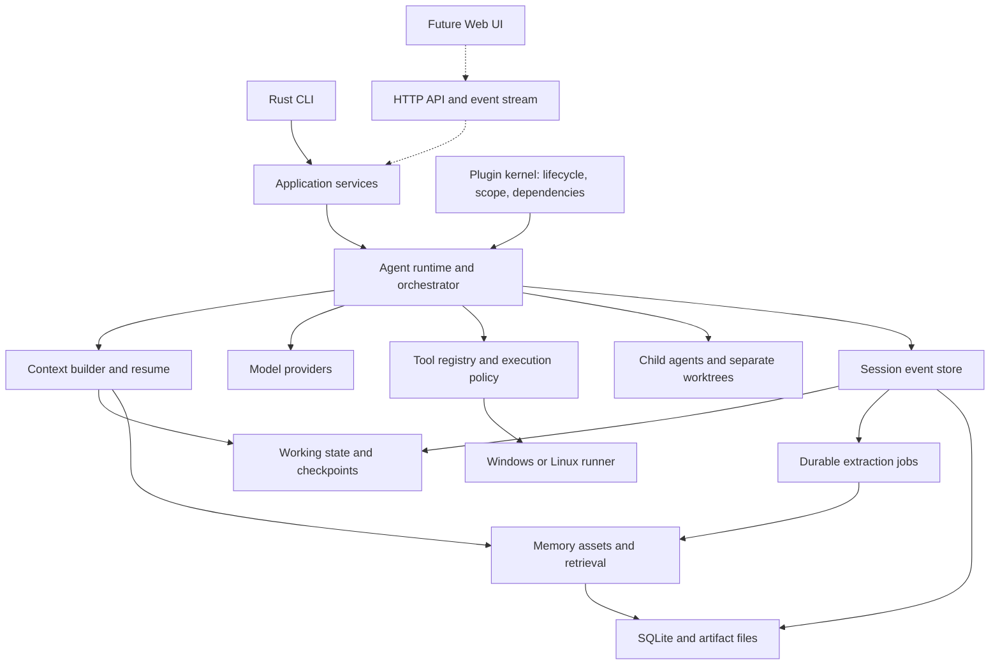

# Rust Harness Agents implementation plan

English | [Tiếng Việt](RUST_HARNESS_PLAN.vi.md)

Revision 2 — September 10, 2026. Status: proposed architecture and implementation plan; no runtime has been built or tested. Start with the [review and decisions](ARCHITECTURE_REVIEW.en.md), then the [plugin contract](PLUGIN_ARCHITECTURE.en.md) and [memory contract](MEMORY_AND_CONTINUITY.en.md) for implementation detail.

## 1. Confirmed objective

Build a personal coding agent in Rust, with a CLI first, delegation to multiple agents, and a Web UI later. The highest priority is continuity: after context exhaustion, application shutdown, or reopening a session, the agent must continue the actual work.

A restored session must establish the current objective, the user's decisions, completed work and its evidence, remaining work, child-agent ownership, and the next action. The user should not have to reconstruct the conversation manually.

Verified starting point: the `harness-agents` workspace contains Git and an initial commit, with no application source or applicable AGENTS.md instructions. Crate names, commands, and configuration in this document are proposed interfaces.

Deployment assumptions: one user; Windows as the primary development machine and Linux as a second test platform; API-backed models, with DeepSeek as the first adapter. The backend and CLI are Rust; invoked tools may include Git, PowerShell, Bash, and the target project's toolchain.

## 2. Findings from DeepSeek and Tencent

Research uses fixed commits to avoid confusing changing documentation:

- DeepSeek: [`2377c272a8e839e0a84c9f0e623b867a1dce2014`](https://github.com/deepseek-ai/deepseek-harness/tree/2377c272a8e839e0a84c9f0e623b867a1dce2014).
- Tencent: [`906b5823b5106eed8f842b62f16d23228838149a`](https://github.com/TencentCloud/TencentDB-Agent-Memory/tree/906b5823b5106eed8f842b62f16d23228838149a), whose default branch at inspection was `feat/server_team`.

DeepSeek uses Cordis for plugins, dependencies, services, events, and registration lifetimes. The agent loop itself is a plugin, and configuration composes the application. The Rust implementation should preserve these boundaries. [DeepSeek architecture](https://github.com/deepseek-ai/deepseek-harness/blob/2377c272a8e839e0a84c9f0e623b867a1dce2014/docs/architecture.md), [Cordis primer](https://github.com/deepseek-ai/deepseek-harness/blob/2377c272a8e839e0a84c9f0e623b867a1dce2014/docs/cordis-primer.md).

DeepSeek derives model input from its session event log. Compaction changes the history currently presented to the model while retaining older events. This provides a foundation for inspectable and recoverable sessions. [Session](https://github.com/deepseek-ai/deepseek-harness/blob/2377c272a8e839e0a84c9f0e623b867a1dce2014/packages/core/session/README.md), [Compaction](https://github.com/deepseek-ai/deepseek-harness/blob/2377c272a8e839e0a84c9f0e623b867a1dce2014/docs/subsystems/compaction.md).

Tencent organizes memory into layers and assets that can be assigned to agents: conversations, atomic knowledge, project context, and stable profiles, alongside Skills, Wiki, and CodeGraph. MemoryCore supplies storage and retrieval; the harness remains responsible for running agents. [MemoryCore](https://github.com/TencentCloud/TencentDB-Agent-Memory/blob/906b5823b5106eed8f842b62f16d23228838149a/MemoryCore/README.md).

This project's design conclusion is to combine a DeepSeek-style session log with scoped, source-backed memory inspired by Tencent, and add structured working state. The following architecture is our proposal, not a claim that either reference project already implements all of it.

## 3. Overall architecture



The first version runs as one writable Rust host per local data directory, owning agents as Tokio tasks. Each agent has its own inbox, session, cancellation token, and context. One store writer coordinates SQLite transactions. Read-only CLI inspection can run separately; competing writer hosts receive `owner_busy`. Shell work and external plugins execute in child processes.

The CLI calls application services rather than owning agent logic. A future Web API will call those same services. An always-running daemon, Redis, Kubernetes, and a separate vector database are not required initially.

## 4. Plugins in Rust

### 4.1. Three extension levels

| Level | Implementation | Timing |
|---|---|---|
| Built-in plugins | Rust traits, compiled into the executable, selected through configuration | From the start |
| External plugins | Separate processes, versioned JSON-RPC over stdio; tools/providers first | Once the core is stable |
| Wasm or external loops | Restricted host APIs, capabilities, and resource limits | After v1, as needed |

A new Rust implementation absent from the binary requires a rebuild; configuration selects implementations already available. Direct compatibility with Cordis TypeScript plugins is not promised. Native dynamic libraries are outside v1; independently distributed extensions use a versioned protocol.

### 4.2. Kernel contract

- Plugin descriptors include id, version, configuration schema, provided services, and dependencies.
- Startup detects missing dependencies, incompatible versions, cycles, and duplicate registrations.
- Initialization follows the dependency graph; partial failure rolls back completed registrations.
- Application, project, and agent scopes prevent registrations from leaking into sibling agents.
- Every registration has an ownership token. `shutdown().await` stops admission, cancels, joins tasks, and removes resources in reverse order.
- `Drop` supports synchronous cleanup only; asynchronous cleanup must be awaited explicitly.
- Running configuration changes apply at step/turn boundaries. v1 does not replace storage or loops during a tool call.

Separate durable business events, decision-returning middleware, and transient UI notifications. Lost notifications must be recoverable from a cursor; a lossy broadcast channel cannot be the delivery mechanism for essential work.

Principal interfaces: `ModelProvider`, `AgentDriver`, `Tool`, `ExecutionPolicy`, `ProcessRunner`, `SessionStore`, `ContextBuilder`, `MemoryStore`, `MemoryRetriever`, and `SubagentBackend`. Consumers depend on interfaces rather than concrete implementations.

The [full plugin specification](PLUGIN_ARCHITECTURE.en.md) adds service definition/provider/consumer separation, typed leases, dependency-loss behavior, scope inheritance, configuration precedence, composition snapshots, external protocol limits and K01–K14 acceptance cases. Mandatory durability/policy services cannot be disabled in the personal-coding profile. Same-process traits and worktrees are not security boundaries.

## 5. Agent loop and execution state

A turn may contain multiple steps; each step contains a model request and the associated tool calls.

1. Persist input in the inbox and return a receipt after commit.
2. Claim input, record turn/step boundaries, and resolve effective policy/configuration.
3. Assemble context from a checkpoint, event tail, and valid memory.
4. Record the frozen request: messages, tool schemas, provider/model, parameters, and context provenance, excluding credentials.
5. Stream the response. UI chunks may be transient; settled responses and failed attempts have separate records.
6. Execute only completed, validated tool calls; persist intent before side effects.
7. Record actual results, artifacts, and WorkingState changes before the next step.
8. Continue for tool results or new input; close the turn once no work is owed.

Agent states: `idle`, `running`, `waiting_approval`, `waiting_children`, `paused`, `recovering`, `failed`, and `disposed`. Persist task state separately: an idle agent does not imply a completed task.

Cancellation propagates into requests, tools, processes, and children. Cancellation completion requires cleanup to settle; a completed future does not establish that its shell process stopped. Tokio provides cancellation and task-tracking primitives for this design. [Tokio shutdown](https://tokio.rs/tokio/topics/shutdown).

Use bounded retries for appropriate model/transport failures. Do not automatically repeat side-effecting tools with uncertain outcomes. A crash after command execution but before its receipt is persisted creates `outcome_unknown`, requiring reconciliation before continuation.

## 6. Remembering work is a foundational feature

Detailed design and Tencent evidence are in [MEMORY_AND_CONTINUITY.en.md](MEMORY_AND_CONTINUITY.en.md).

Maintain three data categories with distinct responsibilities:

| Category | Contents | Update mechanism |
|---|---|---|
| Session journal | Inputs, requests, tool intents/results, decisions, child-agent events | Execution-boundary commits |
| WorkingState | Objective, constraints, completed/pending work, files/diffs, checks, blockers, next action | Event projections and source-backed updates |
| Long-term memory | Knowledge, experience, preferences, and skills reused across sessions | Background extraction, versions, provenance and scope checks |

Resume does not wait for LLM memory extraction. A checkpoint includes `through_seq`; reopening folds every committed event after that point. Summaries aid explanation, while tool receipts and task state determine what actually completed.

Before the first model request after resume, the CLI briefly displays the resumed session, completed and remaining work, and verification status. Repository changes mark affected evidence for revalidation.

Compaction runs before exceeding the context budget and at a safe boundary. The replacement context retains objectives, current instructions, effective decisions, the latest checkpoint, valid tool pairing, and recent conversation. If the summary model fails, construct a minimal continuation packet from WorkingState while preserving source data for retrieval.

A new session in the same project can discover unfinished tasks. A suitable single task can be proposed or continued according to the command; multiple conflicting candidates require selection. Do not silently merge every session in a directory into one task.

## 7. Storage and durability

Use SQLite on local disk, WAL, foreign keys, a busy timeout, and synchronization matching the durable-commit contract. v1 uses `synchronous=FULL` for transactions acknowledging work. WAL databases must not live on network filesystems. [SQLite WAL](https://sqlite.org/wal.html).

Proposed tables:

- `projects`, `sessions`, `session_events`, `session_owners`.
- `tasks`, `task_dependencies`, `task_owners`, `agent_profiles`, `agent_runs`, `inbox_items`, `message_deliveries`.
- `instruction_ledger`, `working_state_snapshots`, `context_checkpoints`, `context_packets`, `composition_snapshots`, `tool_executions`.
- `artifacts`, `memory_assets`, `memory_versions`, `memory_bindings`, `memory_grants`.
- `memory_dependencies`, `background_jobs`, `extraction_cursors`, `schema_migrations`.

`session_events` has unique `(session_id, seq)` and `event_id` keys. Appends check `expected_seq` and writer generation. Two processes cannot simultaneously continue one session. A process lock protects session ownership, and a fencing generation rejects stale writers.

Events, required projections, and resulting jobs commit together when part of one transaction. Jobs carry idempotency keys, state, attempts, due times, and source event ranges. Startup scans unprocessed source ranges even when an earlier notification was lost.

Large outputs become content-addressed artifacts: write a temporary file, flush, publish, then commit its reference. Unreferenced files can be collected later. JSONL is an export/debug format; SQLite is the default transactional source, avoiding competing authoritative stores.

Replay is offline and invokes neither tools nor models. Resume continues execution from reconciled state. Fork creates a session with independent lineage/checkpoints and does not copy one-time authorization grants.

Memory sections 14–17 specify shared transaction ownership, contiguous cursors, task leases across session replacement, project identity, disk-full behavior and backup/retention. Plugin-owned state must not be the only copy of work progress. Exact replay is bounded by retention; explicit deletion may make old payloads unavailable and must be reported.

## 8. Tools and runners

Initial tools: `read_file`, `list_files`, `search_text`, `apply_patch`, `run_process`, `git_status`, `git_diff`, `task_update`, `memory_search`, and `memory_read`.

All tools follow schema validation → identity/scope resolution → policy → approval if needed → final guard → executor → result normalization → durable receipt. Ordinary plugins cannot weaken final guards. DeepSeek likewise separates guards and hooks from tool bodies. [Tool pipeline](https://github.com/deepseek-ai/deepseek-harness/blob/2377c272a8e839e0a84c9f0e623b867a1dce2014/docs/tool-execution-pipeline.md).

Keep immutable execution receipts separate from model/UI result views: truncation and presentation hooks cannot turn a failed test into passing evidence. Approval consumes an invocation-bound grant, not a reusable “allow” string. MCP and nested tools must share the same gate.

Edits compare the previously read content hash to detect concurrent changes. Cover CRLF, Unicode, paths containing spaces, symlinks/junctions, and binary files. Search respects ignore rules and output limits.

Process requests use structured executable/argv fields. Shell scripts are a separate request type, recorded faithfully so authorization is understandable. Support timeouts, bounded output, streaming, cancellation, and process-tree management. Test Windows Job Objects and descendant behavior. [Windows Job Objects](https://learn.microsoft.com/en-us/windows/win32/procthread/job-objects).

Worktrees separate Git changes; OS sandboxes enforce filesystem/network isolation. Host development mode must report its actual protection level. If strict isolation is requested, a runner lacking that capability rejects the mode rather than presenting tool-level path checks as complete sandboxing.

Project policy may only narrow user-level permissions. Repository content, memory, and external plugins do not grant authority. Load API keys from a local credential store or host environment; do not pass them to every subprocess or place them in prompts/logs.

## 9. Multiple agents and workspaces

Start with one coordinator and at most three workers. Configure slots, delegation depth, concurrent requests, and budgets. These are proposed initial measurement defaults, not architectural limits.

Initial roles: explorer reads and investigates; coder edits; reviewer evaluates; verifier runs checks. Roles are presets of the same runtime. Child agents are an optional capability, following DeepSeek's separation. [Subagents](https://github.com/deepseek-ai/deepseek-harness/blob/2377c272a8e839e0a84c9f0e623b867a1dce2014/docs/subsystems/subagent.md).

Delegated tasks include `task_id`, parent, objective, acceptance criteria, inputs, base snapshot, file ownership, capabilities, budget, and deadline. Results contain an outcome, summary, artifact references, base/result revisions, diff, and check receipts. A worker's completion message is a report; the host validates evidence before settling task completion.

Editing agents receive separate worktrees from the same input snapshot. Dirty repositories require capturing tracked changes and selected untracked files while preserving the user's index/HEAD. This requires dedicated tests before automatic dirty-repository support.

Integrate results in dependency order in an integration worktree. The host owns shared Git metadata operations. Run checks against the final integrated revision; branch-level receipts do not replace integration checks.

Task dependencies form a DAG: reject cycles, bound retries, and prevent circular waits. A parent waiting for children releases compute capacity so its children can run. Durable inbox messages carry deduplication ids.

Closing a parent defaults to controlled child cancellation and saved state. Resume distinguishes dead runs using run generations, and does not reassign completed tasks. Running indefinitely after CLI exit requires a later daemon mode.

v1 starts with clean repositories for editing-worker isolation. Dirty-repository support becomes enabled only after its snapshot/preservation fixtures pass; until then explain the unsupported state without stashing/resetting user changes. Final application back to the user's worktree checks its current fingerprint and requires conflict handling if it changed. Workers submit artifacts; they do not unilaterally push, merge into the user's branch or settle another worker's task.

## 10. Stack and source layout

| Area | Proposed choice |
|---|---|
| Async runtime | Tokio, tokio-util |
| CLI | clap; text/JSON before a TUI |
| Model HTTP | reqwest, rustls, SSE parser tested across chunk boundaries |
| Serialization | serde, serde_json, TOML; JSON Schema for configuration/tools |
| Storage | sqlx + SQLite; FTS5 for keyword memory search |
| Observability | tracing; JSON logs with request/task/session correlation |
| MCP | Official `rmcp` client SDK, after core tools |
| Testing | Rust tests, proptest, mock HTTP, subprocess/crash fixtures |
| Post-v1 Web | axum and event streaming; frontend selected at the Web milestone |

Principal libraries were checked against official documentation. Pin exact versions in P0 through the toolchain and Cargo.lock after compatibility checks. [reqwest](https://docs.rs/reqwest/latest/reqwest/), [sqlx](https://docs.rs/sqlx/latest/sqlx/), [clap](https://docs.rs/clap/latest/clap/), [MCP Rust SDK](https://github.com/modelcontextprotocol/rust-sdk).

```text
harness-agents/
  Cargo.toml
  rust-toolchain.toml
  crates/
    harness-types/          # IDs, events, contracts, serialized schemas
    harness-kernel/         # plugin lifecycle, dependencies, scoped services
    harness-session/        # journal, projections, WorkingState, recovery
    harness-store-sqlite/   # transactions, migrations, durable jobs, FTS
    harness-runtime/        # agent actor, loop, context budget, compaction
    harness-providers/      # model adapters and mock provider
    harness-tools/          # execution gate, fs/git/process, platform modules
    harness-orchestrator/   # task DAG, children, worktrees, integration
    harness-memory/         # assets, extraction, retrieval, provenance
    harness-cli/            # commands and application composition
  tests/fixtures/
  evals/continuity/
  examples/profiles/
  docs/
```

The kernel knows nothing about task content, prompts, or model providers. Domain crates share contracts through `harness-types`; check the dependency graph for cycles. These groups may begin as modules and split into crates once boundaries are established.

## 11. Proposed CLI experience

```text
ha init
ha doctor
ha run "Fix the bug and verify the result"
ha run "Implement this feature" --agents 3
ha sessions list
ha resume <session-id>
ha continue --project <project-id>
ha status <session-id>
ha context inspect <session-id>
ha session replay <session-id> --offline
ha memory search "auth decision"
ha memory inspect <memory-id>
ha memory invalidate <memory-id>
ha memory jobs
ha memory catch-up --budget <limit>
ha config explain
ha plugins list
ha plugins inspect <instance-id>
```

`ha resume` displays completed work, evidence, uncertainties, and the next step before acting. `ha context inspect` explains context sources, checkpoint coverage, selected memory versions, and content omitted for budget reasons.

Observation commands do not call a model. `--json` uses a versioned schema, stdout carries data, and stderr carries logs. Credential setup uses local prompts, without requiring secrets in chat.

An interactive CLI host owns mutations while running; separate read-only commands observe persisted state. On `ha continue`, project/task identity is resolved explicitly, not guessed from a matching remote URL. The recovery receipt distinguishes historical test results from checks still valid on the current worktree. Memory inspection shows provenance, version, validity, supersession and why a fact was selected or omitted.

## 12. Milestones and acceptance criteria

Estimates assume one experienced Rust engineer working full time. These are planning estimates rather than delivery promises. Demos can arrive earlier, but each milestone requires its acceptance criteria.

| Milestone | Work and outputs | Required acceptance | Person-days |
|---|---|---|---:|
| P0 | Contracts, schemas, dependency versions, context-loss fixtures, revision-2 decisions | Executable continuity SPEC and failure cases on sample data | 3–4 |
| P1 | Minimal kernel, SQLite journal, instruction ledger, inbox, WorkingState, durable jobs, ownership | Kill/reopen reconstructs state; input survives; second writer rejected; K01–K07 | 8–11 |
| P2 | Mock + DeepSeek provider, loop, request/composition records, context builder, compaction | Repeated compaction preserves requirements; offline replay; incompatible critical events fail clearly | 7–10 |
| P3 | Filesystem/Git/process tools, immutable receipts, policy, Windows/Linux cleanup | Edit fixture repo, run checks, cancel process tree, detect stale edits and uncertain outcomes | 7–10 |
| P4 | L1/L2, manual profiles, provenance, FTS5, dependency invalidation, versioned extraction | Resume with extractor disabled; contiguous catch-up; old memory cannot overwrite decisions | 7–10 |
| P5 | Multiple agents, task DAG/ownership, worktrees, durable handoffs, scoped memory, integration | Three workers; crash recovery; no duplicate task continuation or lost results | 8–12 |
| P6 | Skills, MCP, bounded subprocess protocol, configuration explanations | Plugin/tool failures preserve sessions; same gate; K12–K14 and full plugin regressions | 5–8 |
| P7 | Hardening, migration/backup/retention, packaging, CI, real-project evaluations | Windows/Linux artifacts; C01–C30 and K01–K14 pass, plus documented model evals | 8–11 |
| P8 | Web UI reusing application services, timeline, approvals, memory inspection | Reconnect catches up events; no competing agent loop or authoritative state | Additional 10–15 |

Revision 2 raises P0–P7 to approximately 53–76 person-days before contingency, roughly 13–20 working weeks with 20–30% contingency and five working days per week. This replaces the earlier 11–15-week estimate: plugin lifecycle, cross-session ownership and recovery/retention tests need explicit time. A useful single-agent CLI arrives around P3; multiple agents with shared memory arrive at P5. Web UI is a separate delivery increment.

Priority order: work recovery → coding execution → cross-session memory → multiple agents → extensions → Web. Recovery begins in P1/P2, rather than waiting for advanced memory.

## 13. Product verification

- Contract tests for the journal, projections, policy, task graph, and memory access.
- Mock providers covering multiple tools, incomplete JSON, timeouts, retries, cancellation, and context overflow.
- Crash injection around commits, between side effects and receipts, during compaction, and during child completion.
- Continuity evaluation: ten multi-step coding tasks with restart/compaction checkpoints; measure retained requirements, next-action selection, duplicate work, and final completion.
- Memory evaluation: historical decisions, superseded information, branch changes, inaccessible assets, Vietnamese retrieval, and symbol names.
- Check receipts bound to revision/source fingerprints. Receipts from older revisions cannot establish that the current revision passes.
- CI: fmt, clippy, unit/integration tests, Windows/Linux builds, migrations, and startup from packaged binaries.

Deterministic invariants such as preserving committed events, preventing cross-session writes, and enforcing memory scopes must pass all fixtures. Model action quality is measured as rates against a baseline using the same model/budget; model understanding cannot be guaranteed absolutely.

## 14. Deferred decisions

Wasm, Code Mode, remote agents, a public plugin marketplace, full CodeGraph, automatically generated repository-wide Wiki, default embeddings, a background daemon, and multiple users are deferred beyond v1. Add them when real tasks establish value.

Tencent MemoryCore can be an optional adapter for sharing assets with other harnesses. The default remains local Rust memory. The adapter must retrieve before request recording, preserve source/version information, and avoid dependence on a proxy silently changing prompts.

## 15. First implementation increment

Concrete P0/P1 outputs: `SPEC-CONTINUITY-001`, event/WorkingState schemas, mock-provider fixtures, SQLite journal, durable inbox, a restore command, and kill/reopen tests. The demonstration must show a task with two completed steps and one remaining step; after process termination and reopening, its state and next action are restored correctly.

This proves the central product value before expanding tools or interfaces. This document is a plan, not evidence that any runtime capability has already been implemented.
