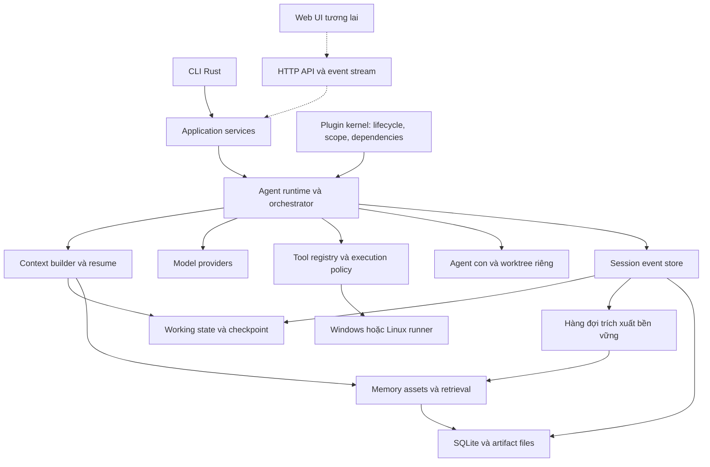

# Kế hoạch xây Harness Agents bằng Rust

[English](RUST_HARNESS_PLAN.en.md) | Tiếng Việt

Revision 2 — 10/09/2026. Trạng thái: đề xuất kiến trúc và kế hoạch triển khai; chưa có runtime được xây hoặc kiểm thử. Đọc [rà soát và quyết định](ARCHITECTURE_REVIEW.vi.md), rồi [hợp đồng plugin](PLUGIN_ARCHITECTURE.vi.md) và [hợp đồng memory](MEMORY_AND_CONTINUITY.vi.md) để đi vào chi tiết triển khai.

## 1. Mục tiêu đã chốt

Xây coding agent cá nhân bằng Rust, dùng CLI trước, giao việc cho nhiều agent, bổ sung Web UI sau. Ưu tiên cao nhất: sau khi hết context, đóng ứng dụng hoặc mở lại phiên, agent tiếp tục đúng công việc đang làm.

Một phiên được phục hồi phải trả lời được: mục tiêu hiện tại là gì; người dùng đã quyết định gì; những gì đã làm và có bằng chứng nào; còn việc gì; agent con nào phụ trách; bước tiếp theo là gì. Không bắt người dùng kể lại lịch sử.

Điểm xuất phát đã kiểm tra: workspace `harness-agents` chỉ có Git và initial commit, chưa có mã nguồn hay quy định AGENTS.md áp dụng. Các tên crate, lệnh và cấu hình dưới đây là thiết kế dự kiến.

Giả định triển khai: một người dùng, Windows là máy sử dụng chính, Linux là nền tảng kiểm thử thứ hai; model qua API, DeepSeek là adapter đầu tiên. Backend và CLI viết bằng Rust; các công cụ được gọi có thể là Git, PowerShell, Bash hoặc toolchain của dự án.

## 2. Kết quả đọc DeepSeek và Tencent

Khảo sát theo commit cố định để tránh nhầm tài liệu đang thay đổi:

- DeepSeek: [`2377c272a8e839e0a84c9f0e623b867a1dce2014`](https://github.com/deepseek-ai/deepseek-harness/tree/2377c272a8e839e0a84c9f0e623b867a1dce2014).
- Tencent: [`906b5823b5106eed8f842b62f16d23228838149a`](https://github.com/TencentCloud/TencentDB-Agent-Memory/tree/906b5823b5106eed8f842b62f16d23228838149a), nhánh mặc định lúc khảo sát là `feat/server_team`.

DeepSeek dùng Cordis để quản lý plugin, dependency, service, event và vòng đời đăng ký. Agent loop cũng là plugin; ứng dụng được lắp từ cấu hình. Bản Rust nên giữ các ranh giới này. [Kiến trúc DeepSeek](https://github.com/deepseek-ai/deepseek-harness/blob/2377c272a8e839e0a84c9f0e623b867a1dce2014/docs/architecture.md), [Cordis primer](https://github.com/deepseek-ai/deepseek-harness/blob/2377c272a8e839e0a84c9f0e623b867a1dce2014/docs/cordis-primer.md).

DeepSeek dựng đầu vào model từ session event log; compaction thay đổi phần lịch sử đang hiển thị cho model nhưng giữ các sự kiện cũ. Đây là nền tảng cho khả năng giải thích và phục hồi phiên. [Session](https://github.com/deepseek-ai/deepseek-harness/blob/2377c272a8e839e0a84c9f0e623b867a1dce2014/packages/core/session/README.md), [Compaction](https://github.com/deepseek-ai/deepseek-harness/blob/2377c272a8e839e0a84c9f0e623b867a1dce2014/docs/subsystems/compaction.md).

Tencent tổ chức memory thành nhiều lớp và tài sản có thể gắn cho agent: hội thoại, kiến thức nguyên tử, bối cảnh dự án, hồ sơ ổn định; cùng Skills, Wiki và CodeGraph. MemoryCore cung cấp lưu trữ và truy hồi, còn việc chạy agent thuộc harness. [MemoryCore](https://github.com/TencentCloud/TencentDB-Agent-Memory/blob/906b5823b5106eed8f842b62f16d23228838149a/MemoryCore/README.md).

Kết luận thiết kế của dự án này: kết hợp session log kiểu DeepSeek với memory có phạm vi và nguồn gốc kiểu Tencent, đồng thời bổ sung trạng thái công việc có cấu trúc. Đây là đề xuất riêng; không phải tuyên bố hai dự án đã cung cấp đầy đủ cơ chế dưới đây.

## 3. Kiến trúc tổng thể



Phiên bản đầu có một Rust host được ghi trên mỗi data directory local, sở hữu các agent dưới dạng Tokio tasks. Mỗi agent có inbox, session, cancellation token và context riêng. Một store writer điều phối giao dịch SQLite. CLI read-only có thể chạy riêng; writer host cạnh tranh nhận `owner_busy`. Công việc shell và plugin bên ngoài chạy trong tiến trình con.

CLI gọi application services, không chứa logic agent. Sau này Web API gọi lại những services này. Chưa cần daemon luôn chạy, Redis, Kubernetes hay cơ sở dữ liệu vector riêng.

## 4. Plugin trong Rust

### 4.1. Ba mức mở rộng

| Mức | Cách triển khai | Thời điểm |
|---|---|---|
| Plugin tích hợp | Rust trait, build cùng executable, bật/tắt/chọn implementation bằng cấu hình | Ngay từ đầu |
| Plugin bên ngoài | Tiến trình riêng, JSON-RPC có version qua stdio; hỗ trợ tool/provider trước | Khi lõi ổn định |
| Plugin Wasm hoặc loop bên ngoài | Host API giới hạn, capability và giới hạn tài nguyên | Sau v1, theo nhu cầu |

Một implementation Rust mới chưa được build vào binary cần build lại; cấu hình chỉ chọn các implementation đã có. Không hứa tương thích trực tiếp với plugin TypeScript của Cordis. Plugin native động không nằm trong v1; dùng protocol có version cho việc phân phối độc lập.

### 4.2. Hợp đồng kernel

- Plugin descriptor: id, version, config schema, services cung cấp và services phụ thuộc.
- Startup kiểm tra thiếu dependency, version không tương thích, cycle và đăng ký trùng.
- Khởi tạo theo dependency graph; lỗi giữa chừng rollback đăng ký đã tạo.
- Scope theo application, project, agent; đăng ký không rò giữa hai agent ngang hàng.
- Mỗi registration có token sở hữu. `shutdown().await` dừng nhận việc, hủy, chờ task kết thúc, gỡ tài nguyên theo thứ tự ngược.
- `Drop` chỉ hỗ trợ thu hồi đồng bộ; cleanup bất đồng bộ phải được chờ rõ ràng.
- Thay cấu hình đang chạy chỉ áp dụng tại ranh giới step/turn. v1 không hot-swap storage hoặc loop giữa một tool call.

Events được chia thành: sự kiện nghiệp vụ phải lưu bền; middleware cần trả quyết định; và thông báo UI tạm thời. Notification bị mất phải có thể đọc bù từ cursor; không dùng broadcast có thể rơi thông điệp để giao việc quan trọng.

Các interface chính: `ModelProvider`, `AgentDriver`, `Tool`, `ExecutionPolicy`, `ProcessRunner`, `SessionStore`, `ContextBuilder`, `MemoryStore`, `MemoryRetriever`, `SubagentBackend`. Consumer phụ thuộc interface, không phụ thuộc implementation cụ thể.

[Đặc tả plugin đầy đủ](PLUGIN_ARCHITECTURE.vi.md) bổ sung tách service definition/provider/consumer, typed leases, xử lý mất dependency, scope inheritance, config precedence, composition snapshots, giới hạn protocol bên ngoài và K01–K14. Không cho tắt durability/policy bắt buộc trong profile personal-coding. Trait cùng process và worktree không phải security boundary.

## 5. Vòng lặp agent và trạng thái thực thi

Một turn có thể có nhiều step; mỗi step gồm một request model và các tool calls liên quan.

1. Ghi input vào inbox bền vững; trả receipt sau khi commit.
2. Claim input, ghi turn/step boundary, lấy policy và cấu hình hiệu lực.
3. Dựng context từ checkpoint, event tail và memory hợp lệ.
4. Ghi bản request đã đóng băng: messages, tool schemas, provider/model, tham số và nguồn context; loại credential khỏi record.
5. Stream response. Chunk UI có thể tạm thời; response hoàn chỉnh hoặc attempt thất bại có record riêng.
6. Chỉ thực thi tool call có arguments đã hoàn tất và qua validation; ghi intent trước khi tạo side effect.
7. Ghi kết quả thật, artifact và thay đổi WorkingState; commit trước step tiếp theo.
8. Có tool result hoặc input tiếp theo thì chạy tiếp; hết nghĩa vụ thì đóng turn.

Trạng thái agent: `idle`, `running`, `waiting_approval`, `waiting_children`, `paused`, `recovering`, `failed`, `disposed`. Trạng thái task được lưu riêng; agent đang idle không có nghĩa task đã hoàn tất.

Cancellation phải truyền xuống request, tool, process và agent con. Hủy xong phải chờ cleanup; một future kết thúc không chứng minh tiến trình shell đã dừng. Tokio cung cấp cancellation và task tracking để xây cơ chế này. [Tokio shutdown](https://tokio.rs/tokio/topics/shutdown).

Retry có giới hạn cho lỗi model/transport phù hợp. Không tự chạy lại tool có side effect chưa rõ kết quả. Crash sau khi command đã chạy nhưng trước khi lưu receipt tạo trạng thái `outcome_unknown`, cần đối chiếu hiện trạng trước khi tiếp tục.

## 6. Khả năng nhớ công việc là chức năng nền tảng

Thiết kế chi tiết và bằng chứng Tencent nằm trong [MEMORY_AND_CONTINUITY.vi.md](MEMORY_AND_CONTINUITY.vi.md).

Harness duy trì ba loại dữ liệu với nhiệm vụ khác nhau:

| Loại | Nội dung | Cách cập nhật |
|---|---|---|
| Session journal | Input, request, tool intent/result, quyết định, event agent con | Commit theo ranh giới thực thi |
| WorkingState | Mục tiêu, ràng buộc, việc xong/còn lại, file/diff, test, blockers, next action | Projection từ event và cập nhật có nguồn |
| Long-term memory | Kiến thức, kinh nghiệm, preferences, skills dùng ở phiên khác | Trích xuất nền, version, kiểm tra nguồn và phạm vi |

Resume không chờ LLM trích xuất memory xong. Checkpoint chứa `through_seq`; khi mở lại phải fold thêm mọi event đã commit sau đó. Summary chỉ hỗ trợ diễn giải; receipt của tool và trạng thái task quyết định việc gì thật sự đã hoàn tất.

Trước khi gọi model sau resume, CLI hiển thị ngắn: phiên đang tiếp tục, việc đã xong, việc còn lại và trạng thái kiểm chứng. Khi repository đã đổi, các chứng cứ liên quan được đánh dấu cần xác minh lại.

Compaction chạy trước khi vượt budget, tại ranh giới an toàn. Context mới luôn giữ mục tiêu, yêu cầu hiện hành, quyết định có hiệu lực, checkpoint mới nhất, tool pairing hợp lệ và phần hội thoại gần đây. Nếu summary model lỗi, dựng gói tiếp tục tối thiểu từ WorkingState; dữ liệu gốc vẫn được giữ để truy xuất.

Mở phiên mới cùng project có thể tìm task chưa xong. Nếu có một task phù hợp thì dùng định danh task để đề xuất/tiếp tục theo lệnh; nếu nhiều task mâu thuẫn thì hiển thị danh sách để chọn. Không gộp nhầm mọi phiên trong cùng thư mục thành một công việc.

## 7. Lưu trữ và tính bền vững

Chọn SQLite trên ổ đĩa cục bộ, WAL, foreign keys, busy timeout và mức đồng bộ phù hợp với hợp đồng durable commit. Với v1, dùng `synchronous=FULL` cho các transaction xác nhận công việc. WAL không dành cho database đặt trên network filesystem. [SQLite WAL](https://sqlite.org/wal.html).

Các bảng dự kiến:

- `projects`, `sessions`, `session_events`, `session_owners`.
- `tasks`, `task_dependencies`, `task_owners`, `agent_profiles`, `agent_runs`, `inbox_items`, `message_deliveries`.
- `instruction_ledger`, `working_state_snapshots`, `context_checkpoints`, `context_packets`, `composition_snapshots`, `tool_executions`.
- `artifacts`, `memory_assets`, `memory_versions`, `memory_bindings`, `memory_grants`.
- `memory_dependencies`, `background_jobs`, `extraction_cursors`, `schema_migrations`.

`session_events` có khóa duy nhất `(session_id, seq)` và `event_id`. Append kiểm tra `expected_seq` và generation của writer. Hai tiến trình không được cùng tiếp tục một session. Process lock bảo vệ chủ phiên; fencing generation từ chối writer cũ.

Event, projection bắt buộc và job phát sinh cùng commit khi thuộc một transaction. Mỗi job có idempotency key, trạng thái, attempt, thời điểm chạy và nguồn event range. Startup quét lại nguồn chưa xử lý, kể cả khi notification trước đó bị mất.

Output lớn lưu thành artifact theo content hash: ghi file tạm, flush, publish, rồi commit tham chiếu; file chưa được tham chiếu có thể dọn sau. JSONL là định dạng export/debug; SQLite là nguồn giao dịch mặc định, tránh hai kho cùng tự nhận là nguồn chuẩn.

Replay để xem lại phải offline, không chạy tool và không gọi model. Resume là thực thi tiếp từ trạng thái đã kiểm tra. Fork tạo session có lineage và checkpoint riêng; không sao chép quyền đã cấp một lần sang phiên khác.

Mục 14–17 của tài liệu memory quy định transaction ownership chung, contiguous cursors, task leases qua thay session, project identity, disk-full và backup/retention. Plugin state không được là bản duy nhất của tiến độ. Exact replay có giới hạn retention; khi chủ động xóa payload cũ phải báo phần không còn đọc được.

## 8. Tools và runner

Toolset đầu tiên: `read_file`, `list_files`, `search_text`, `apply_patch`, `run_process`, `git_status`, `git_diff`, `task_update`, `memory_search`, `memory_read`.

Mọi tool đi qua: schema validation → resolve identity/scope → policy → approval nếu cần → guard cuối → executor → chuẩn hóa kết quả → durable receipt. Các guard cuối không được plugin thường nới quyền. DeepSeek cũng tách guard và hooks khỏi tool body. [Tool pipeline](https://github.com/deepseek-ai/deepseek-harness/blob/2377c272a8e839e0a84c9f0e623b867a1dce2014/docs/tool-execution-pipeline.md).

Tách execution receipt bất biến khỏi result view cho model/UI: truncation và presentation hooks không biến test fail thành bằng chứng pass. Approval tiêu thụ grant gắn invocation, không phải chuỗi “allow” dùng lại. MCP và nested tools đi qua cùng gate.

File edit kiểm tra hash đã đọc để phát hiện nội dung thay đổi; hỗ trợ CRLF, Unicode, đường dẫn có khoảng trắng, symlink/junction và file nhị phân. Tool search tôn trọng ignore và giới hạn output.

Process runner nhận executable và argv có cấu trúc. Script shell là loại yêu cầu riêng, được ghi nguyên nghĩa để người dùng hiểu quyền đã cấp. Có timeout, giới hạn output, streaming, cancellation và quản lý cả cây tiến trình. Trên Windows, kiểm tra Job Objects và hành vi tiến trình cháu. [Windows Job Objects](https://learn.microsoft.com/en-us/windows/win32/procthread/job-objects).

Worktree giúp tách thay đổi Git; OS sandbox chịu trách nhiệm cách ly filesystem/network. Chế độ phát triển chạy trên host phải báo đúng mức bảo vệ. Khi người dùng yêu cầu isolation chặt, runner thiếu khả năng phải từ chối chế độ đó; không báo sandbox đầy đủ dựa trên kiểm tra đường dẫn của tool.

Policy dự án chỉ được thu hẹp quyền của policy người dùng. Nội dung repo, memory và plugin bên ngoài không tự cấp quyền. API key lấy từ credential store cục bộ hoặc environment của host; không truyền cho mọi subprocess và không đưa vào prompt/log.

## 9. Nhiều agent và workspace

Bắt đầu với coordinator và tối đa 3 worker; số slot, độ sâu giao việc, request đồng thời và ngân sách đều cấu hình được. Đây là mặc định đề xuất để đo hiệu quả, không phải giới hạn kiến trúc.

Role ban đầu: explorer đọc và tìm hiểu; coder sửa; reviewer đánh giá; verifier chạy kiểm tra. Role chỉ là preset của cùng runtime. Agent con là capability tùy chọn, tương tự đường phân tách của DeepSeek. [Subagents](https://github.com/deepseek-ai/deepseek-harness/blob/2377c272a8e839e0a84c9f0e623b867a1dce2014/docs/subsystems/subagent.md).

Mỗi nhiệm vụ giao có `task_id`, parent, mục tiêu, acceptance criteria, inputs, base snapshot, file ownership, capabilities, budget và deadline. Kết quả có outcome, summary, artifact refs, base/result revision, diff và test receipts. Lời báo "đã xong" của worker chỉ là báo cáo; host kiểm tra bằng chứng trước khi chốt task.

Agent sửa code có worktree riêng từ cùng snapshot đầu vào. Repo đang dirty cần snapshot cả thay đổi tracked và các untracked được chọn, giữ nguyên index/HEAD của người dùng. Đây là phần bắt buộc có kiểm thử trước khi hỗ trợ dirty repo tự động.

Tích hợp kết quả theo thứ tự dependency trong integration worktree. Git metadata dùng chung được quản lý bởi host. Sau khi tích hợp chạy kiểm tra trên revision cuối; báo cáo test của từng nhánh không thay thế kiểm tra tích hợp.

Task graph là DAG; reject cycle, giới hạn retry và chống chờ vòng. Agent chờ con không giữ slot tính toán làm con không chạy được. Kết quả/handoff đi qua inbox bền vững, có message id chống trùng.

Nếu parent bị đóng, mặc định hủy có kiểm soát và lưu trạng thái con. Khi resume, các run đã chết được nhận diện theo run generation; task hoàn thành không bị giao lại. Chế độ chạy ngầm sau khi CLI thoát dành cho daemon ở giai đoạn sau.

v1 bắt đầu bằng repo sạch cho editing-worker isolation. Chỉ bật hỗ trợ dirty repo sau khi các fixtures snapshot/bảo toàn thay đổi đạt yêu cầu; trước đó báo trạng thái chưa hỗ trợ, không tự stash/reset dữ liệu user. Áp kết quả về worktree user phải kiểm tra fingerprint hiện tại và xử lý conflict nếu đã đổi. Worker nộp artifacts; không tự push, merge vào branch user hoặc chốt task worker khác.

## 10. Stack và cấu trúc mã nguồn

| Phần | Lựa chọn đề xuất |
|---|---|
| Async runtime | Tokio, tokio-util |
| CLI | clap; hiển thị text/JSON trước, TUI sau |
| HTTP model | reqwest, rustls, parser SSE có test chunking |
| Serialization | serde, serde_json, TOML; JSON Schema cho config/tool contracts |
| Storage | sqlx + SQLite; FTS5 cho keyword memory search |
| Quan sát | tracing; JSON logs, request/task/session correlation |
| MCP | `rmcp`, client SDK chính thức, sau core tools |
| Kiểm thử | Rust tests, proptest, mock HTTP, subprocess/crash fixtures |
| Web sau v1 | axum và event stream; frontend quyết định ở mốc Web |

Các thư viện chủ chốt đã đối chiếu tài liệu chính thức; version cụ thể sẽ pin ở P0 bằng toolchain và Cargo.lock sau khi kiểm tra tương thích. [reqwest](https://docs.rs/reqwest/latest/reqwest/), [sqlx](https://docs.rs/sqlx/latest/sqlx/), [clap](https://docs.rs/clap/latest/clap/), [MCP Rust SDK](https://github.com/modelcontextprotocol/rust-sdk).

```text
harness-agents/
  Cargo.toml
  rust-toolchain.toml
  crates/
    harness-types/          # IDs, events, contracts, serialized schemas
    harness-kernel/         # plugin lifecycle, dependency graph, scoped services
    harness-session/        # journal, projections, WorkingState, recovery
    harness-store-sqlite/   # transactions, migrations, durable jobs, FTS
    harness-runtime/        # agent actor, loop, context budget, compaction
    harness-providers/      # model adapters và mock provider
    harness-tools/          # execution gate, fs/git/process, platform modules
    harness-orchestrator/   # task DAG, children, worktrees, result integration
    harness-memory/         # assets, extraction, retrieval, provenance
    harness-cli/            # commands và application composition
  tests/fixtures/
  evals/continuity/
  examples/profiles/
  docs/
```

Kernel không biết nội dung task, prompt hay provider. Các crate nghiệp vụ chia sẻ contract qua `harness-types`; kiểm tra dependency graph để tránh vòng phụ thuộc. Các nhóm trên có thể bắt đầu bằng module rồi tách crate khi ranh giới đã rõ.

## 11. Trải nghiệm CLI dự kiến

```text
ha init
ha doctor
ha run "Sửa lỗi và kiểm tra kết quả"
ha run "Thực hiện feature này" --agents 3
ha sessions list
ha resume <session-id>
ha continue --project <project-id>
ha status <session-id>
ha context inspect <session-id>
ha session replay <session-id> --offline
ha memory search "quyết định về auth"
ha memory inspect <memory-id>
ha memory invalidate <memory-id>
ha memory jobs
ha memory catch-up --budget <limit>
ha config explain
ha plugins list
ha plugins inspect <instance-id>
```

`ha resume` hiển thị bản tiếp tục trước khi hành động, gồm việc đã hoàn tất, bằng chứng, điều chưa chắc và bước tiếp theo. `ha context inspect` giải thích context từ đâu, checkpoint đến seq nào, memory version nào được dùng và phần nào bị lược vì budget.

Các lệnh quan sát không gọi model. `--json` xuất schema có version, stdout dành cho dữ liệu, stderr cho log. Credential setup dùng prompt cục bộ. Không có yêu cầu đưa secret vào cuộc trò chuyện.

CLI host interactive sở hữu mutations khi đang chạy; lệnh read-only riêng đọc trạng thái đã lưu. `ha continue` resolve project/task identity rõ, không đoán từ remote URL giống nhau. Recovery receipt phân biệt test lịch sử với checks còn hợp lệ trên worktree hiện tại. Memory inspection cho biết provenance, version, validity, supersession và lý do chọn/bỏ fact.

## 12. Lộ trình và tiêu chí nghiệm thu

Ước lượng dưới đây dành cho một kỹ sư Rust có kinh nghiệm làm toàn thời gian. Đây là dự toán kỹ thuật, không phải cam kết tốc độ. Có thể làm demo sớm nhưng chỉ chuyển mốc khi đạt tiêu chí.

| Mốc | Công việc và đầu ra | Nghiệm thu bắt buộc | Ngày công |
|---|---|---|---:|
| P0 | Chốt contract, schema, dependency versions, fixtures mất context, quyết định revision 2 | SPEC continuity và failure cases chạy được với dữ liệu mẫu | 3–4 |
| P1 | Kernel tối thiểu, journal SQLite, instruction ledger, inbox, WorkingState, durable jobs, ownership | Kill/reopen đúng; input đã ACK còn nguyên; chặn writer thứ hai; K01–K07 | 8–11 |
| P2 | Mock + DeepSeek provider, loop, request/composition records, context builder, compaction | Compaction nhiều lần giữ yêu cầu; offline replay; critical event không tương thích lỗi rõ | 7–10 |
| P3 | Tools filesystem/Git/process, immutable receipts, policy, Windows/Linux cleanup | Sửa repo fixture, test, cancel cây process, phát hiện stale edit và outcome chưa rõ | 7–10 |
| P4 | L1/L2, profile thủ công, provenance, FTS5, dependency invalidation, extraction có version | Tắt extractor vẫn resume; catch-up liên tục; memory cũ không ghi đè quyết định | 7–10 |
| P5 | Multi-agent, task DAG/ownership, worktrees, durable handoffs, scoped memory, integration | 3 worker; crash recovery; không tiếp tục trùng task hay mất results | 8–12 |
| P6 | Skills, MCP, subprocess protocol có giới hạn, config explanations | Plugin/tool lỗi không hỏng phiên; cùng gate; K12–K14 và toàn bộ plugin regressions | 5–8 |
| P7 | Hardening, migration/backup/retention, packaging, CI, real-project eval | Windows/Linux artifacts; C01–C30, K01–K14 đạt; có báo cáo model evals | 8–11 |
| P8 | Web UI dùng lại application services, timeline, approvals, memory inspector | Browser reconnect đọc bù event; không sinh loop hoặc kho trạng thái cạnh tranh | Thêm 10–15 |

Revision 2 nâng P0–P7 lên khoảng 53–76 ngày công trước dự phòng, tương đương 13–20 tuần làm việc với 20–30% dự phòng và 5 ngày/tuần. Thay cho dự toán 11–15 tuần trước: plugin lifecycle, ownership xuyên phiên và tests recovery/retention cần thời gian riêng. CLI một agent hữu dụng ở P3; nhiều agent có memory dùng chung ở P5. Web UI là đợt riêng.

Thứ tự ưu tiên: phục hồi công việc → chạy coding task → memory qua phiên → nhiều agent → hệ mở rộng → Web. Khả năng phục hồi phải có từ P1/P2, không đợi đến mốc memory nâng cao.

## 13. Bộ kiểm chứng sản phẩm

- Contract tests cho journal, projections, policy, task graph và memory access.
- Mock provider tái hiện response nhiều tool, JSON dở dang, timeout, retry, cancel và context overflow.
- Crash injection trước/sau commit, sau side effect nhưng trước receipt, giữa compaction và khi worker báo xong.
- Continuity eval: 10 bài coding nhiều bước, mỗi bài có các checkpoint restart và compaction; đánh giá giữ yêu cầu, chọn next action, không làm lại và mức thành công cuối.
- Memory eval: câu hỏi cần quyết định cũ, thông tin đã bị thay thế, đổi branch, tài sản agent không được đọc, retrieval tiếng Việt và tên symbol.
- Test receipts gắn revision/source fingerprint. Không dùng receipt của revision cũ để kết luận revision hiện tại pass.
- CI: fmt, clippy, unit/integration tests, build Windows/Linux; kiểm tra migration và startup từ binary đã đóng gói.

Các bất biến xác định như không mất event đã commit, không ghi đè sai phiên, không lộ memory sai scope phải đạt 100% fixtures. Chất lượng chọn hành động của model đo bằng tỷ lệ và so sánh baseline trên cùng model/budget; không thể đảm bảo tuyệt đối model sẽ luôn hiểu đúng.

## 14. Quyết định để sau

Wasm, Code Mode, agent ở máy khác, public plugin marketplace, full CodeGraph, tự sinh Wiki toàn repo, embeddings mặc định, daemon nền và đa người dùng đều để sau v1. Trước khi thêm, cần chứng minh lợi ích bằng task thực tế.

Tích hợp trực tiếp Tencent MemoryCore là một adapter tùy chọn nếu cần dùng chung tài sản với harness khác. Đường mặc định vẫn là memory Rust cục bộ. Adapter phải truy hồi trước khi request được ghi nhận, lưu nguồn/version và không phụ thuộc một proxy âm thầm sửa prompt.

## 15. Đợt triển khai đầu tiên

Đầu ra cụ thể của P0/P1: `SPEC-CONTINUITY-001`, schema events/WorkingState, mock provider fixtures, SQLite journal, inbox bền vững, restore command và test kill/reopen. Demo phải chứng minh một task đã hoàn thành hai bước, còn một bước; sau khi tiến trình bị dừng và mở lại, trạng thái và bước tiếp theo được phục hồi chính xác.

Đây là mốc chứng minh giá trị cốt lõi trước khi mở rộng toolset hoặc giao diện. Tài liệu này mới là kế hoạch; chưa xác nhận bất kỳ khả năng runtime nào đã được triển khai.
